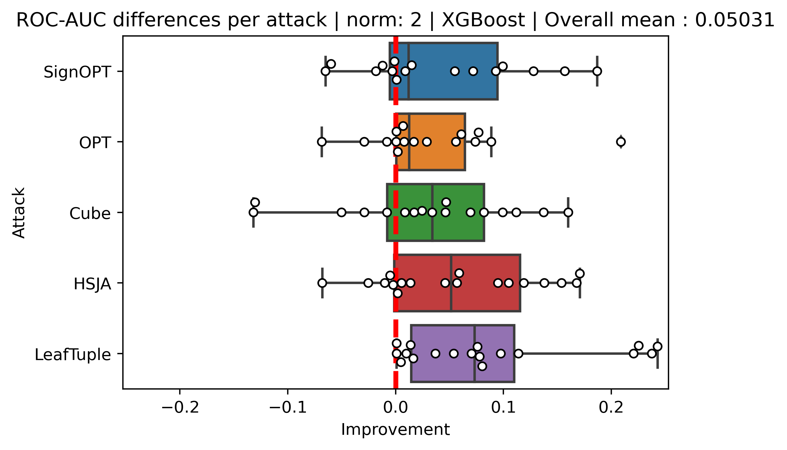
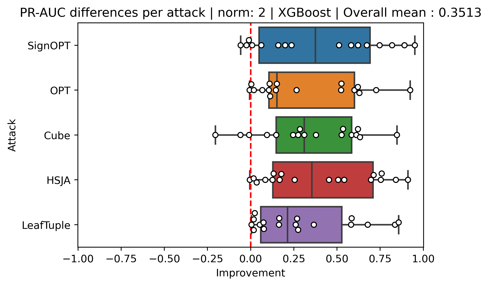

# Adversarial Evasion Attacks Detection for Tree-Based Ensembles: A Representation Learning Approach

This repository contains the experiment code from the paper.

## Abstract

Research on adversarial evasion attacks primarily focuses on neural network models due to their popularity in fields such as computer vision and natural language processing, as well as their properties that facilitate the search for adversarial examples with minimal input changes. However, due to their high performance and explainability, decision trees and tree ensembles remain widely used, particularly in domains dominated by tabular data. In recent years, several studies have introduced novel adversarial attacks specifically targeting decision trees and tree ensembles, resulting in numerous papers addressing robust versions of these models.

## Prerequisites & Setup

Before running the project, ensure you have the following installed:

- **Python 3.10 or higher**

- **Required Python packages**:

    You can install the necessary packages using `pip` and the provided `pyproject.toml` file.
    ```bash
    pip install .[cpu] # for cpu 
    pip install .[gpu] # for gpu 
    ```

## Datasets


## How To Run

```bash
python trees_adversarial_detector/full_experiment_flow.py <dataset> <attack_type> <norm> <detection_type> <sampled_embed_dim> <nodes_embed_dim> <modeltype>
```

Arguments:
* `dataset` - The dataset to execute the experiment on. If it one of `['breast_cancer', 'codrna', 'diabetes', 'ijcnn1', 'webspam', 'mnist26', 'mnist', 'covtype', 'fashion', 'higgs', 'sensorless']`
* 


## Experimental Results

Showing here two box plots that represent the differences in AUC of ROC and PRC, between our method’s performance and the OC-score method’s.
The distributions of the differences comparing our method to OC-score for L2 norm.

ROC-AUC differences for XGBoost experiments between our method and OC-score for L2 norm:

<center></center>


### Figure 2: 

PRC-AUC differences for XGBoost experiments between our method and OC-score for L2 norm:

<center></center>

Full results represented <a href="https://galbraun.github.io/trees_adversarial_detector">here</a>.

## Citation

If you use this code or find our work helpful, please consider citing our paper:
```
@article{Braun2025,
  title = {Adversarial evasion attacks detection for tree-based ensembles: A representation learning approach},
  ISSN = {1566-2535},
  url = {http://dx.doi.org/10.1016/j.inffus.2025.102964},
  DOI = {10.1016/j.inffus.2025.102964},
  journal = {Information Fusion},
  publisher = {Elsevier BV},
  author = {Braun,  Gal and Cohen,  Seffi and Rokach,  Lior},
  year = {2025},
  month = jan,
  pages = {102964}
}
```