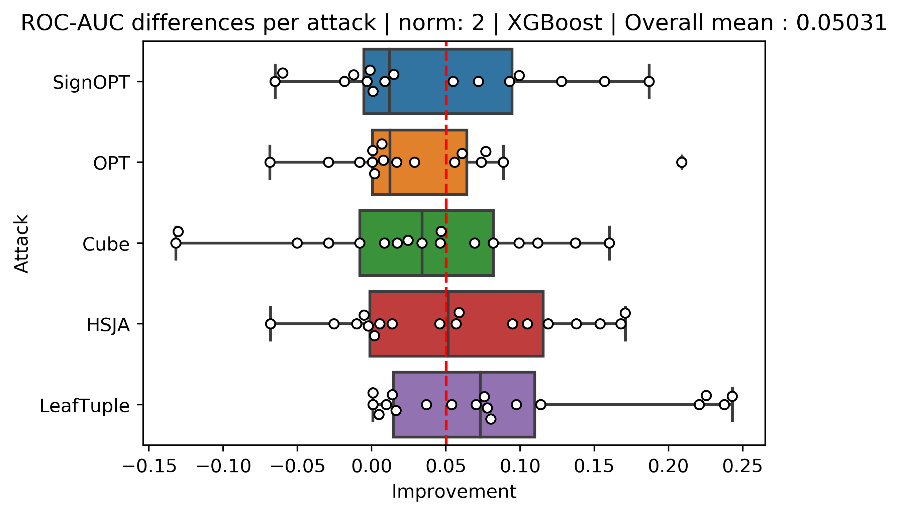
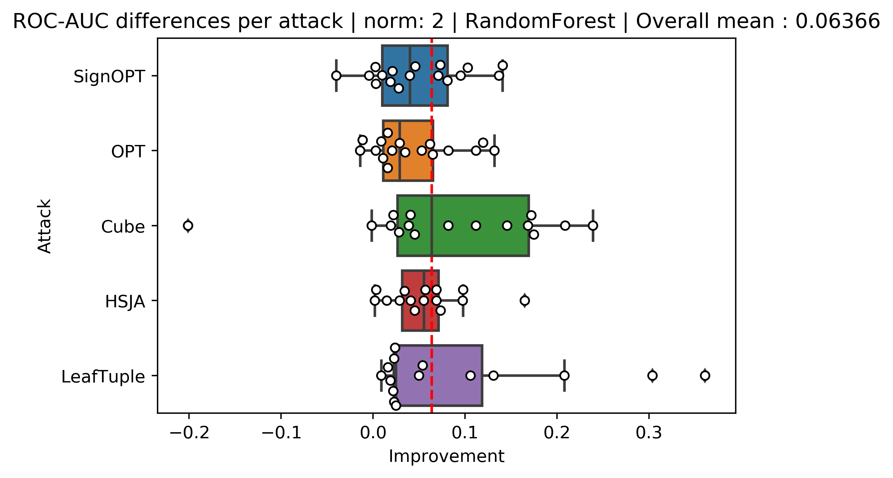
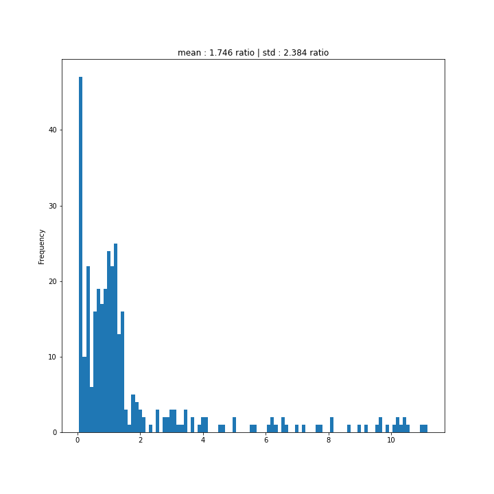

# Adversarial Evasion Attacks Detection for Tree-Based Ensembles: A Representation Learning Approach - Full Experiments Results

# Table of Contents

1. [Full Metrics Differences Figures](#full-metrics-differences-figures)
2. [XGBoost Full Experiments Results](#xgboost-full-experiments-results)
3. [RandomForest Full Experiments Results](#randomforest-full-experiments-results)
4. [Adversarial Samples Information](#adversarial-samples-information)
5. [Detector Ablation Study](#detector-ablation-study)
6. [Tree Models Performance Using Less Data](#tree-models-performance-using-less-data)
7. [Inference Time Addition](#inference-time-addition)

## Full Metrics Differences Figures

Here are all the different figures comparing our method to OC-Score and a detector based on the original representations of the dataset. For the experiments compared to the OC-score (Figures 1, 2, 3, 4, 5, 6, 7, and 8) the total mean and the median of each section is positive in all of them, which means that our metrics yielded better results for the new representation in most of our experiments. When looking at figures that compare our new method to the original representations (Figures 9, 10, 11, 12, 13, 14, 15 and 16) we can see the ROC-AUC and PR-AUC overall mean of the experiments is positive beside the experiments targeted XGBoost with L infinity  norm which the overall mean is negative.

### Figure 1: 

ROC-AUC differences for XGBoost experiments between our method and OC-score for L2 norm:

### Figure 2: 

PRC-AUC differences for XGBoost experiments between our method and OC-score for L2 norm:

### Figure 3: 

ROC-AUC differences for XGBoost experiments between our method and OC-score for L infinity  norm:

### Figure 4: 

PRC-AUC differences for XGBoost experiments between our method and OC-score for L infinity  norm:

### Figure 5: 

PRC-AUC differences for XGBoost experiments between the new method and original representation for L2 norm:

### Figure 6: 

ROC-AUC differences for XGBoost experiments between the new method and original representation for L infinity  norm:

### Figure 7: 

RC-AUC differences for XGBoost experiments between the new method and original representation for L infinity  norm:

### Figure 8: 

PRC-AUC differences for XGBoost experiments between the new method and original representation for L infinity  norm:

### Figure 9: 

ROC-AUC differences for RandomForest experiments between our method and OC-score for L2 norm:

### Figure 10: 

PRC-AUC differences for RandomForest experiments between our method and OC-score for L2 norm:

### Figure 11: 

OC-AUC differences for RandomForest experiments between our method and OC-score for L infinity  norm:

### Figure 12: 

PRC-AUC differences for RandomForest experiments between our method and OC-score for L infinity  norm:

### Figure 13: 

ROC-AUC differences for RandomForest experiments between the new method and original representation for L2 norm:

### Figure 14: 

PRC-AUC differences for RandomForest experiments between the new method and original representation for L2 norm:

### Figure 15: 

ROC-AUC differences for RandomForest experiments between the new method and original representation for L infinity  norm:

### Figure 16:

PRC-AUC differences for RandomForest experiments between the new method and original representation for L infinity  norm:

## XGBoost Full Experiments Results

In Tables 1,2,3,4 and 5 we can see the raw metrics of the experiments for each dataset, attack method, and norm for the XGBoost target experiments. In bold is the method or methods that achieved the highest value. Rows that fill in hyphens are cases where the adversarial sample creation process failed.

### Table 1: Sign-OPT XGBoost Experiments Results

<table>
  <thead>
    <tr>
      <th rowspan="2"></th>
      <th colspan="6">Sign-OPT L2 </th>
      <th colspan="6">Sign-OPT L infinity  </th>
    </tr>
    <tr>
      <th colspan="3">PRC-AUC</th>
      <th colspan="3">ROC-AUC</th>
      <th colspan="3">PRC-AUC</th>
      <th colspan="3">ROC-AUC</th>
    </tr>
    <tr>
      <th>Dataset</th>
      <th>New</th>
      <th>Original</th>
      <th>OC-score</th>
      <th>New</th>
      <th>Original</th>
      <th>OC-score</th>
      <th>New</th>
      <th>Original</th>
      <th>OC-score</th>
      <th>New</th>
      <th>Original</th>
      <th>OC-score</th>
    </tr>
  </thead>
  <tbody>
    <tr>
      <td>breast-cancer</td>
      <td>0.988</td>
      <td><strong><u>0.9919</u></strong></td>
      <td>0.958</td>
      <td>0.987</td>
      <td><strong><u>0.9919</u></strong></td>
      <td>0.965</td>
      <td><strong><u>0.9971</u></strong></td>
      <td>0.997</td>
      <td>0.960</td>
      <td><strong><u>0.997</u></strong></td>
      <td><strong><u>0.997</u></strong></td>
      <td>0.970</td>
    </tr>
    <tr>
      <td>covtype</td>
      <td><strong><u>1.0</u></strong></td>
      <td><strong><u>1.0</u></strong></td>
      <td>0.049</td>
      <td><strong><u>1.0</u></strong></td>
      <td><strong><u>1.0</u></strong></td>
      <td>0.843</td>
      <td><strong><u>1.0</u></strong></td>
      <td><strong><u>1.0</u></strong></td>
      <td>0.053</td>
      <td><strong><u>1.0</u></strong></td>
      <td><strong><u>1.0</u></strong></td>
      <td>0.833</td>
    </tr>
    <tr>
      <td>cod-rna</td>
      <td>0.743</td>
      <td><strong><u>0.7655</u></strong></td>
      <td>0.161</td>
      <td><strong><u>0.9795</u></strong></td>
      <td>0.955</td>
      <td>0.880</td>
      <td><strong><u>0.7773</u></strong></td>
      <td>0.599</td>
      <td>0.238</td>
      <td><strong><u>0.9808</u></strong></td>
      <td>0.936</td>
      <td>0.889</td>
    </tr>
    <tr>
      <td>diabetes</td>
      <td>0.672</td>
      <td><strong><u>0.855</u></strong></td>
      <td>0.730</td>
      <td>0.707</td>
      <td><strong><u>0.8432</u></strong></td>
      <td>0.772</td>
      <td>0.580</td>
      <td><strong><u>0.8668</u></strong></td>
      <td>0.445</td>
      <td>0.702</td>
      <td><strong><u>0.8678</u></strong></td>
      <td>0.615</td>
    </tr>
    <tr>
      <td>Fashion-MNIST</td>
      <td><strong><u>1.0</u></strong></td>
      <td><strong><u>1.0</u></strong></td>
      <td>0.157</td>
      <td><strong><u>1.0</u></strong></td>
      <td><strong><u>1.0</u></strong></td>
      <td>0.839</td>
      <td><strong><u>0.9999</u></strong></td>
      <td><strong><u>0.9999</u></strong></td>
      <td>0.237</td>
      <td><strong><u>1.0</u></strong></td>
      <td><strong><u>1.0</u></strong></td>
      <td>0.908</td>
    </tr>
    <tr>
      <td>ijcnn1</td>
      <td><strong><u>1.0</u></strong></td>
      <td><strong><u>1.0</u></strong></td>
      <td>0.181</td>
      <td><strong><u>1.0</u></strong></td>
      <td><strong><u>1.0</u></strong></td>
      <td>0.907</td>
      <td><strong><u>1.0</u></strong></td>
      <td><strong><u>1.0</u></strong></td>
      <td>0.276</td>
      <td><strong><u>1.0</u></strong></td>
      <td><strong><u>1.0</u></strong></td>
      <td>0.935</td>
    </tr>
    <tr>
      <td>MNIST</td>
      <td><strong><u>1.0</u></strong></td>
      <td><strong><u>1.0</u></strong></td>
      <td>0.327</td>
      <td><strong><u>1.0</u></strong></td>
      <td><strong><u>1.0</u></strong></td>
      <td>0.945</td>
      <td><strong><u>1.0</u></strong></td>
      <td><strong><u>1.0</u></strong></td>
      <td>0.434</td>
      <td><strong><u>1.0</u></strong></td>
      <td><strong><u>1.0</u></strong></td>
      <td>0.960</td>
    </tr>
    <tr>
      <td>MNIST2-6</td>
      <td><strong><u>0.9999</u></strong></td>
      <td><strong><u>0.9999</u></strong></td>
      <td>0.994</td>
      <td><strong><u>1.0</u></strong></td>
      <td><strong><u>1.0</u></strong></td>
      <td>0.999</td>
      <td><strong><u>1.0</u></strong></td>
      <td><strong><u>1.0</u></strong></td>
      <td>0.991</td>
      <td><strong><u>1.0</u></strong></td>
      <td><strong><u>1.0</u></strong></td>
      <td>0.999</td>
    </tr>
    <tr>
      <td>Sensorless</td>
      <td>0.887</td>
      <td>0.803</td>
      <td><strong><u>0.9111</u></strong></td>
      <td>0.980</td>
      <td>0.934</td>
      <td><strong><u>0.9982</u></strong></td>
      <td><strong><u>0.9709</u></strong></td>
      <td>0.939</td>
      <td>0.887</td>
      <td>0.997</td>
      <td>0.987</td>
      <td><strong><u>0.9984</u></strong></td>
    </tr>
    <tr>
      <td>webspam</td>
      <td><strong><u>1.0</u></strong></td>
      <td><strong><u>1.0</u></strong></td>
      <td>0.253</td>
      <td><strong><u>1.0</u></strong></td>
      <td><strong><u>1.0</u></strong></td>
      <td>0.985</td>
      <td><strong><u>1.0</u></strong></td>
      <td><strong><u>1.0</u></strong></td>
      <td>0.354</td>
      <td><strong><u>1.0</u></strong></td>
      <td><strong><u>1.0</u></strong></td>
      <td>0.990</td>
    </tr>
    <tr>
      <td>electricity</td>
      <td>0.751</td>
      <td><strong><u>0.9763</u></strong></td>
      <td>0.129</td>
      <td>0.955</td>
      <td><strong><u>0.997</u></strong></td>
      <td>0.883</td>
      <td>0.829</td>
      <td><strong><u>0.9661</u></strong></td>
      <td>0.300</td>
      <td>0.970</td>
      <td><strong><u>0.9968</u></strong></td>
      <td>0.901</td>
    </tr>
    <tr>
      <td>drybean</td>
      <td>0.942</td>
      <td><strong><u>0.9617</u></strong></td>
      <td>0.705</td>
      <td>0.975</td>
      <td><strong><u>0.9862</u></strong></td>
      <td>0.974</td>
      <td><strong><u>0.9585</u></strong></td>
      <td>0.914</td>
      <td>0.796</td>
      <td><strong><u>0.9868</u></strong></td>
      <td>0.955</td>
      <td>0.967</td>
    </tr>
    <tr>
      <td>adult</td>
      <td><strong><u>1.0</u></strong></td>
      <td><strong><u>1.0</u></strong></td>
      <td>0.109</td>
      <td><strong><u>1.0</u></strong></td>
      <td><strong><u>1.0</u></strong></td>
      <td>0.813</td>
      <td><strong><u>1.0</u></strong></td>
      <td><strong><u>1.0</u></strong></td>
      <td>0.128</td>
      <td><strong><u>1.0</u></strong></td>
      <td><strong><u>1.0</u></strong></td>
      <td>0.817</td>
    </tr>
    <tr>
      <td>banknote</td>
      <td>0.968</td>
      <td><strong><u>0.99</u></strong></td>
      <td>0.768</td>
      <td>0.970</td>
      <td><strong><u>0.9918</u></strong></td>
      <td>0.961</td>
      <td><strong><u>0.9699</u></strong></td>
      <td>0.961</td>
      <td>0.798</td>
      <td><strong><u>0.9822</u></strong></td>
      <td>0.982</td>
      <td>0.957</td>
    </tr>
    <tr>
      <td>gender-by-voice</td>
      <td><strong><u>0.9854</u></strong></td>
      <td>0.983</td>
      <td>0.887</td>
      <td><strong><u>0.9897</u></strong></td>
      <td>0.989</td>
      <td>0.978</td>
      <td>0.982</td>
      <td><strong><u>0.9964</u></strong></td>
      <td>0.960</td>
      <td>0.990</td>
      <td><strong><u>0.9975</u></strong></td>
      <td>0.993</td>
    </tr>
    <tr>
      <td>waveform</td>
      <td>0.540</td>
      <td><strong><u>0.5538</u></strong></td>
      <td>0.380</td>
      <td>0.803</td>
      <td>0.801</td>
      <td><strong><u>0.8628</u></strong></td>
      <td>0.467</td>
      <td><strong><u>0.5575</u></strong></td>
      <td>0.461</td>
      <td>0.717</td>
      <td>0.779</td>
      <td><strong><u>0.8665</u></strong></td>
    </tr>
    <tr>
      <td>wind</td>
      <td>0.695</td>
      <td><strong><u>0.8821</u></strong></td>
      <td>0.183</td>
      <td>0.858</td>
      <td><strong><u>0.9414</u></strong></td>
      <td>0.730</td>
      <td>0.526</td>
      <td><strong><u>0.7558</u></strong></td>
      <td>0.205</td>
      <td>0.819</td>
      <td><strong><u>0.8812</u></strong></td>
      <td>0.742</td>
    </tr>
    <tr>
      <td>speech</td>
      <td>0.990</td>
      <td>0.915</td>
      <td><strong><u>1.0</u></strong></td>
      <td>0.999</td>
      <td>0.995</td>
      <td><strong><u>1.0</u></strong></td>
      <td><strong><u>0.9943</u></strong></td>
      <td>0.965</td>
      <td>0.967</td>
      <td><strong><u>0.9987</u></strong></td>
      <td>0.990</td>
      <td>0.998</td>
    </tr>
  </tbody>
</table>
  

### Table 2: OPT XGBoost Experiments Results

<table>
  <thead>
    <tr>
      <th rowspan="2"></th>
      <th colspan="6">OPT L2 </th>
      <th colspan="6">OPT L infinity  </th>
    </tr>
    <tr>
      <th colspan="3">PRC-AUC</th>
      <th colspan="3">ROC-AUC</th>
      <th colspan="3">PRC-AUC</th>
      <th colspan="3">ROC-AUC</th>
    </tr>
    <tr>
      <th>Dataset</th>
      <th>New</th>
      <th>Original</th>
      <th>OC-score</th>
      <th>New</th>
      <th>Original</th>
      <th>OC-score</th>
      <th>New</th>
      <th>Original</th>
      <th>OC-score</th>
      <th>New</th>
      <th>Original</th>
      <th>OC-score</th>
    </tr>
  </thead>
  <tbody>
    <tr>
      <td>breast-cancer</td>
      <td>0.992</td>
      <td><strong><u>0.9956</u></strong></td>
      <td>0.867</td>
      <td>0.992</td>
      <td><strong><u>0.9952</u></strong></td>
      <td>0.925</td>
      <td>0.973</td>
      <td><strong><u>0.9737</u></strong></td>
      <td>0.920</td>
      <td><strong><u>0.9788</u></strong></td>
      <td>0.978</td>
      <td>0.968</td>
    </tr>
    <tr>
      <td>covtype</td>
      <td><strong><u>1.0</u></strong></td>
      <td><strong><u>1.0</u></strong></td>
      <td>0.056</td>
      <td><strong><u>1.0</u></strong></td>
      <td><strong><u>1.0</u></strong></td>
      <td>0.768</td>
      <td><strong><u>1.0</u></strong></td>
      <td><strong><u>1.0</u></strong></td>
      <td>0.072</td>
      <td><strong><u>1.0</u></strong></td>
      <td><strong><u>1.0</u></strong></td>
      <td>0.856</td>
    </tr>
    <tr>
      <td>cod-rna</td>
      <td><strong><u>0.804</u></strong></td>
      <td>0.716</td>
      <td>0.183</td>
      <td><strong><u>0.9808</u></strong></td>
      <td>0.958</td>
      <td>0.892</td>
      <td><strong><u>0.8035</u></strong></td>
      <td>0.647</td>
      <td>0.234</td>
      <td><strong><u>0.9774</u></strong></td>
      <td>0.953</td>
      <td>0.907</td>
    </tr>
    <tr>
      <td>diabetes</td>
      <td>0.652</td>
      <td><strong><u>0.8434</u></strong></td>
      <td>0.594</td>
      <td>0.675</td>
      <td><strong><u>0.8612</u></strong></td>
      <td>0.741</td>
      <td><strong><u>0.8455</u></strong></td>
      <td>0.751</td>
      <td>0.699</td>
      <td><strong><u>0.8174</u></strong></td>
      <td>0.745</td>
      <td>0.736</td>
    </tr>
    <tr>
      <td>Fashion-MNIST</td>
      <td><strong><u>1.0</u></strong></td>
      <td><strong><u>1.0</u></strong></td>
      <td>0.370</td>
      <td><strong><u>1.0</u></strong></td>
      <td><strong><u>1.0</u></strong></td>
      <td>0.923</td>
      <td><strong><u>1.0</u></strong></td>
      <td><strong><u>1.0</u></strong></td>
      <td>0.445</td>
      <td><strong><u>1.0</u></strong></td>
      <td><strong><u>1.0</u></strong></td>
      <td>0.936</td>
    </tr>
    <tr>
      <td>ijcnn1</td>
      <td><strong><u>1.0</u></strong></td>
      <td><strong><u>1.0</u></strong></td>
      <td>0.273</td>
      <td><strong><u>1.0</u></strong></td>
      <td><strong><u>1.0</u></strong></td>
      <td>0.926</td>
      <td><strong><u>1.0</u></strong></td>
      <td><strong><u>1.0</u></strong></td>
      <td>0.246</td>
      <td><strong><u>1.0</u></strong></td>
      <td><strong><u>1.0</u></strong></td>
      <td>0.941</td>
    </tr>
    <tr>
      <td>MNIST</td>
      <td><strong><u>1.0</u></strong></td>
      <td><strong><u>1.0</u></strong></td>
      <td>0.476</td>
      <td><strong><u>1.0</u></strong></td>
      <td><strong><u>1.0</u></strong></td>
      <td>0.971</td>
      <td><strong><u>1.0</u></strong></td>
      <td><strong><u>1.0</u></strong></td>
      <td>0.566</td>
      <td><strong><u>1.0</u></strong></td>
      <td><strong><u>1.0</u></strong></td>
      <td>0.975</td>
    </tr>
    <tr>
      <td>MNIST2-6</td>
      <td><strong><u>1.0</u></strong></td>
      <td><strong><u>1.0</u></strong></td>
      <td>0.996</td>
      <td><strong><u>1.0</u></strong></td>
      <td><strong><u>1.0</u></strong></td>
      <td><strong><u>1.0</u></strong></td>
      <td><strong><u>1.0</u></strong></td>
      <td><strong><u>1.0</u></strong></td>
      <td>0.986</td>
      <td><strong><u>1.0</u></strong></td>
      <td><strong><u>1.0</u></strong></td>
      <td>0.999</td>
    </tr>
    <tr>
      <td>sensorless</td>
      <td><strong><u>0.9929</u></strong></td>
      <td>0.974</td>
      <td>0.883</td>
      <td><strong><u>0.9998</u></strong></td>
      <td>0.999</td>
      <td>0.999</td>
      <td><strong><u>0.9871</u></strong></td>
      <td>0.965</td>
      <td>0.877</td>
      <td><strong><u>0.999</u></strong></td>
      <td>0.993</td>
      <td>0.998</td>
    </tr>
    <tr>
      <td>webspam</td>
      <td><strong><u>1.0</u></strong></td>
      <td><strong><u>1.0</u></strong></td>
      <td>0.399</td>
      <td><strong><u>1.0</u></strong></td>
      <td><strong><u>1.0</u></strong></td>
      <td>0.992</td>
      <td><strong><u>1.0</u></strong></td>
      <td><strong><u>1.0</u></strong></td>
      <td>0.387</td>
      <td><strong><u>1.0</u></strong></td>
      <td><strong><u>1.0</u></strong></td>
      <td>0.991</td>
    </tr>
    <tr>
      <td>electricity</td>
      <td>0.774</td>
      <td><strong><u>0.8818</u></strong></td>
      <td>0.248</td>
      <td>0.948</td>
      <td><strong><u>0.982</u></strong></td>
      <td>0.887</td>
      <td>0.852</td>
      <td><strong><u>0.891</u></strong></td>
      <td>0.286</td>
      <td><strong><u>0.9731</u></strong></td>
      <td>0.960</td>
      <td>0.904</td>
    </tr>
    <tr>
      <td>drybean</td>
      <td><strong><u>0.9536</u></strong></td>
      <td>0.935</td>
      <td>0.848</td>
      <td><strong><u>0.9861</u></strong></td>
      <td>0.969</td>
      <td>0.984</td>
      <td><strong><u>0.9396</u></strong></td>
      <td>0.934</td>
      <td>0.877</td>
      <td>0.964</td>
      <td>0.970</td>
      <td><strong><u>0.9869</u></strong></td>
    </tr>
    <tr>
      <td>adult</td>
      <td><strong><u>1.0</u></strong></td>
      <td><strong><u>1.0</u></strong></td>
      <td>0.076</td>
      <td><strong><u>1.0</u></strong></td>
      <td><strong><u>1.0</u></strong></td>
      <td>0.791</td>
      <td><strong><u>1.0</u></strong></td>
      <td><strong><u>1.0</u></strong></td>
      <td>0.058</td>
      <td><strong><u>1.0</u></strong></td>
      <td><strong><u>1.0</u></strong></td>
      <td>0.702</td>
    </tr>
    <tr>
      <td>banknote</td>
      <td><strong><u>0.9893</u></strong></td>
      <td>0.950</td>
      <td>0.911</td>
      <td><strong><u>0.9906</u></strong></td>
      <td>0.984</td>
      <td>0.976</td>
      <td><strong><u>0.956</u></strong></td>
      <td>0.942</td>
      <td>0.876</td>
      <td>0.974</td>
      <td>0.967</td>
      <td><strong><u>0.9767</u></strong></td>
    </tr>
    <tr>
      <td>gender-by-voice</td>
      <td>0.964</td>
      <td><strong><u>0.9943</u></strong></td>
      <td>0.812</td>
      <td>0.981</td>
      <td><strong><u>0.9964</u></strong></td>
      <td>0.964</td>
      <td>0.976</td>
      <td><strong><u>0.9926</u></strong></td>
      <td>0.842</td>
      <td>0.987</td>
      <td><strong><u>0.9951</u></strong></td>
      <td>0.974</td>
    </tr>
    <tr>
      <td>waveform</td>
      <td>0.538</td>
      <td><strong><u>0.6195</u></strong></td>
      <td>0.392</td>
      <td>0.784</td>
      <td>0.777</td>
      <td><strong><u>0.8524</u></strong></td>
      <td>0.590</td>
      <td><strong><u>0.6673</u></strong></td>
      <td>0.395</td>
      <td>0.819</td>
      <td>0.800</td>
      <td><strong><u>0.8813</u></strong></td>
    </tr>
    <tr>
      <td>wind</td>
      <td>0.476</td>
      <td><strong><u>0.7908</u></strong></td>
      <td>0.210</td>
      <td>0.777</td>
      <td><strong><u>0.9054</u></strong></td>
      <td>0.785</td>
      <td>0.423</td>
      <td><strong><u>0.7694</u></strong></td>
      <td>0.176</td>
      <td>0.755</td>
      <td><strong><u>0.8653</u></strong></td>
      <td>0.729</td>
    </tr>
    <tr>
      <td>speech</td>
      <td><strong><u>0.9917</u></strong></td>
      <td>0.983</td>
      <td>0.973</td>
      <td><strong><u>0.9986</u></strong></td>
      <td>0.997</td>
      <td>0.998</td>
      <td><strong><u>0.9957</u></strong></td>
      <td>0.799</td>
      <td>0.984</td>
      <td>0.9996</td>
      <td>0.977</td>
      <td><strong><u>1.0</u></strong></td>
    </tr>
  </tbody>
</table>

### Table 3: HSJA XGBoost Experiments Results

<table>
  <thead>
    <tr>
      <th rowspan="2"></th>
      <th colspan="6">HSJA L2 </th>
      <th colspan="6">HSJA L infinity  </th>
    </tr>
    <tr>
      <th colspan="3">PRC-AUC</th>
      <th colspan="3">ROC-AUC</th>
      <th colspan="3">PRC-AUC</th>
      <th colspan="3">ROC-AUC</th>
    </tr>
    <tr>
      <th>Dataset</th>
      <th>New</th>
      <th>Original</th>
      <th>OC-score</th>
      <th>New</th>
      <th>Original</th>
      <th>OC-score</th>
      <th>New</th>
      <th>Original</th>
      <th>OC-score</th>
      <th>New</th>
      <th>Original</th>
      <th>OC-score</th>
    </tr>
  </thead>
  <tbody>
    <tr>
      <td>breast-cancer</td>
      <td><strong><u>0.9909</u></strong></td>
      <td>0.988</td>
      <td>0.799</td>
      <td><strong><u>0.9905</u></strong></td>
      <td>0.988</td>
      <td>0.923</td>
      <td>0.982</td>
      <td><strong><u>0.9956</u></strong></td>
      <td>0.934</td>
      <td>0.987</td>
      <td><strong><u>0.9958</u></strong></td>
      <td>0.954</td>
    </tr>
    <tr>
      <td>covtype</td>
      <td><strong><u>1.0</u></strong></td>
      <td><strong><u>1.0</u></strong></td>
      <td>0.159</td>
      <td><strong><u>1.0</u></strong></td>
      <td><strong><u>1.0</u></strong></td>
      <td>0.832</td>
      <td><strong><u>1.0</u></strong></td>
      <td><strong><u>1.0</u></strong></td>
      <td>0.230</td>
      <td><strong><u>1.0</u></strong></td>
      <td><strong><u>1.0</u></strong></td>
      <td>0.811</td>
    </tr>
    <tr>
      <td>cod-rna</td>
      <td><strong><u>0.8193</u></strong></td>
      <td>0.669</td>
      <td>0.107</td>
      <td><strong><u>0.9879</u></strong></td>
      <td>0.926</td>
      <td>0.817</td>
      <td><strong><u>0.8389</u></strong></td>
      <td>0.594</td>
      <td>0.185</td>
      <td><strong><u>0.9891</u></strong></td>
      <td>0.944</td>
      <td>0.847</td>
    </tr>
    <tr>
      <td>diabetes</td>
      <td><strong><u>0.7947</u></strong></td>
      <td>0.786</td>
      <td>0.522</td>
      <td><strong><u>0.834</u></strong></td>
      <td>0.830</td>
      <td>0.708</td>
      <td>0.787</td>
      <td><strong><u>0.8219</u></strong></td>
      <td>0.516</td>
      <td>0.790</td>
      <td><strong><u>0.8325</u></strong></td>
      <td>0.710</td>
    </tr>
    <tr>
      <td>Fashion-MNIST</td>
      <td>0.994</td>
      <td><strong><u>0.998</u></strong></td>
      <td>0.235</td>
      <td><strong><u>1.0</u></strong></td>
      <td><strong><u>1.0</u></strong></td>
      <td>0.881</td>
      <td><strong><u>1.0</u></strong></td>
      <td>0.9997</td>
      <td>0.266</td>
      <td><strong><u>1.0</u></strong></td>
      <td><strong><u>1.0</u></strong></td>
      <td>0.868</td>
    </tr>
    <tr>
      <td>ijcnn1</td>
      <td><strong><u>1.0</u></strong></td>
      <td><strong><u>1.0</u></strong></td>
      <td>0.089</td>
      <td><strong><u>1.0</u></strong></td>
      <td><strong><u>1.0</u></strong></td>
      <td>0.846</td>
      <td><strong><u>1.0</u></strong></td>
      <td><strong><u>1.0</u></strong></td>
      <td>0.132</td>
      <td><strong><u>1.0</u></strong></td>
      <td><strong><u>1.0</u></strong></td>
      <td>0.893</td>
    </tr>
    <tr>
      <td>MNIST</td>
      <td><strong><u>1.0</u></strong></td>
      <td><strong><u>1.0</u></strong></td>
      <td>0.493</td>
      <td><strong><u>1.0</u></strong></td>
      <td><strong><u>1.0</u></strong></td>
      <td>0.954</td>
      <td><strong><u>1.0</u></strong></td>
      <td><strong><u>1.0</u></strong></td>
      <td>0.420</td>
      <td><strong><u>1.0</u></strong></td>
      <td><strong><u>1.0</u></strong></td>
      <td>0.945</td>
    </tr>
    <tr>
      <td>MNIST2-6</td>
      <td><strong><u>1.0</u></strong></td>
      <td><strong><u>1.0</u></strong></td>
      <td>0.965</td>
      <td><strong><u>1.0</u></strong></td>
      <td><strong><u>1.0</u></strong></td>
      <td>0.998</td>
      <td><strong><u>1.0</u></strong></td>
      <td><strong><u>1.0</u></strong></td>
      <td>0.972</td>
      <td><strong><u>1.0</u></strong></td>
      <td><strong><u>1.0</u></strong></td>
      <td>0.998</td>
    </tr>
    <tr>
      <td>sensorless</td>
      <td><strong><u>0.8562</u></strong></td>
      <td>0.729</td>
      <td>0.839</td>
      <td>0.972</td>
      <td>0.920</td>
      <td><strong><u>0.9973</u></strong></td>
      <td><strong><u>0.9175</u></strong></td>
      <td>0.782</td>
      <td>0.893</td>
      <td>0.990</td>
      <td>0.934</td>
      <td><strong><u>0.9984</u></strong></td>
    </tr>
    <tr>
      <td>webspam</td>
      <td><strong><u>0.9859</u></strong></td>
      <td>0.986</td>
      <td>0.232</td>
      <td>0.9999</td>
      <td><strong><u>1.0</u></strong></td>
      <td>0.986</td>
      <td><strong><u>1.0</u></strong></td>
      <td><strong><u>1.0</u></strong></td>
      <td>0.212</td>
      <td><strong><u>1.0</u></strong></td>
      <td><strong><u>1.0</u></strong></td>
      <td>0.984</td>
    </tr>
    <tr>
      <td>electricity</td>
      <td>0.795</td>
      <td><strong><u>0.9084</u></strong></td>
      <td>0.098</td>
      <td>0.962</td>
      <td><strong><u>0.9789</u></strong></td>
      <td>0.824</td>
      <td><strong><u>0.8877</u></strong></td>
      <td>0.853</td>
      <td>0.189</td>
      <td><strong><u>0.9841</u></strong></td>
      <td>0.953</td>
      <td>0.852</td>
    </tr>
    <tr>
      <td>drybean</td>
      <td><strong><u>0.9568</u></strong></td>
      <td>0.943</td>
      <td>0.872</td>
      <td><strong><u>0.9826</u></strong></td>
      <td>0.974</td>
      <td>0.977</td>
      <td><strong><u>0.9561</u></strong></td>
      <td>0.953</td>
      <td>0.846</td>
      <td><strong><u>0.9795</u></strong></td>
      <td>0.979</td>
      <td>0.978</td>
    </tr>
    <tr>
      <td>adult</td>
      <td><strong><u>1.0</u></strong></td>
      <td><strong><u>1.0</u></strong></td>
      <td>0.458</td>
      <td><strong><u>1.0</u></strong></td>
      <td><strong><u>1.0</u></strong></td>
      <td>0.905</td>
      <td><strong><u>1.0</u></strong></td>
      <td><strong><u>1.0</u></strong></td>
      <td>0.366</td>
      <td><strong><u>1.0</u></strong></td>
      <td><strong><u>1.0</u></strong></td>
      <td>0.883</td>
    </tr>
    <tr>
      <td>banknote</td>
      <td><strong><u>0.8879</u></strong></td>
      <td>0.851</td>
      <td>0.742</td>
      <td>0.889</td>
      <td><strong><u>0.9017</u></strong></td>
      <td>0.901</td>
      <td>0.895</td>
      <td><strong><u>0.901</u></strong></td>
      <td>0.658</td>
      <td><strong><u>0.9265</u></strong></td>
      <td>0.907</td>
      <td>0.869</td>
    </tr>
    <tr>
      <td>gender-by-voice</td>
      <td>0.920</td>
      <td><strong><u>0.9668</u></strong></td>
      <td>0.787</td>
      <td>0.952</td>
      <td><strong><u>0.9758</u></strong></td>
      <td>0.962</td>
      <td>0.961</td>
      <td><strong><u>0.9882</u></strong></td>
      <td>0.721</td>
      <td>0.975</td>
      <td><strong><u>0.9927</u></strong></td>
      <td>0.947</td>
    </tr>
    <tr>
      <td>waveform</td>
      <td><strong><u>0.6012</u></strong></td>
      <td>0.592</td>
      <td>0.493</td>
      <td>0.774</td>
      <td>0.768</td>
      <td><strong><u>0.883</u></strong></td>
      <td>0.680</td>
      <td><strong><u>0.692</u></strong></td>
      <td>0.372</td>
      <td><strong><u>0.8323</u></strong></td>
      <td>0.815</td>
      <td>0.831</td>
    </tr>
    <tr>
      <td>wind</td>
      <td>0.763</td>
      <td><strong><u>0.7846</u></strong></td>
      <td>0.309</td>
      <td>0.881</td>
      <td><strong><u>0.8814</u></strong></td>
      <td>0.824</td>
      <td>0.712</td>
      <td><strong><u>0.8311</u></strong></td>
      <td>0.328</td>
      <td>0.870</td>
      <td><strong><u>0.9151</u></strong></td>
      <td>0.789</td>
    </tr>
    <tr>
      <td>speech</td>
      <td><strong><u>0.9965</u></strong></td>
      <td>0.994</td>
      <td>0.989</td>
      <td><strong><u>0.9993</u></strong></td>
      <td>0.999</td>
      <td>0.999</td>
      <td>0.996</td>
      <td>0.994</td>
      <td><strong><u>0.9995</u></strong></td>
      <td>0.999</td>
      <td>0.998</td>
      <td><strong><u>1.0</u></strong></td>
    </tr>
  </tbody>
</table>

### Table 4: Cube XGBoost Experiments Results

<table>
  <thead>
    <tr>
      <th rowspan="2"></th>
      <th colspan="6">Cube L2 </th>
      <th colspan="6">Cube L infinity  </th>
    </tr>
    <tr>
      <th colspan="3">PRC-AUC</th>
      <th colspan="3">ROC-AUC</th>
      <th colspan="3">PRC-AUC</th>
      <th colspan="3">ROC-AUC</th>
    </tr>
    <tr>
      <th>Dataset</th>
      <th>New</th>
      <th>Original</th>
      <th>OC-score</th>
      <th>New</th>
      <th>Original</th>
      <th>OC-score</th>
      <th>New</th>
      <th>Original</th>
      <th>OC-score</th>
      <th>New</th>
      <th>Original</th>
      <th>OC-score</th>
    </tr>
  </thead>
  <tbody>
    <tr>
      <td>breast-cancer</td>
      <td>0.537</td>
      <td>0.212</td>
      <td><strong><u>0.7413</u></strong></td>
      <td>0.756</td>
      <td>0.591</td>
      <td><strong><u>0.8878</u></strong></td>
      <td>0.869</td>
      <td><strong><u>0.9257</u></strong></td>
      <td>0.303</td>
      <td>0.931</td>
      <td><strong><u>0.9665</u></strong></td>
      <td>0.575</td>
    </tr>
    <tr>
      <td>covtype</td>
      <td><strong><u>0.9823</u></strong></td>
      <td>0.020</td>
      <td>0.045</td>
      <td><strong><u>0.9998</u></strong></td>
      <td>0.649</td>
      <td>0.838</td>
      <td><strong><u>1.0</u></strong></td>
      <td><strong><u>1.0</u></strong></td>
      <td>0.043</td>
      <td><strong><u>1.0</u></strong></td>
      <td><strong><u>1.0</u></strong></td>
      <td>0.893</td>
    </tr>
    <tr>
      <td>cod-rna</td>
      <td><strong><u>0.7678</u></strong></td>
      <td>0.212</td>
      <td>0.183</td>
      <td><strong><u>0.985</u></strong></td>
      <td>0.800</td>
      <td>0.873</td>
      <td><strong><u>0.8643</u></strong></td>
      <td>0.732</td>
      <td>0.343</td>
      <td><strong><u>0.9841</u></strong></td>
      <td>0.944</td>
      <td>0.915</td>
    </tr>
    <tr>
      <td>diabetes</td>
      <td><strong><u>0.5437</u></strong></td>
      <td>0.458</td>
      <td>0.258</td>
      <td><strong><u>0.7935</u></strong></td>
      <td>0.717</td>
      <td>0.724</td>
      <td>0.567</td>
      <td><strong><u>0.6097</u></strong></td>
      <td>0.532</td>
      <td><strong><u>0.7316</u></strong></td>
      <td>0.667</td>
      <td>0.710</td>
    </tr>
    <tr>
      <td>Fashion-MNIST</td>
      <td><strong><u>0.9094</u></strong></td>
      <td>0.538</td>
      <td>0.098</td>
      <td><strong><u>0.9951</u></strong></td>
      <td>0.798</td>
      <td>0.850</td>
      <td><strong><u>0.8929</u></strong></td>
      <td>0.750</td>
      <td>0.014</td>
      <td><strong><u>0.9996</u></strong></td>
      <td>0.999</td>
      <td>0.903</td>
    </tr>
    <tr>
      <td>ijcnn1</td>
      <td><strong><u>0.773</u></strong></td>
      <td>0.310</td>
      <td>0.246</td>
      <td><strong><u>0.987</u></strong></td>
      <td>0.915</td>
      <td>0.905</td>
      <td>0.998</td>
      <td><strong><u>0.9998</u></strong></td>
      <td>0.216</td>
      <td><strong><u>1.0</u></strong></td>
      <td><strong><u>1.0</u></strong></td>
      <td>0.912</td>
    </tr>
    <tr>
      <td>MNIST</td>
      <td><strong><u>0.7755</u></strong></td>
      <td>0.263</td>
      <td>0.202</td>
      <td><strong><u>0.9846</u></strong></td>
      <td>0.735</td>
      <td>0.926</td>
      <td><strong><u>1.0</u></strong></td>
      <td><strong><u>1.0</u></strong></td>
      <td>0.028</td>
      <td><strong><u>1.0</u></strong></td>
      <td><strong><u>1.0</u></strong></td>
      <td>0.917</td>
    </tr>
    <tr>
      <td>MNIST2-6</td>
      <td>0.968</td>
      <td><strong><u>0.9853</u></strong></td>
      <td>0.977</td>
      <td>0.990</td>
      <td>0.995</td>
      <td><strong><u>0.9979</u></strong></td>
      <td><strong><u>1.0</u></strong></td>
      <td><strong><u>1.0</u></strong></td>
      <td>0.987</td>
      <td><strong><u>1.0</u></strong></td>
      <td><strong><u>1.0</u></strong></td>
      <td>0.999</td>
    </tr>
    <tr>
      <td>sensorless</td>
      <td><strong><u>0.8793</u></strong></td>
      <td>0.650</td>
      <td>0.595</td>
      <td>0.994</td>
      <td>0.916</td>
      <td><strong><u>0.9961</u></strong></td>
      <td><strong><u>1.0</u></strong></td>
      <td><strong><u>1.0</u></strong></td>
      <td>0.770</td>
      <td><strong><u>1.0</u></strong></td>
      <td><strong><u>1.0</u></strong></td>
      <td>0.996</td>
    </tr>
    <tr>
      <td>webspam</td>
      <td><strong><u>0.9185</u></strong></td>
      <td>0.843</td>
      <td>0.297</td>
      <td><strong><u>0.9987</u></strong></td>
      <td>0.984</td>
      <td>0.990</td>
      <td><strong><u>0.9994</u></strong></td>
      <td><strong><u>0.9994</u></strong></td>
      <td>0.390</td>
      <td><strong><u>1.0</u></strong></td>
      <td><strong><u>1.0</u></strong></td>
      <td>0.990</td>
    </tr>
    <tr>
      <td>electricity</td>
      <td><strong><u>0.7746</u></strong></td>
      <td>0.671</td>
      <td>0.312</td>
      <td><strong><u>0.9666</u></strong></td>
      <td>0.887</td>
      <td>0.904</td>
      <td><strong><u>0.9931</u></strong></td>
      <td>0.986</td>
      <td>0.652</td>
      <td><strong><u>0.9996</u></strong></td>
      <td>0.995</td>
      <td>0.969</td>
    </tr>
    <tr>
      <td>drybean</td>
      <td><strong><u>0.9954</u></strong></td>
      <td>0.987</td>
      <td>0.720</td>
      <td><strong><u>0.9996</u></strong></td>
      <td>0.999</td>
      <td>0.975</td>
      <td><strong><u>1.0</u></strong></td>
      <td><strong><u>1.0</u></strong></td>
      <td>0.610</td>
      <td><strong><u>1.0</u></strong></td>
      <td><strong><u>1.0</u></strong></td>
      <td>0.937</td>
    </tr>
    <tr>
      <td>adult</td>
      <td>0.944</td>
      <td><strong><u>0.9454</u></strong></td>
      <td>0.315</td>
      <td><strong><u>0.993</u></strong></td>
      <td>0.985</td>
      <td>0.941</td>
      <td><strong><u>1.0</u></strong></td>
      <td><strong><u>1.0</u></strong></td>
      <td>0.551</td>
      <td><strong><u>1.0</u></strong></td>
      <td><strong><u>1.0</u></strong></td>
      <td>0.998</td>
    </tr>
    <tr>
      <td>banknote</td>
      <td><strong><u>0.6201</u></strong></td>
      <td>0.538</td>
      <td>0.469</td>
      <td>0.971</td>
      <td>0.862</td>
      <td><strong><u>0.9893</u></strong></td>
      <td><strong><u>0.9973</u></strong></td>
      <td><strong><u>0.9973</u></strong></td>
      <td>0.364</td>
      <td><strong><u>0.9992</u></strong></td>
      <td><strong><u>0.9992</u></strong></td>
      <td>0.923</td>
    </tr>
    <tr>
      <td>gender-by-voice</td>
      <td>0.811</td>
      <td><strong><u>0.866</u></strong></td>
      <td>0.663</td>
      <td>0.915</td>
      <td>0.943</td>
      <td><strong><u>0.9439</u></strong></td>
      <td><strong><u>1.0</u></strong></td>
      <td><strong><u>1.0</u></strong></td>
      <td>0.117</td>
      <td><strong><u>1.0</u></strong></td>
      <td><strong><u>1.0</u></strong></td>
      <td>0.671</td>
    </tr>
    <tr>
      <td>waveform</td>
      <td><strong><u>0.9614</u></strong></td>
      <td>0.959</td>
      <td>0.426</td>
      <td><strong><u>0.9754</u></strong></td>
      <td>0.969</td>
      <td>0.838</td>
      <td><strong><u>1.0</u></strong></td>
      <td><strong><u>1.0</u></strong></td>
      <td>0.188</td>
      <td><strong><u>1.0</u></strong></td>
      <td><strong><u>1.0</u></strong></td>
      <td>0.705</td>
    </tr>
    <tr>
      <td>wind</td>
      <td><strong><u>1.0</u></strong></td>
      <td><strong><u>1.0</u></strong></td>
      <td>0.754</td>
      <td><strong><u>1.0</u></strong></td>
      <td><strong><u>1.0</u></strong></td>
      <td>0.966</td>
      <td><strong><u>1.0</u></strong></td>
      <td><strong><u>1.0</u></strong></td>
      <td>0.017</td>
      <td><strong><u>1.0</u></strong></td>
      <td><strong><u>1.0</u></strong></td>
      <td>0.119</td>
    </tr>
    <tr>
      <td>speech</td>
      <td>-</td>
      <td>-</td>
      <td>-</td>
      <td>-</td>
      <td>-</td>
      <td>-</td>
      <td>-</td>
      <td>-</td>
      <td>-</td>
      <td>-</td>
      <td>-</td>
      <td>-</td>
    </tr>
  </tbody>
</table>

### Table 5: Leaf-Tuple XGBoost Experiments Results

<table>
  <thead>
    <tr>
      <th rowspan="2"></th>
      <th colspan="6">Leaf-Tuple L2 </th>
      <th colspan="6">Leaf-Tuple L infinity  </th>
    </tr>
    <tr>
      <th colspan="3">PRC-AUC</th>
      <th colspan="3">ROC-AUC</th>
      <th colspan="3">PRC-AUC</th>
      <th colspan="3">ROC-AUC</th>
    </tr>
    <tr>
      <th>Dataset</th>
      <th>New</th>
      <th>Original</th>
      <th>OC-score</th>
      <th>New</th>
      <th>Original</th>
      <th>OC-score</th>
      <th>New</th>
      <th>Original</th>
      <th>OC-score</th>
      <th>New</th>
      <th>Original</th>
      <th>OC-score</th>
    </tr>
  </thead>
  <tbody>
    <tr>
      <td>breast-cancer</td>
      <td><strong><u>0.9954</u></strong></td>
      <td>0.989</td>
      <td>0.921</td>
      <td><strong><u>0.9954</u></strong></td>
      <td>0.988</td>
      <td>0.915</td>
      <td>0.871</td>
      <td>0.835</td>
      <td><strong><u>0.9399</u></strong></td>
      <td>0.893</td>
      <td>0.854</td>
      <td><strong><u>0.9356</u></strong></td>
    </tr>
    <tr>
      <td>covtype</td>
      <td><strong><u>0.9962</u></strong></td>
      <td>0.723</td>
      <td>0.118</td>
      <td><strong><u>0.9995</u></strong></td>
      <td>0.934</td>
      <td>0.761</td>
      <td><strong><u>0.9969</u></strong></td>
      <td>0.783</td>
      <td>0.110</td>
      <td><strong><u>0.9999</u></strong></td>
      <td>0.950</td>
      <td>0.782</td>
    </tr>
    <tr>
      <td>cod-rna</td>
      <td>0.932</td>
      <td><strong><u>0.9477</u></strong></td>
      <td>0.540</td>
      <td>0.981</td>
      <td><strong><u>0.9822</u></strong></td>
      <td>0.861</td>
      <td>0.951</td>
      <td><strong><u>0.97</u></strong></td>
      <td>0.614</td>
      <td>0.986</td>
      <td><strong><u>0.9891</u></strong></td>
      <td>0.891</td>
    </tr>
    <tr>
      <td>diabetes</td>
      <td><strong><u>0.7227</u></strong></td>
      <td>0.653</td>
      <td>0.557</td>
      <td><strong><u>0.7826</u></strong></td>
      <td>0.688</td>
      <td>0.685</td>
      <td>0.561</td>
      <td><strong><u>0.5782</u></strong></td>
      <td>0.419</td>
      <td>0.643</td>
      <td><strong><u>0.6522</u></strong></td>
      <td>0.611</td>
    </tr>
    <tr>
      <td>Fashion-MNIST</td>
      <td><strong><u>0.9627</u></strong></td>
      <td>0.948</td>
      <td>0.367</td>
      <td><strong><u>0.9891</u></strong></td>
      <td>0.973</td>
      <td>0.759</td>
      <td><strong><u>0.9544</u></strong></td>
      <td>0.951</td>
      <td>0.393</td>
      <td><strong><u>0.9868</u></strong></td>
      <td>0.978</td>
      <td>0.786</td>
    </tr>
    <tr>
      <td>ijcnn1</td>
      <td>0.946</td>
      <td><strong><u>0.9584</u></strong></td>
      <td>0.668</td>
      <td>0.984</td>
      <td><strong><u>0.9867</u></strong></td>
      <td>0.906</td>
      <td>0.960</td>
      <td><strong><u>0.9711</u></strong></td>
      <td>0.744</td>
      <td>0.988</td>
      <td><strong><u>0.9899</u></strong></td>
      <td>0.935</td>
    </tr>
    <tr>
      <td>MNIST</td>
      <td>0.995</td>
      <td><strong><u>0.9953</u></strong></td>
      <td>0.410</td>
      <td><strong><u>0.9982</u></strong></td>
      <td>0.997</td>
      <td>0.773</td>
      <td><strong><u>0.9972</u></strong></td>
      <td>0.997</td>
      <td>0.435</td>
      <td><strong><u>0.9993</u></strong></td>
      <td>0.999</td>
      <td>0.800</td>
    </tr>
    <tr>
      <td>MNIST2-6</td>
      <td>0.999</td>
      <td><strong><u>0.9997</u></strong></td>
      <td>0.981</td>
      <td>0.999</td>
      <td><strong><u>0.9997</u></strong></td>
      <td>0.989</td>
      <td>0.999</td>
      <td><strong><u>0.9995</u></strong></td>
      <td>0.983</td>
      <td>0.999</td>
      <td><strong><u>0.9995</u></strong></td>
      <td>0.988</td>
    </tr>
    <tr>
      <td>Sensorless</td>
      <td><strong><u>0.9657</u></strong></td>
      <td>0.965</td>
      <td>0.889</td>
      <td><strong><u>0.9855</u></strong></td>
      <td>0.985</td>
      <td>0.969</td>
      <td><strong><u>0.9712</u></strong></td>
      <td>0.969</td>
      <td>0.891</td>
      <td><strong><u>0.9886</u></strong></td>
      <td>0.986</td>
      <td>0.956</td>
    </tr>
    <tr>
      <td>webspam</td>
      <td><strong><u>1.0</u></strong></td>
      <td><strong><u>1.0</u></strong></td>
      <td>0.322</td>
      <td><strong><u>1.0</u></strong></td>
      <td><strong><u>1.0</u></strong></td>
      <td>0.946</td>
      <td><strong><u>1.0</u></strong></td>
      <td><strong><u>1.0</u></strong></td>
      <td>0.318</td>
      <td><strong><u>1.0</u></strong></td>
      <td><strong><u>1.0</u></strong></td>
      <td>0.942</td>
    </tr>
    <tr>
      <td>electricity</td>
      <td>0.987</td>
      <td><strong><u>0.987</u></strong></td>
      <td>0.712</td>
      <td><strong><u>0.9955</u></strong></td>
      <td>0.995</td>
      <td>0.925</td>
      <td><strong><u>0.9935</u></strong></td>
      <td>0.992</td>
      <td>0.700</td>
      <td><strong><u>0.9976</u></strong></td>
      <td>0.997</td>
      <td>0.933</td>
    </tr>
    <tr>
      <td>drybean</td>
      <td><strong><u>1.0</u></strong></td>
      <td><strong><u>1.0</u></strong></td>
      <td>0.836</td>
      <td><strong><u>1.0</u></strong></td>
      <td><strong><u>1.0</u></strong></td>
      <td>0.963</td>
      <td><strong><u>1.0</u></strong></td>
      <td><strong><u>1.0</u></strong></td>
      <td>0.807</td>
      <td><strong><u>1.0</u></strong></td>
      <td><strong><u>1.0</u></strong></td>
      <td>0.952</td>
    </tr>
    <tr>
      <td>adult</td>
      <td><strong><u>1.0</u></strong></td>
      <td><strong><u>1.0</u></strong></td>
      <td>0.982</td>
      <td><strong><u>1.0</u></strong></td>
      <td><strong><u>1.0</u></strong></td>
      <td>0.999</td>
      <td><strong><u>1.0</u></strong></td>
      <td><strong><u>1.0</u></strong></td>
      <td><strong><u>1.0</u></strong></td>
      <td><strong><u>1.0</u></strong></td>
      <td><strong><u>1.0</u></strong></td>
      <td><strong><u>1.0</u></strong></td>
    </tr>
    <tr>
      <td>banknote</td>
      <td>0.997</td>
      <td><strong><u>1.0</u></strong></td>
      <td>0.728</td>
      <td>0.998</td>
      <td><strong><u>1.0</u></strong></td>
      <td>0.920</td>
      <td><strong><u>1.0</u></strong></td>
      <td><strong><u>1.0</u></strong></td>
      <td>0.756</td>
      <td><strong><u>1.0</u></strong></td>
      <td><strong><u>1.0</u></strong></td>
      <td>0.953</td>
    </tr>
    <tr>
      <td>gender-by-voice</td>
      <td><strong><u>1.0</u></strong></td>
      <td><strong><u>1.0</u></strong></td>
      <td>0.947</td>
      <td><strong><u>1.0</u></strong></td>
      <td><strong><u>1.0</u></strong></td>
      <td>0.986</td>
      <td><strong><u>1.0</u></strong></td>
      <td><strong><u>1.0</u></strong></td>
      <td>0.922</td>
      <td><strong><u>1.0</u></strong></td>
      <td><strong><u>1.0</u></strong></td>
      <td>0.974</td>
    </tr>
    <tr>
      <td>waveform</td>
      <td><strong><u>1.0</u></strong></td>
      <td><strong><u>1.0</u></strong></td>
      <td>0.164</td>
      <td><strong><u>1.0</u></strong></td>
      <td><strong><u>1.0</u></strong></td>
      <td>0.757</td>
      <td><strong><u>1.0</u></strong></td>
      <td><strong><u>1.0</u></strong></td>
      <td>0.172</td>
      <td><strong><u>1.0</u></strong></td>
      <td><strong><u>1.0</u></strong></td>
      <td>0.776</td>
    </tr>
    <tr>
      <td>wind</td>
      <td><strong><u>1.0</u></strong></td>
      <td><strong><u>1.0</u></strong></td>
      <td>0.995</td>
      <td><strong><u>1.0</u></strong></td>
      <td><strong><u>1.0</u></strong></td>
      <td>0.999</td>
      <td><strong><u>1.0</u></strong></td>
      <td><strong><u>1.0</u></strong></td>
      <td>0.834</td>
      <td><strong><u>1.0</u></strong></td>
      <td><strong><u>1.0</u></strong></td>
      <td>0.999</td>
    </tr>
    <tr>
      <td>speech</td>
      <td><strong><u>1.0</u></strong></td>
      <td><strong><u>1.0</u></strong></td>
      <td>0.976</td>
      <td><strong><u>1.0</u></strong></td>
      <td><strong><u>1.0</u></strong></td>
      <td>0.995</td>
      <td><strong><u>1.0</u></strong></td>
      <td>0.9999</td>
      <td>0.992</td>
      <td><strong><u>0.9999</u></strong></td>
      <td><strong><u>0.9999</u></strong></td>
      <td>0.998</td>
    </tr>
  </tbody>
</table>

## RandomForest Full Experiments Results

In Tables 6,7,8,9 and 10 we can see the raw metrics of the experiments for each dataset, attack method, and norm for the RandomForest target experiments. In bold is the method or methods that achieved the highest value. Rows that fill in hyphens are cases where the adversarial sample creation process failed.

### Table 6: Sign-OPT RandomForest Experiments Results

<table>
  <thead>
    <tr>
      <th rowspan="2"></th>
      <th colspan="6">Sign-OPT L2 </th>
      <th colspan="6">Sign-OPT L infinity  </th>
    </tr>
    <tr>
      <th colspan="3">PRC-AUC</th>
      <th colspan="3">ROC-AUC</th>
      <th colspan="3">PRC-AUC</th>
      <th colspan="3">ROC-AUC</th>
    </tr>
    <tr>
      <th>Dataset</th>
      <th>New</th>
      <th>Original</th>
      <th>OC-score</th>
      <th>New</th>
      <th>Original</th>
      <th>OC-score</th>
      <th>New</th>
      <th>Original</th>
      <th>OC-score</th>
      <th>New</th>
      <th>Original</th>
      <th>OC-score</th>
    </tr>
  </thead>
  <tbody>
    <tr>
      <td>breast-cancer</td>
      <td>0.992</td>
      <td>0.983</td>
      <td><strong><u>0.9952</u></strong></td>
      <td>0.992</td>
      <td>0.986</td>
      <td><strong><u>0.9962</u></strong></td>
      <td>0.965</td>
      <td><strong><u>0.997</u></strong></td>
      <td>0.997</td>
      <td>0.961</td>
      <td>0.997</td>
      <td><strong><u>0.9974</u></strong></td>
    </tr>
    <tr>
      <td>covtype</td>
      <td><strong><u>1.0</u></strong></td>
      <td><strong><u>1.0</u></strong></td>
      <td>0.097</td>
      <td><strong><u>1.0</u></strong></td>
      <td><strong><u>1.0</u></strong></td>
      <td>0.859</td>
      <td><strong><u>1.0</u></strong></td>
      <td><strong><u>1.0</u></strong></td>
      <td>0.080</td>
      <td><strong><u>1.0</u></strong></td>
      <td><strong><u>1.0</u></strong></td>
      <td>0.731</td>
    </tr>
    <tr>
      <td>cod-rna</td>
      <td><strong><u>0.9572</u></strong></td>
      <td>0.918</td>
      <td>0.248</td>
      <td><strong><u>0.9982</u></strong></td>
      <td>0.995</td>
      <td>0.925</td>
      <td><strong><u>0.9266</u></strong></td>
      <td>0.749</td>
      <td>0.178</td>
      <td><strong><u>0.996</u></strong></td>
      <td>0.979</td>
      <td>0.898</td>
    </tr>
    <tr>
      <td>diabetes</td>
      <td>0.840</td>
      <td><strong><u>0.8485</u></strong></td>
      <td>0.593</td>
      <td><strong><u>0.8593</u></strong></td>
      <td>0.854</td>
      <td>0.764</td>
      <td>0.738</td>
      <td><strong><u>0.8493</u></strong></td>
      <td>0.669</td>
      <td>0.815</td>
      <td><strong><u>0.8735</u></strong></td>
      <td>0.809</td>
    </tr>
    <tr>
      <td>Fashion-MNIST</td>
      <td><strong><u>1.0</u></strong></td>
      <td><strong><u>1.0</u></strong></td>
      <td>0.147</td>
      <td><strong><u>1.0</u></strong></td>
      <td><strong><u>1.0</u></strong></td>
      <td>0.919</td>
      <td><strong><u>1.0</u></strong></td>
      <td><strong><u>1.0</u></strong></td>
      <td>0.223</td>
      <td><strong><u>1.0</u></strong></td>
      <td><strong><u>1.0</u></strong></td>
      <td>0.943</td>
    </tr>
    <tr>
      <td>ijcnn1</td>
      <td><strong><u>1.0</u></strong></td>
      <td><strong><u>1.0</u></strong></td>
      <td>0.375</td>
      <td>1.000</td>
      <td><strong><u>1.0</u></strong></td>
      <td>0.972</td>
      <td><strong><u>1.0</u></strong></td>
      <td><strong><u>1.0</u></strong></td>
      <td>0.390</td>
      <td><strong><u>1.0</u></strong></td>
      <td><strong><u>1.0</u></strong></td>
      <td>0.958</td>
    </tr>
    <tr>
      <td>MNIST</td>
      <td><strong><u>1.0</u></strong></td>
      <td><strong><u>1.0</u></strong></td>
      <td>0.238</td>
      <td><strong><u>1.0</u></strong></td>
      <td><strong><u>1.0</u></strong></td>
      <td>0.929</td>
      <td><strong><u>1.0</u></strong></td>
      <td><strong><u>1.0</u></strong></td>
      <td>0.553</td>
      <td><strong><u>1.0</u></strong></td>
      <td><strong><u>1.0</u></strong></td>
      <td>0.967</td>
    </tr>
    <tr>
      <td>MNIST2-6</td>
      <td><strong><u>1.0</u></strong></td>
      <td><strong><u>1.0</u></strong></td>
      <td>0.869</td>
      <td><strong><u>1.0</u></strong></td>
      <td><strong><u>1.0</u></strong></td>
      <td>0.990</td>
      <td><strong><u>1.0</u></strong></td>
      <td><strong><u>1.0</u></strong></td>
      <td>0.872</td>
      <td><strong><u>1.0</u></strong></td>
      <td><strong><u>1.0</u></strong></td>
      <td>0.990</td>
    </tr>
    <tr>
      <td>sensorless</td>
      <td><strong><u>0.8165</u></strong></td>
      <td>0.735</td>
      <td>0.637</td>
      <td><strong><u>0.9842</u></strong></td>
      <td>0.942</td>
      <td>0.981</td>
      <td><strong><u>0.973</u></strong></td>
      <td>0.968</td>
      <td>0.641</td>
      <td><strong><u>0.9982</u></strong></td>
      <td>0.994</td>
      <td>0.975</td>
    </tr>
    <tr>
      <td>webspam</td>
      <td><strong><u>1.0</u></strong></td>
      <td><strong><u>1.0</u></strong></td>
      <td>0.161</td>
      <td><strong><u>1.0</u></strong></td>
      <td><strong><u>1.0</u></strong></td>
      <td>0.981</td>
      <td><strong><u>1.0</u></strong></td>
      <td><strong><u>1.0</u></strong></td>
      <td>0.138</td>
      <td><strong><u>1.0</u></strong></td>
      <td><strong><u>1.0</u></strong></td>
      <td>0.979</td>
    </tr>
    <tr>
      <td>electricity</td>
      <td>0.939</td>
      <td><strong><u>0.9644</u></strong></td>
      <td>0.295</td>
      <td>0.995</td>
      <td><strong><u>0.9975</u></strong></td>
      <td>0.892</td>
      <td>0.968</td>
      <td><strong><u>0.9696</u></strong></td>
      <td>0.406</td>
      <td><strong><u>0.9981</u></strong></td>
      <td>0.993</td>
      <td>0.917</td>
    </tr>
    <tr>
      <td>drybean</td>
      <td><strong><u>0.9808</u></strong></td>
      <td>0.914</td>
      <td>0.810</td>
      <td><strong><u>0.9897</u></strong></td>
      <td>0.946</td>
      <td>0.987</td>
      <td><strong><u>0.9739</u></strong></td>
      <td>0.948</td>
      <td>0.866</td>
      <td><strong><u>0.9945</u></strong></td>
      <td>0.977</td>
      <td>0.991</td>
    </tr>
    <tr>
      <td>adult</td>
      <td><strong><u>1.0</u></strong></td>
      <td>0.9998</td>
      <td>0.227</td>
      <td><strong><u>1.0</u></strong></td>
      <td><strong><u>1.0</u></strong></td>
      <td>0.863</td>
      <td><strong><u>1.0</u></strong></td>
      <td><strong><u>1.0</u></strong></td>
      <td>0.300</td>
      <td><strong><u>1.0</u></strong></td>
      <td><strong><u>1.0</u></strong></td>
      <td>0.910</td>
    </tr>
    <tr>
      <td>banknote</td>
      <td>0.886</td>
      <td><strong><u>0.9614</u></strong></td>
      <td>0.875</td>
      <td>0.941</td>
      <td>0.969</td>
      <td><strong><u>0.9809</u></strong></td>
      <td><strong><u>0.9847</u></strong></td>
      <td>0.982</td>
      <td>0.920</td>
      <td><strong><u>0.9888</u></strong></td>
      <td>0.985</td>
      <td>0.981</td>
    </tr>
    <tr>
      <td>gender-by-voice</td>
      <td>0.969</td>
      <td><strong><u>0.9988</u></strong></td>
      <td>0.751</td>
      <td>0.986</td>
      <td><strong><u>0.9992</u></strong></td>
      <td>0.946</td>
      <td><strong><u>0.9957</u></strong></td>
      <td>0.989</td>
      <td>0.942</td>
      <td><strong><u>0.9976</u></strong></td>
      <td>0.995</td>
      <td>0.989</td>
    </tr>
    <tr>
      <td>waveform</td>
      <td><strong><u>0.8227</u></strong></td>
      <td>0.756</td>
      <td>0.447</td>
      <td><strong><u>0.9182</u></strong></td>
      <td>0.868</td>
      <td>0.897</td>
      <td>0.787</td>
      <td><strong><u>0.9148</u></strong></td>
      <td>0.516</td>
      <td>0.914</td>
      <td><strong><u>0.9552</u></strong></td>
      <td>0.918</td>
    </tr>
    <tr>
      <td>wind</td>
      <td>0.784</td>
      <td><strong><u>0.9087</u></strong></td>
      <td>0.309</td>
      <td>0.943</td>
      <td><strong><u>0.9661</u></strong></td>
      <td>0.897</td>
      <td>0.745</td>
      <td><strong><u>0.8765</u></strong></td>
      <td>0.379</td>
      <td>0.934</td>
      <td><strong><u>0.9551</u></strong></td>
      <td>0.894</td>
    </tr>
    <tr>
      <td>speech</td>
      <td>-</td>
      <td>-</td>
      <td>-</td>
      <td>-</td>
      <td>-</td>
      <td>-</td>
      <td>-</td>
      <td>-</td>
      <td>-</td>
      <td>-</td>
      <td>-</td>
      <td>-</td>
    </tr>
  </tbody>
</table>

### Table 7: OPT RandomForest Experiments Results

<table>
  <thead>
    <tr>
      <th rowspan="2"></th>
      <th colspan="6">OPT L2 </th>
      <th colspan="6">OPT L infinity  </th>
    </tr>
    <tr>
      <th colspan="3">PRC-AUC</th>
      <th colspan="3">ROC-AUC</th>
      <th colspan="3">PRC-AUC</th>
      <th colspan="3">ROC-AUC</th>
    </tr>
    <tr>
      <th>Dataset</th>
      <th>New</th>
      <th>Original</th>
      <th>OC-score</th>
      <th>New</th>
      <th>Original</th>
      <th>OC-score</th>
      <th>New</th>
      <th>Original</th>
      <th>OC-score</th>
      <th>New</th>
      <th>Original</th>
      <th>OC-score</th>
    </tr>
  </thead>
  <tbody>
    <tr>
      <td>breast-cancer</td>
      <td>0.975</td>
      <td><strong><u>0.9926</u></strong></td>
      <td>0.947</td>
      <td>0.982</td>
      <td><strong><u>0.9935</u></strong></td>
      <td>0.973</td>
      <td>0.980</td>
      <td><strong><u>0.9932</u></strong></td>
      <td>0.834</td>
      <td>0.978</td>
      <td><strong><u>0.9937</u></strong></td>
      <td>0.909</td>
    </tr>
    <tr>
      <td>covtype</td>
      <td><strong><u>1.0</u></strong></td>
      <td><strong><u>1.0</u></strong></td>
      <td>0.127</td>
      <td><strong><u>1.0</u></strong></td>
      <td><strong><u>1.0</u></strong></td>
      <td>0.868</td>
      <td><strong><u>1.0</u></strong></td>
      <td><strong><u>1.0</u></strong></td>
      <td>0.114</td>
      <td><strong><u>1.0</u></strong></td>
      <td><strong><u>1.0</u></strong></td>
      <td>0.807</td>
    </tr>
    <tr>
      <td>cod-rna</td>
      <td><strong><u>0.9316</u></strong></td>
      <td>0.927</td>
      <td>0.163</td>
      <td><strong><u>0.9977</u></strong></td>
      <td>0.994</td>
      <td>0.878</td>
      <td><strong><u>0.9069</u></strong></td>
      <td>0.747</td>
      <td>0.148</td>
      <td><strong><u>0.9948</u></strong></td>
      <td>0.973</td>
      <td>0.915</td>
    </tr>
    <tr>
      <td>diabetes</td>
      <td>0.747</td>
      <td><strong><u>0.7514</u></strong></td>
      <td>0.509</td>
      <td>0.784</td>
      <td><strong><u>0.8161</u></strong></td>
      <td>0.719</td>
      <td><strong><u>0.8889</u></strong></td>
      <td>0.842</td>
      <td>0.545</td>
      <td><strong><u>0.913</u></strong></td>
      <td>0.878</td>
      <td>0.701</td>
    </tr>
    <tr>
      <td>Fashion-MNIST</td>
      <td><strong><u>1.0</u></strong></td>
      <td><strong><u>1.0</u></strong></td>
      <td>0.236</td>
      <td><strong><u>1.0</u></strong></td>
      <td><strong><u>1.0</u></strong></td>
      <td>0.938</td>
      <td><strong><u>1.0</u></strong></td>
      <td><strong><u>1.0</u></strong></td>
      <td>0.220</td>
      <td><strong><u>1.0</u></strong></td>
      <td><strong><u>1.0</u></strong></td>
      <td>0.932</td>
    </tr>
    <tr>
      <td>ijcnn1</td>
      <td><strong><u>1.0</u></strong></td>
      <td><strong><u>1.0</u></strong></td>
      <td>0.366</td>
      <td><strong><u>1.0</u></strong></td>
      <td><strong><u>1.0</u></strong></td>
      <td>0.947</td>
      <td><strong><u>1.0</u></strong></td>
      <td><strong><u>1.0</u></strong></td>
      <td>0.379</td>
      <td><strong><u>1.0</u></strong></td>
      <td><strong><u>1.0</u></strong></td>
      <td>0.945</td>
    </tr>
    <tr>
      <td>MNIST</td>
      <td><strong><u>1.0</u></strong></td>
      <td><strong><u>1.0</u></strong></td>
      <td>0.555</td>
      <td><strong><u>1.0</u></strong></td>
      <td><strong><u>1.0</u></strong></td>
      <td>0.971</td>
      <td><strong><u>1.0</u></strong></td>
      <td><strong><u>1.0</u></strong></td>
      <td>0.484</td>
      <td><strong><u>1.0</u></strong></td>
      <td><strong><u>1.0</u></strong></td>
      <td>0.961</td>
    </tr>
    <tr>
      <td>MNIST2-6</td>
      <td><strong><u>1.0</u></strong></td>
      <td><strong><u>0.9997</u></strong></td>
      <td>0.859</td>
      <td><strong><u>1.0</u></strong></td>
      <td><strong><u>1.0</u></strong></td>
      <td>0.989</td>
      <td><strong><u>1.0</u></strong></td>
      <td><strong><u>1.0</u></strong></td>
      <td>0.800</td>
      <td><strong><u>1.0</u></strong></td>
      <td><strong><u>1.0</u></strong></td>
      <td>0.977</td>
    </tr>
    <tr>
      <td>Sensorless</td>
      <td><strong><u>0.9705</u></strong></td>
      <td>0.911</td>
      <td>0.704</td>
      <td><strong><u>0.9978</u></strong></td>
      <td>0.967</td>
      <td>0.977</td>
      <td><strong><u>0.9772</u></strong></td>
      <td>0.938</td>
      <td>0.694</td>
      <td><strong><u>0.9984</u></strong></td>
      <td>0.973</td>
      <td>0.967</td>
    </tr>
    <tr>
      <td>webspam</td>
      <td><strong><u>1.0</u></strong></td>
      <td><strong><u>1.0</u></strong></td>
      <td>0.187</td>
      <td><strong><u>1.0</u></strong></td>
      <td><strong><u>1.0</u></strong></td>
      <td>0.984</td>
      <td><strong><u>1.0</u></strong></td>
      <td><strong><u>1.0</u></strong></td>
      <td>0.217</td>
      <td><strong><u>1.0</u></strong></td>
      <td><strong><u>1.0</u></strong></td>
      <td>0.985</td>
    </tr>
    <tr>
      <td>electricity</td>
      <td>0.936</td>
      <td><strong><u>0.9646</u></strong></td>
      <td>0.429</td>
      <td>0.991</td>
      <td><strong><u>0.9964</u></strong></td>
      <td>0.956</td>
      <td>0.975</td>
      <td><strong><u>0.992</u></strong></td>
      <td>0.529</td>
      <td>0.997</td>
      <td><strong><u>0.9995</u></strong></td>
      <td>0.976</td>
    </tr>
    <tr>
      <td>drybean</td>
      <td><strong><u>0.983</u></strong></td>
      <td>0.917</td>
      <td>0.902</td>
      <td><strong><u>0.996</u></strong></td>
      <td>0.958</td>
      <td>0.993</td>
      <td><strong><u>0.9779</u></strong></td>
      <td>0.951</td>
      <td>0.806</td>
      <td><strong><u>0.9937</u></strong></td>
      <td>0.971</td>
      <td>0.984</td>
    </tr>
    <tr>
      <td>adult</td>
      <td><strong><u>1.0</u></strong></td>
      <td><strong><u>1.0</u></strong></td>
      <td>0.398</td>
      <td><strong><u>1.0</u></strong></td>
      <td><strong><u>1.0</u></strong></td>
      <td>0.918</td>
      <td><strong><u>1.0</u></strong></td>
      <td><strong><u>1.0</u></strong></td>
      <td>0.278</td>
      <td><strong><u>1.0</u></strong></td>
      <td><strong><u>1.0</u></strong></td>
      <td>0.864</td>
    </tr>
    <tr>
      <td>banknote</td>
      <td>0.954</td>
      <td><strong><u>0.9975</u></strong></td>
      <td>0.908</td>
      <td>0.968</td>
      <td><strong><u>0.9982</u></strong></td>
      <td>0.982</td>
      <td>0.942</td>
      <td><strong><u>0.9504</u></strong></td>
      <td>0.815</td>
      <td>0.949</td>
      <td>0.964</td>
      <td><strong><u>0.9672</u></strong></td>
    </tr>
    <tr>
      <td>gender-by-voice</td>
      <td>0.973</td>
      <td><strong><u>0.995</u></strong></td>
      <td>0.812</td>
      <td>0.984</td>
      <td><strong><u>0.9968</u></strong></td>
      <td>0.968</td>
      <td>0.985</td>
      <td><strong><u>0.9947</u></strong></td>
      <td>0.950</td>
      <td>0.991</td>
      <td><strong><u>0.9967</u></strong></td>
      <td>0.991</td>
    </tr>
    <tr>
      <td>waveform</td>
      <td><strong><u>0.8013</u></strong></td>
      <td>0.799</td>
      <td>0.447</td>
      <td>0.899</td>
      <td>0.893</td>
      <td><strong><u>0.9103</u></strong></td>
      <td>0.659</td>
      <td><strong><u>0.6708</u></strong></td>
      <td>0.481</td>
      <td>0.826</td>
      <td>0.824</td>
      <td><strong><u>0.8952</u></strong></td>
    </tr>
    <tr>
      <td>wind</td>
      <td>0.752</td>
      <td><strong><u>0.8612</u></strong></td>
      <td>0.236</td>
      <td>0.922</td>
      <td><strong><u>0.9273</u></strong></td>
      <td>0.810</td>
      <td>0.740</td>
      <td><strong><u>0.8563</u></strong></td>
      <td>0.354</td>
      <td>0.923</td>
      <td><strong><u>0.9465</u></strong></td>
      <td>0.870</td>
    </tr>
    <tr>
      <td>speech</td>
      <td>-</td>
      <td>-</td>
      <td>-</td>
      <td>-</td>
      <td>-</td>
      <td>-</td>
      <td>-</td>
      <td>-</td>
      <td>-</td>
      <td>-</td>
      <td>-</td>
      <td>-</td>
    </tr>
  </tbody>
</table>

### Table 8: HSJA RandomForest Experiments Results

<table>
  <thead>
    <tr>
      <th rowspan="2"></th>
      <th colspan="6">HSJA L2 </th>
      <th colspan="6">HSJA L infinity  </th>
    </tr>
    <tr>
      <th colspan="3">PRC-AUC</th>
      <th colspan="3">ROC-AUC</th>
      <th colspan="3">PRC-AUC</th>
      <th colspan="3">ROC-AUC</th>
    </tr>
    <tr>
      <th>Dataset</th>
      <th>New</th>
      <th>Original</th>
      <th>OC-score</th>
      <th>New</th>
      <th>Original</th>
      <th>OC-score</th>
      <th>New</th>
      <th>Original</th>
      <th>OC-score</th>
      <th>New</th>
      <th>Original</th>
      <th>OC-score</th>
    </tr>
  </thead>
  <tbody>
    <tr>
      <td>breast-cancer</td>
      <td><strong><u>0.986</u></strong></td>
      <td>0.983</td>
      <td>0.962</td>
      <td><strong><u>0.9875</u></strong></td>
      <td>0.986</td>
      <td>0.984</td>
      <td>0.980</td>
      <td><strong><u>0.9974</u></strong></td>
      <td>0.774</td>
      <td>0.986</td>
      <td><strong><u>0.9982</u></strong></td>
      <td>0.936</td>
    </tr>
    <tr>
      <td>covtype</td>
      <td><strong><u>1.0</u></strong></td>
      <td><strong><u>1.0</u></strong></td>
      <td>0.230</td>
      <td><strong><u>1.0</u></strong></td>
      <td><strong><u>1.0</u></strong></td>
      <td>0.835</td>
      <td><strong><u>1.0</u></strong></td>
      <td><strong><u>1.0</u></strong></td>
      <td>0.245</td>
      <td><strong><u>1.0</u></strong></td>
      <td><strong><u>1.0</u></strong></td>
      <td>0.853</td>
    </tr>
    <tr>
      <td>cod-rna</td>
      <td>-</td>
      <td>-</td>
      <td>-</td>
      <td>-</td>
      <td>-</td>
      <td>-</td>
      <td>-</td>
      <td>-</td>
      <td>-</td>
      <td>-</td>
      <td>-</td>
      <td>-</td>
    </tr>
    <tr>
      <td>diabetes</td>
      <td>-</td>
      <td>-</td>
      <td>-</td>
      <td>-</td>
      <td>-</td>
      <td>-</td>
      <td>-</td>
      <td>-</td>
      <td>-</td>
      <td>-</td>
      <td>-</td>
      <td>-</td>
    </tr>
    <tr>
      <td>Fashion-MNIST</td>
      <td><strong><u>0.9999</u></strong></td>
      <td><strong><u>0.9999</u></strong></td>
      <td>0.248</td>
      <td><strong><u>1.0</u></strong></td>
      <td><strong><u>1.0</u></strong></td>
      <td>0.943</td>
      <td><strong><u>1.0</u></strong></td>
      <td><strong><u>1.0</u></strong></td>
      <td>0.240</td>
      <td><strong><u>1.0</u></strong></td>
      <td><strong><u>1.0</u></strong></td>
      <td>0.943</td>
    </tr>
    <tr>
      <td>ijcnn1</td>
      <td><strong><u>1.0</u></strong></td>
      <td><strong><u>1.0</u></strong></td>
      <td>0.224</td>
      <td><strong><u>1.0</u></strong></td>
      <td><strong><u>1.0</u></strong></td>
      <td>0.902</td>
      <td><strong><u>1.0</u></strong></td>
      <td><strong><u>1.0</u></strong></td>
      <td>0.237</td>
      <td><strong><u>1.0</u></strong></td>
      <td><strong><u>1.0</u></strong></td>
      <td>0.887</td>
    </tr>
    <tr>
      <td>MNIST</td>
      <td><strong><u>1.0</u></strong></td>
      <td><strong><u>1.0</u></strong></td>
      <td>0.321</td>
      <td><strong><u>1.0</u></strong></td>
      <td><strong><u>1.0</u></strong></td>
      <td>0.931</td>
      <td><strong><u>1.0</u></strong></td>
      <td><strong><u>1.0</u></strong></td>
      <td>0.385</td>
      <td><strong><u>1.0</u></strong></td>
      <td><strong><u>1.0</u></strong></td>
      <td>0.953</td>
    </tr>
    <tr>
      <td>MNIST2-6</td>
      <td><strong><u>1.0</u></strong></td>
      <td><strong><u>1.0</u></strong></td>
      <td>0.775</td>
      <td><strong><u>1.0</u></strong></td>
      <td><strong><u>1.0</u></strong></td>
      <td>0.985</td>
      <td><strong><u>1.0</u></strong></td>
      <td><strong><u>1.0</u></strong></td>
      <td>0.700</td>
      <td><strong><u>1.0</u></strong></td>
      <td><strong><u>1.0</u></strong></td>
      <td>0.975</td>
    </tr>
    <tr>
      <td>sensorless</td>
      <td><strong><u>0.9235</u></strong></td>
      <td>0.777</td>
      <td>0.550</td>
      <td><strong><u>0.9934</u></strong></td>
      <td>0.931</td>
      <td>0.948</td>
      <td><strong><u>0.8885</u></strong></td>
      <td>0.737</td>
      <td>0.430</td>
      <td><strong><u>0.9913</u></strong></td>
      <td>0.919</td>
      <td>0.951</td>
    </tr>
    <tr>
      <td>webspam</td>
      <td><strong><u>1.0</u></strong></td>
      <td><strong><u>1.0</u></strong></td>
      <td>0.094</td>
      <td><strong><u>1.0</u></strong></td>
      <td><strong><u>1.0</u></strong></td>
      <td>0.959</td>
      <td><strong><u>1.0</u></strong></td>
      <td><strong><u>1.0</u></strong></td>
      <td>0.041</td>
      <td><strong><u>1.0</u></strong></td>
      <td><strong><u>1.0</u></strong></td>
      <td>0.900</td>
    </tr>
    <tr>
      <td>electricity</td>
      <td><strong><u>0.9381</u></strong></td>
      <td>0.931</td>
      <td>0.297</td>
      <td><strong><u>0.9935</u></strong></td>
      <td>0.991</td>
      <td>0.920</td>
      <td>0.947</td>
      <td><strong><u>0.9544</u></strong></td>
      <td>0.290</td>
      <td><strong><u>0.9973</u></strong></td>
      <td>0.989</td>
      <td>0.882</td>
    </tr>
    <tr>
      <td>drybean</td>
      <td><strong><u>0.9676</u></strong></td>
      <td>0.948</td>
      <td>0.874</td>
      <td><strong><u>0.991</u></strong></td>
      <td>0.978</td>
      <td>0.989</td>
      <td><strong><u>0.9847</u></strong></td>
      <td>0.984</td>
      <td>0.828</td>
      <td><strong><u>0.9974</u></strong></td>
      <td>0.997</td>
      <td>0.985</td>
    </tr>
    <tr>
      <td>adult</td>
      <td><strong><u>1.0</u></strong></td>
      <td><strong><u>1.0</u></strong></td>
      <td>0.538</td>
      <td><strong><u>1.0</u></strong></td>
      <td><strong><u>1.0</u></strong></td>
      <td>0.931</td>
      <td><strong><u>1.0</u></strong></td>
      <td><strong><u>1.0</u></strong></td>
      <td>0.480</td>
      <td><strong><u>1.0</u></strong></td>
      <td><strong><u>1.0</u></strong></td>
      <td>0.877</td>
    </tr>
    <tr>
      <td>banknote</td>
      <td><strong><u>0.9632</u></strong></td>
      <td>0.874</td>
      <td>0.747</td>
      <td><strong><u>0.9642</u></strong></td>
      <td>0.916</td>
      <td>0.909</td>
      <td>0.943</td>
      <td><strong><u>0.9496</u></strong></td>
      <td>0.774</td>
      <td><strong><u>0.9579</u></strong></td>
      <td>0.955</td>
      <td>0.921</td>
    </tr>
    <tr>
      <td>gender-by-voice</td>
      <td>0.955</td>
      <td><strong><u>0.985</u></strong></td>
      <td>0.724</td>
      <td>0.973</td>
      <td><strong><u>0.9882</u></strong></td>
      <td>0.944</td>
      <td>0.960</td>
      <td><strong><u>0.9684</u></strong></td>
      <td>0.726</td>
      <td>0.975</td>
      <td><strong><u>0.9765</u></strong></td>
      <td>0.930</td>
    </tr>
    <tr>
      <td>waveform</td>
      <td><strong><u>0.736</u></strong></td>
      <td>0.704</td>
      <td>0.308</td>
      <td><strong><u>0.8824</u></strong></td>
      <td>0.836</td>
      <td>0.848</td>
      <td><strong><u>0.7729</u></strong></td>
      <td>0.636</td>
      <td>0.397</td>
      <td><strong><u>0.8893</u></strong></td>
      <td>0.821</td>
      <td>0.849</td>
    </tr>
    <tr>
      <td>wind</td>
      <td><strong><u>0.8744</u></strong></td>
      <td>0.860</td>
      <td>0.425</td>
      <td><strong><u>0.9495</u></strong></td>
      <td>0.916</td>
      <td>0.852</td>
      <td>0.843</td>
      <td><strong><u>0.8597</u></strong></td>
      <td>0.311</td>
      <td><strong><u>0.9519</u></strong></td>
      <td>0.941</td>
      <td>0.858</td>
    </tr>
    <tr>
      <td>speech</td>
      <td>-</td>
      <td>-</td>
      <td>-</td>
      <td>-</td>
      <td>-</td>
      <td>-</td>
      <td>-</td>
      <td>-</td>
      <td>-</td>
      <td>-</td>
      <td>-</td>
      <td>-</td>
    </tr>
  </tbody>
</table>

### Table 9: Cube RandomForest Experiments Results

<table>
  <thead>
    <tr>
      <th rowspan="2"></th>
      <th colspan="6">Cube L2 </th>
      <th colspan="6">Cube L infinity  </th>
    </tr>
    <tr>
      <th colspan="3">PRC-AUC</th>
      <th colspan="3">ROC-AUC</th>
      <th colspan="3">PRC-AUC</th>
      <th colspan="3">ROC-AUC</th>
    </tr>
    <tr>
      <th>Dataset</th>
      <th>New</th>
      <th>Original</th>
      <th>OC-score</th>
      <th>New</th>
      <th>Original</th>
      <th>OC-score</th>
      <th>New</th>
      <th>Original</th>
      <th>OC-score</th>
      <th>New</th>
      <th>Original</th>
      <th>OC-score</th>
    </tr>
  </thead>
  <tbody>
    <tr>
      <td>breast-cancer</td>
      <td>0.435</td>
      <td>0.139</td>
      <td><strong><u>0.6983</u></strong></td>
      <td>0.738</td>
      <td>0.283</td>
      <td><strong><u>0.9391</u></strong></td>
      <td><strong><u>1.0</u></strong></td>
      <td>0.932</td>
      <td>0.173</td>
      <td><strong><u>1.0</u></strong></td>
      <td>0.979</td>
      <td>0.695</td>
    </tr>
    <tr>
      <td>covtype</td>
      <td><strong><u>0.7853</u></strong></td>
      <td>0.123</td>
      <td>0.106</td>
      <td><strong><u>0.9911</u></strong></td>
      <td>0.710</td>
      <td>0.752</td>
      <td><strong><u>1.0</u></strong></td>
      <td><strong><u>1.0</u></strong></td>
      <td>0.070</td>
      <td><strong><u>1.0</u></strong></td>
      <td><strong><u>1.0</u></strong></td>
      <td>0.831</td>
    </tr>
    <tr>
      <td>cod-rna</td>
      <td><strong><u>0.7844</u></strong></td>
      <td>0.299</td>
      <td>0.111</td>
      <td><strong><u>0.9871</u></strong></td>
      <td>0.876</td>
      <td>0.815</td>
      <td><strong><u>0.9158</u></strong></td>
      <td>0.833</td>
      <td>0.164</td>
      <td><strong><u>0.9955</u></strong></td>
      <td>0.974</td>
      <td>0.872</td>
    </tr>
    <tr>
      <td>diabetes</td>
      <td><strong><u>0.6343</u></strong></td>
      <td>0.248</td>
      <td>0.307</td>
      <td><strong><u>0.9185</u></strong></td>
      <td>0.620</td>
      <td>0.750</td>
      <td>0.384</td>
      <td><strong><u>0.4718</u></strong></td>
      <td>0.307</td>
      <td>0.562</td>
      <td><strong><u>0.6139</u></strong></td>
      <td>0.597</td>
    </tr>
    <tr>
      <td>Fashion-MNIST</td>
      <td><strong><u>0.864</u></strong></td>
      <td>0.687</td>
      <td>0.149</td>
      <td><strong><u>0.9939</u></strong></td>
      <td>0.898</td>
      <td>0.912</td>
      <td><strong><u>0.9947</u></strong></td>
      <td>0.991</td>
      <td>0.374</td>
      <td>0.9999</td>
      <td><strong><u>1.0</u></strong></td>
      <td>0.954</td>
    </tr>
    <tr>
      <td>ijcnn1</td>
      <td><strong><u>0.8503</u></strong></td>
      <td>0.612</td>
      <td>0.280</td>
      <td><strong><u>0.9949</u></strong></td>
      <td>0.967</td>
      <td>0.883</td>
      <td>0.984</td>
      <td><strong><u>1.0</u></strong></td>
      <td>0.120</td>
      <td><strong><u>1.0</u></strong></td>
      <td><strong><u>1.0</u></strong></td>
      <td>0.870</td>
    </tr>
    <tr>
      <td>MNIST</td>
      <td><strong><u>0.9337</u></strong></td>
      <td>0.894</td>
      <td>0.335</td>
      <td><strong><u>0.9978</u></strong></td>
      <td>0.972</td>
      <td>0.957</td>
      <td><strong><u>1.0</u></strong></td>
      <td><strong><u>1.0</u></strong></td>
      <td>0.852</td>
      <td><strong><u>1.0</u></strong></td>
      <td><strong><u>1.0</u></strong></td>
      <td>0.994</td>
    </tr>
    <tr>
      <td>MNIST2-6</td>
      <td><strong><u>0.9399</u></strong></td>
      <td>0.933</td>
      <td>0.858</td>
      <td>0.990</td>
      <td>0.971</td>
      <td><strong><u>0.9914</u></strong></td>
      <td><strong><u>1.0</u></strong></td>
      <td><strong><u>1.0</u></strong></td>
      <td>0.910</td>
      <td><strong><u>1.0</u></strong></td>
      <td><strong><u>1.0</u></strong></td>
      <td>0.991</td>
    </tr>
    <tr>
      <td>sensorless</td>
      <td><strong><u>0.9066</u></strong></td>
      <td>0.666</td>
      <td>0.425</td>
      <td><strong><u>0.9924</u></strong></td>
      <td>0.882</td>
      <td>0.947</td>
      <td><strong><u>0.9945</u></strong></td>
      <td>0.988</td>
      <td>0.767</td>
      <td>0.9998</td>
      <td><strong><u>1.0</u></strong></td>
      <td>0.984</td>
    </tr>
    <tr>
      <td>webspam</td>
      <td><strong><u>0.9345</u></strong></td>
      <td>0.735</td>
      <td>0.311</td>
      <td><strong><u>0.9984</u></strong></td>
      <td>0.952</td>
      <td>0.979</td>
      <td><strong><u>1.0</u></strong></td>
      <td><strong><u>1.0</u></strong></td>
      <td>0.127</td>
      <td><strong><u>1.0</u></strong></td>
      <td><strong><u>1.0</u></strong></td>
      <td>0.913</td>
    </tr>
    <tr>
      <td>electricity</td>
      <td><strong><u>0.9726</u></strong></td>
      <td>0.914</td>
      <td>0.445</td>
      <td><strong><u>0.9978</u></strong></td>
      <td>0.975</td>
      <td>0.852</td>
      <td><strong><u>0.9988</u></strong></td>
      <td>0.998</td>
      <td>0.095</td>
      <td>0.9999</td>
      <td><strong><u>1.0</u></strong></td>
      <td>0.877</td>
    </tr>
    <tr>
      <td>drybean</td>
      <td>0.938</td>
      <td><strong><u>0.964</u></strong></td>
      <td>0.797</td>
      <td><strong><u>0.9862</u></strong></td>
      <td>0.980</td>
      <td>0.964</td>
      <td><strong><u>1.0</u></strong></td>
      <td><strong><u>1.0</u></strong></td>
      <td>0.838</td>
      <td><strong><u>1.0</u></strong></td>
      <td><strong><u>1.0</u></strong></td>
      <td>0.990</td>
    </tr>
    <tr>
      <td>adult</td>
      <td><strong><u>0.9977</u></strong></td>
      <td>0.995</td>
      <td>0.151</td>
      <td>0.9999</td>
      <td><strong><u>1.0</u></strong></td>
      <td>0.791</td>
      <td><strong><u>1.0</u></strong></td>
      <td><strong><u>1.0</u></strong></td>
      <td>0.010</td>
      <td><strong><u>1.0</u></strong></td>
      <td><strong><u>1.0</u></strong></td>
      <td>0.472</td>
    </tr>
    <tr>
      <td>banknote</td>
      <td><strong><u>0.9316</u></strong></td>
      <td>0.865</td>
      <td>0.504</td>
      <td><strong><u>0.9853</u></strong></td>
      <td>0.964</td>
      <td>0.957</td>
      <td>0.944</td>
      <td><strong><u>1.0</u></strong></td>
      <td>0.176</td>
      <td>0.996</td>
      <td><strong><u>1.0</u></strong></td>
      <td>0.927</td>
    </tr>
    <tr>
      <td>gender-by-voice</td>
      <td><strong><u>0.8822</u></strong></td>
      <td>0.839</td>
      <td>0.481</td>
      <td><strong><u>0.9799</u></strong></td>
      <td>0.965</td>
      <td>0.941</td>
      <td><strong><u>1.0</u></strong></td>
      <td><strong><u>1.0</u></strong></td>
      <td>0.347</td>
      <td><strong><u>1.0</u></strong></td>
      <td><strong><u>1.0</u></strong></td>
      <td>0.869</td>
    </tr>
    <tr>
      <td>waveform</td>
      <td>0.954</td>
      <td><strong><u>0.9535</u></strong></td>
      <td>0.226</td>
      <td><strong><u>0.9739</u></strong></td>
      <td>0.973</td>
      <td>0.799</td>
      <td><strong><u>1.0</u></strong></td>
      <td><strong><u>1.0</u></strong></td>
      <td>0.083</td>
      <td><strong><u>1.0</u></strong></td>
      <td><strong><u>1.0</u></strong></td>
      <td>0.542</td>
    </tr>
    <tr>
      <td>wind</td>
      <td>-</td>
      <td>-</td>
      <td>-</td>
      <td>-</td>
      <td>-</td>
      <td>-</td>
      <td>-</td>
      <td>-</td>
      <td>-</td>
      <td>-</td>
      <td>-</td>
      <td>-</td>
    </tr>
    <tr>
      <td>speech</td>
      <td>-</td>
      <td>-</td>
      <td>-</td>
      <td>-</td>
      <td>-</td>
      <td>-</td>
      <td>-</td>
      <td>-</td>
      <td>-</td>
      <td>-</td>
      <td>-</td>
      <td>-</td>
    </tr>
  </tbody>
</table>

### Table 10: Leaf-Tuple RandomForest Experiments Results

<table>
  <thead>
    <tr>
      <th rowspan="2"></th>
      <th colspan="6">Leaf-Tuple L2 </th>
      <th colspan="6">Leaf-Tuple L infinity  </th>
    </tr>
    <tr>
      <th colspan="3">PRC-AUC</th>
      <th colspan="3">ROC-AUC</th>
      <th colspan="3">PRC-AUC</th>
      <th colspan="3">ROC-AUC</th>
    </tr>
    <tr>
      <th>Dataset</th>
      <th>New</th>
      <th>Original</th>
      <th>OC-score</th>
      <th>New</th>
      <th>Original</th>
      <th>OC-score</th>
      <th>New</th>
      <th>Original</th>
      <th>OC-score</th>
      <th>New</th>
      <th>Original</th>
      <th>OC-score</th>
    </tr>
  </thead>
  <tbody>
    <tr>
      <td>breast-cancer</td>
      <td>0.971</td>
      <td><strong><u>0.9964</u></strong></td>
      <td>0.939</td>
      <td>0.972</td>
      <td><strong><u>0.9964</u></strong></td>
      <td>0.947</td>
      <td>0.995</td>
      <td><strong><u>0.9964</u></strong></td>
      <td>0.872</td>
      <td>0.995</td>
      <td><strong><u>0.9965</u></strong></td>
      <td>0.922</td>
    </tr>
    <tr>
      <td>covtype</td>
      <td>-</td>
      <td>-</td>
      <td>-</td>
      <td>-</td>
      <td>-</td>
      <td>-</td>
      <td>-</td>
      <td>-</td>
      <td>-</td>
      <td>-</td>
      <td>-</td>
      <td>-</td>
    </tr>
    <tr>
      <td>cod-rna</td>
      <td>0.988</td>
      <td><strong><u>0.9895</u></strong></td>
      <td>0.581</td>
      <td><strong><u>0.997</u></strong></td>
      <td>0.997</td>
      <td>0.891</td>
      <td>0.993</td>
      <td><strong><u>0.9953</u></strong></td>
      <td>0.693</td>
      <td>0.998</td>
      <td><strong><u>0.9987</u></strong></td>
      <td>0.940</td>
    </tr>
    <tr>
      <td>diabetes</td>
      <td>-</td>
      <td>-</td>
      <td>-</td>
      <td>-</td>
      <td>-</td>
      <td>-</td>
      <td>-</td>
      <td>-</td>
      <td>-</td>
      <td>-</td>
      <td>-</td>
      <td>-</td>
    </tr>
    <tr>
      <td>Fashion-MNIST</td>
      <td><strong><u>0.8023</u></strong></td>
      <td>0.578</td>
      <td>0.033</td>
      <td><strong><u>0.9918</u></strong></td>
      <td>0.878</td>
      <td>0.688</td>
      <td><strong><u>0.8884</u></strong></td>
      <td>0.693</td>
      <td>0.021</td>
      <td><strong><u>0.9916</u></strong></td>
      <td>0.849</td>
      <td>0.602</td>
    </tr>
    <tr>
      <td>ijcnn1</td>
      <td><strong><u>0.9939</u></strong></td>
      <td>0.994</td>
      <td>0.912</td>
      <td><strong><u>0.9983</u></strong></td>
      <td>0.998</td>
      <td>0.982</td>
      <td>0.990</td>
      <td><strong><u>0.9929</u></strong></td>
      <td>0.931</td>
      <td>0.997</td>
      <td><strong><u>0.998</u></strong></td>
      <td>0.988</td>
    </tr>
    <tr>
      <td>MNIST</td>
      <td><strong><u>0.7772</u></strong></td>
      <td>0.423</td>
      <td>0.023</td>
      <td><strong><u>0.986</u></strong></td>
      <td>0.885</td>
      <td>0.625</td>
      <td><strong><u>0.8996</u></strong></td>
      <td>0.840</td>
      <td>0.108</td>
      <td><strong><u>0.9883</u></strong></td>
      <td>0.934</td>
      <td>0.860</td>
    </tr>
    <tr>
      <td>MNIST2-6</td>
      <td>0.996</td>
      <td><strong><u>0.999</u></strong></td>
      <td>0.962</td>
      <td>0.996</td>
      <td><strong><u>0.999</u></strong></td>
      <td>0.973</td>
      <td>0.998</td>
      <td><strong><u>0.9989</u></strong></td>
      <td>0.976</td>
      <td>0.998</td>
      <td><strong><u>0.9989</u></strong></td>
      <td>0.987</td>
    </tr>
    <tr>
      <td>Sensorless</td>
      <td><strong><u>0.6531</u></strong></td>
      <td>0.171</td>
      <td>0.030</td>
      <td><strong><u>0.9801</u></strong></td>
      <td>0.709</td>
      <td>0.772</td>
      <td><strong><u>0.9427</u></strong></td>
      <td>0.799</td>
      <td>0.042</td>
      <td><strong><u>0.9938</u></strong></td>
      <td>0.931</td>
      <td>0.677</td>
    </tr>
    <tr>
      <td>webspam</td>
      <td><strong><u>1.0</u></strong></td>
      <td><strong><u>1.0</u></strong></td>
      <td>0.731</td>
      <td><strong><u>1.0</u></strong></td>
      <td><strong><u>1.0</u></strong></td>
      <td>0.978</td>
      <td><strong><u>1.0</u></strong></td>
      <td><strong><u>1.0</u></strong></td>
      <td>0.602</td>
      <td><strong><u>1.0</u></strong></td>
      <td><strong><u>1.0</u></strong></td>
      <td>0.978</td>
    </tr>
    <tr>
      <td>electricity</td>
      <td>0.999</td>
      <td><strong><u>0.9997</u></strong></td>
      <td>0.822</td>
      <td><strong><u>1.0</u></strong></td>
      <td>0.9999</td>
      <td>0.976</td>
      <td>0.996</td>
      <td><strong><u>0.999</u></strong></td>
      <td>0.828</td>
      <td>0.999</td>
      <td><strong><u>0.9997</u></strong></td>
      <td>0.947</td>
    </tr>
    <tr>
      <td>drybean</td>
      <td><strong><u>1.0</u></strong></td>
      <td><strong><u>1.0</u></strong></td>
      <td>0.503</td>
      <td><strong><u>1.0</u></strong></td>
      <td><strong><u>1.0</u></strong></td>
      <td>0.946</td>
      <td><strong><u>1.0</u></strong></td>
      <td><strong><u>1.0</u></strong></td>
      <td>0.636</td>
      <td><strong><u>1.0</u></strong></td>
      <td><strong><u>1.0</u></strong></td>
      <td>0.946</td>
    </tr>
    <tr>
      <td>adult</td>
      <td><strong><u>1.0</u></strong></td>
      <td><strong><u>1.0</u></strong></td>
      <td>0.469</td>
      <td><strong><u>1.0</u></strong></td>
      <td><strong><u>1.0</u></strong></td>
      <td>0.991</td>
      <td><strong><u>1.0</u></strong></td>
      <td><strong><u>1.0</u></strong></td>
      <td>0.812</td>
      <td><strong><u>1.0</u></strong></td>
      <td><strong><u>1.0</u></strong></td>
      <td>0.995</td>
    </tr>
    <tr>
      <td>banknote</td>
      <td><strong><u>1.0</u></strong></td>
      <td><strong><u>1.0</u></strong></td>
      <td>0.805</td>
      <td><strong><u>1.0</u></strong></td>
      <td><strong><u>1.0</u></strong></td>
      <td>0.977</td>
      <td><strong><u>1.0</u></strong></td>
      <td><strong><u>1.0</u></strong></td>
      <td>0.544</td>
      <td><strong><u>1.0</u></strong></td>
      <td><strong><u>1.0</u></strong></td>
      <td>0.893</td>
    </tr>
    <tr>
      <td>gender-by-voice</td>
      <td><strong><u>1.0</u></strong></td>
      <td><strong><u>1.0</u></strong></td>
      <td>0.892</td>
      <td><strong><u>1.0</u></strong></td>
      <td><strong><u>1.0</u></strong></td>
      <td>0.981</td>
      <td><strong><u>1.0</u></strong></td>
      <td><strong><u>1.0</u></strong></td>
      <td>0.867</td>
      <td><strong><u>1.0</u></strong></td>
      <td><strong><u>1.0</u></strong></td>
      <td>0.968</td>
    </tr>
    <tr>
      <td>waveform</td>
      <td><strong><u>1.0</u></strong></td>
      <td><strong><u>1.0</u></strong></td>
      <td>0.298</td>
      <td><strong><u>1.0</u></strong></td>
      <td><strong><u>1.0</u></strong></td>
      <td>0.869</td>
      <td><strong><u>1.0</u></strong></td>
      <td><strong><u>1.0</u></strong></td>
      <td>0.347</td>
      <td><strong><u>1.0</u></strong></td>
      <td><strong><u>1.0</u></strong></td>
      <td>0.922</td>
    </tr>
    <tr>
      <td>wind</td>
      <td><strong><u>1.0</u></strong></td>
      <td><strong><u>1.0</u></strong></td>
      <td>0.366</td>
      <td><strong><u>1.0</u></strong></td>
      <td><strong><u>1.0</u></strong></td>
      <td>0.950</td>
      <td><strong><u>1.0</u></strong></td>
      <td><strong><u>1.0</u></strong></td>
      <td>0.451</td>
      <td><strong><u>1.0</u></strong></td>
      <td><strong><u>1.0</u></strong></td>
      <td>0.986</td>
    </tr>
    <tr>
      <td>speech</td>
      <td>-</td>
      <td>-</td>
      <td>-</td>
      <td>-</td>
      <td>-</td>
      <td>-</td>
      <td>-</td>
      <td>-</td>
      <td>-</td>
      <td>-</td>
      <td>-</td>
      <td>-</td>
    </tr>
  </tbody>
</table>

## Adversarial Samples Information 

In the following tables, we calculated several statistics about the perturbations generated in our various experiments split by target model type and attack method. Interesting behaviors we noticed:
    * We can see that for SignOPT and OPT attacks in all of the experiments, a perturbation was applied to all of the features (max features changed is equal to the mean, which is also equal to the number of features for each dataset).
    * The mean perturbation size for datasets adult and drybean seem very high for attack methods HopSkipJumpAttack, Cube, and LeafTuple.

### XGBoost Perturbation Statistics

In Tables 11, 12, 13, 14, and 15 we can see the adversarial samples statistics for XGBoost experiments.

#### Table 11: XGBoost Sign-OPT perturbations statistics

<table>
  <thead>
    <tr>
      <th rowspan="1"></th>
      <th colspan="3">Sign-OPT L2 </th>
      <th colspan="3">Sign-OPT L infinity  </th>
    </tr>
    <tr>
      <th>Dataset name</th>
      <th>Max #features changed</th>
      <th>Mean #features changed</th>
      <th>Mean ||L2|| perturbations</th>
      <th>Max #features changed</th>
      <th>Mean #features changed</th>
      <th>Mean ||L infinity || perturbations</th>
    </tr>
  </thead>
  <tbody>
    <tr>
      <td>breast-cancer</td>
      <td>10</td>
      <td>10.0</td>
      <td>0.3148</td>
      <td>10</td>
      <td>10.0</td>
      <td>0.2514</td>
    </tr>
    <tr>
      <td>covtype</td>
      <td>54</td>
      <td>54.0</td>
      <td>0.058</td>
      <td>54</td>
      <td>54.0</td>
      <td>0.0433</td>
    </tr>
    <tr>
      <td>cod-rna</td>
      <td>8</td>
      <td>8.0</td>
      <td>0.0405</td>
      <td>8</td>
      <td>8.0</td>
      <td>0.0366</td>
    </tr>
    <tr>
      <td>diabetes</td>
      <td>8</td>
      <td>8.0</td>
      <td>0.0567</td>
      <td>8</td>
      <td>8.0</td>
      <td>0.0604</td>
    </tr>
    <tr>
      <td>Fashion-MNIST</td>
      <td>784</td>
      <td>784.0</td>
      <td>0.0514</td>
      <td>784</td>
      <td>784.0</td>
      <td>0.0423</td>
    </tr>
    <tr>
      <td>ijcnn1</td>
      <td>22</td>
      <td>22.0</td>
      <td>0.0425</td>
      <td>22</td>
      <td>22.0</td>
      <td>0.0419</td>
    </tr>
    <tr>
      <td>MNIST</td>
      <td>784</td>
      <td>784.0</td>
      <td>0.06</td>
      <td>784</td>
      <td>784.0</td>
      <td>0.048</td>
    </tr>
    <tr>
      <td>Sensorless</td>
      <td>48</td>
      <td>48.0</td>
      <td>0.0168</td>
      <td>48</td>
      <td>48.0</td>
      <td>0.0194</td>
    </tr>
    <tr>
      <td>webspam</td>
      <td>254</td>
      <td>254.0</td>
      <td>0.0051</td>
      <td>254</td>
      <td>254.0</td>
      <td>0.0065</td>
    </tr>
    <tr>
      <td>MNIST 2 vs. 6</td>
      <td>784</td>
      <td>784.0</td>
      <td>0.2907</td>
      <td>784</td>
      <td>784.0</td>
      <td>0.2869</td>
    </tr>
    <tr>
      <td>electricity</td>
      <td>8</td>
      <td>8.0</td>
      <td>0.01</td>
      <td>8</td>
      <td>8.0</td>
      <td>0.0072</td>
    </tr>
    <tr>
      <td>drybean</td>
      <td>16</td>
      <td>16.0</td>
      <td>0.0176</td>
      <td>16</td>
      <td>16.0</td>
      <td>0.0103</td>
    </tr>
    <tr>
      <td>adult</td>
      <td>14</td>
      <td>14.0</td>
      <td>0.93</td>
      <td>14</td>
      <td>14.0</td>
      <td>0.745</td>
    </tr>
    <tr>
      <td>banknote</td>
      <td>4</td>
      <td>4.0</td>
      <td>1.6709</td>
      <td>4</td>
      <td>4.0</td>
      <td>1.7985</td>
    </tr>
    <tr>
      <td>gender-by-voice</td>
      <td>20</td>
      <td>20.0</td>
      <td>0.0243</td>
      <td>20</td>
      <td>20.0</td>
      <td>0.0296</td>
    </tr>
    <tr>
      <td>waveform</td>
      <td>40</td>
      <td>40.0</td>
      <td>0.8176</td>
      <td>40</td>
      <td>40.0</td>
      <td>0.7742</td>
    </tr>
    <tr>
      <td>wind</td>
      <td>14</td>
      <td>14.0</td>
      <td>1.1833</td>
      <td>14</td>
      <td>14.0</td>
      <td>0.8493</td>
    </tr>
    <tr>
      <td>speech</td>
      <td>400</td>
      <td>400.0</td>
      <td>1.6003</td>
      <td>400</td>
      <td>400.0</td>
      <td>1.1995</td>
    </tr>
  </tbody>
</table>

#### Table 12: XGBoost OPT perturbations statistics

<table>
  <thead>
    <tr>
      <th rowspan="1"></th>
      <th colspan="3">OPT L2 </th>
      <th colspan="3">OPT L infinity  </th>
    </tr>
    <tr>
      <th>Dataset name</th>
      <th>Max #features changed</th>
      <th>Mean #features changed</th>
      <th>Mean ||L2|| perturbations</th>
      <th>Max #features changed</th>
      <th>Mean #features changed</th>
      <th>Mean ||L infinity || perturbations</th>
    </tr>
  </thead>
  <tbody>
    <tr>
      <td>breast-cancer</td>
      <td>10</td>
      <td>10.0</td>
      <td>0.2288</td>
      <td>10</td>
      <td>10.0</td>
      <td>0.2274</td>
    </tr>
    <tr>
      <td>covtype</td>
      <td>54</td>
      <td>54.0</td>
      <td>0.0568</td>
      <td>54</td>
      <td>54.0</td>
      <td>0.0494</td>
    </tr>
    <tr>
      <td>cod-rna</td>
      <td>8</td>
      <td>8.0</td>
      <td>0.0436</td>
      <td>8</td>
      <td>8.0</td>
      <td>0.039</td>
    </tr>
    <tr>
      <td>diabetes</td>
      <td>8</td>
      <td>8.0</td>
      <td>0.0462</td>
      <td>8</td>
      <td>8.0</td>
      <td>0.0613</td>
    </tr>
    <tr>
      <td>Fashion-MNIST</td>
      <td>784</td>
      <td>784.0</td>
      <td>0.0973</td>
      <td>784</td>
      <td>784.0</td>
      <td>0.1023</td>
    </tr>
    <tr>
      <td>ijcnn1</td>
      <td>22</td>
      <td>22.0</td>
      <td>0.0519</td>
      <td>22</td>
      <td>22.0</td>
      <td>0.0418</td>
    </tr>
    <tr>
      <td>MNIST</td>
      <td>784</td>
      <td>784.0</td>
      <td>0.089</td>
      <td>784</td>
      <td>784.0</td>
      <td>0.1551</td>
    </tr>
    <tr>
      <td>sensorless</td>
      <td>48</td>
      <td>48.0</td>
      <td>0.0201</td>
      <td>48</td>
      <td>48.0</td>
      <td>0.0233</td>
    </tr>
    <tr>
      <td>webspam</td>
      <td>254</td>
      <td>254.0</td>
      <td>0.0132</td>
      <td>254</td>
      <td>254.0</td>
      <td>0.0095</td>
    </tr>
    <tr>
      <td>MNIST 2 vs. 6</td>
      <td>784</td>
      <td>784.0</td>
      <td>0.2615</td>
      <td>784</td>
      <td>784.0</td>
      <td>0.4055</td>
    </tr>
    <tr>
      <td>electricity</td>
      <td>8</td>
      <td>8.0</td>
      <td>0.0081</td>
      <td>8</td>
      <td>8.0</td>
      <td>0.0107</td>
    </tr>
    <tr>
      <td>drybean</td>
      <td>16</td>
      <td>16.0</td>
      <td>0.0069</td>
      <td>16</td>
      <td>16.0</td>
      <td>0.0481</td>
    </tr>
    <tr>
      <td>adult</td>
      <td>14</td>
      <td>14.0</td>
      <td>0.8486</td>
      <td>14</td>
      <td>14.0</td>
      <td>0.7598</td>
    </tr>
    <tr>
      <td>banknote</td>
      <td>4</td>
      <td>4.0</td>
      <td>1.8506</td>
      <td>4</td>
      <td>4.0</td>
      <td>1.3701</td>
    </tr>
    <tr>
      <td>gender-by-voice</td>
      <td>20</td>
      <td>20.0</td>
      <td>0.0288</td>
      <td>20</td>
      <td>20.0</td>
      <td>0.0294</td>
    </tr>
    <tr>
      <td>waveform</td>
      <td>40</td>
      <td>40.0</td>
      <td>0.8439</td>
      <td>40</td>
      <td>40.0</td>
      <td>0.7449</td>
    </tr>
    <tr>
      <td>wind</td>
      <td>14</td>
      <td>14.0</td>
      <td>0.886</td>
      <td>14</td>
      <td>14.0</td>
      <td>0.876</td>
    </tr>
    <tr>
      <td>speech</td>
      <td>400</td>
      <td>400.0</td>
      <td>1.3453</td>
      <td>400</td>
      <td>400.0</td>
      <td>1.6119</td>
    </tr>
  </tbody>
</table>

#### Table 13: XGBoost HSJA perturbations statistics

<table>
  <thead>
    <tr>
      <th rowspan="1"></th>
      <th colspan="3">HSJA L2 </th>
      <th colspan="3">HSJA L infinity  </th>
    </tr>
    <tr>
      <th>Dataset name</th>
      <th>Max #features changed</th>
      <th>Mean #features changed</th>
      <th>Mean ||L2|| perturbations</th>
      <th>Max #features changed</th>
      <th>Mean #features changed</th>
      <th>Mean ||L infinity || perturbations</th>
    </tr>
  </thead>
  <tbody>
    <tr>
      <td>breast-cancer</td>
      <td>10</td>
      <td>9.8537</td>
      <td>0.3335</td>
      <td>10</td>
      <td>9.8049</td>
      <td>0.2454</td>
    </tr>
    <tr>
      <td>covtype</td>
      <td>53</td>
      <td>43.42</td>
      <td>0.1805</td>
      <td>52</td>
      <td>43.49</td>
      <td>0.199</td>
    </tr>
    <tr>
      <td>cod-rna</td>
      <td>8</td>
      <td>7.98</td>
      <td>0.0854</td>
      <td>8</td>
      <td>8.0</td>
      <td>0.1099</td>
    </tr>
    <tr>
      <td>diabetes</td>
      <td>8</td>
      <td>7.9091</td>
      <td>0.0546</td>
      <td>8</td>
      <td>7.8235</td>
      <td>0.0668</td>
    </tr>
    <tr>
      <td>Fashion-MNIST</td>
      <td>773</td>
      <td>736.66</td>
      <td>1.8948</td>
      <td>776</td>
      <td>740.18</td>
      <td>3.2664</td>
    </tr>
    <tr>
      <td>ijcnn1</td>
      <td>22</td>
      <td>20.09</td>
      <td>0.0961</td>
      <td>22</td>
      <td>19.95</td>
      <td>0.1031</td>
    </tr>
    <tr>
      <td>MNIST</td>
      <td>768</td>
      <td>707.41</td>
      <td>4.0607</td>
      <td>762</td>
      <td>705.16</td>
      <td>1.0578</td>
    </tr>
    <tr>
      <td>sensorless</td>
      <td>48</td>
      <td>48.0</td>
      <td>0.0669</td>
      <td>48</td>
      <td>48.0</td>
      <td>0.0747</td>
    </tr>
    <tr>
      <td>webspam</td>
      <td>253</td>
      <td>231.35</td>
      <td>0.1992</td>
      <td>253</td>
      <td>233.32</td>
      <td>0.4914</td>
    </tr>
    <tr>
      <td>MNIST 2 vs. 6</td>
      <td>769</td>
      <td>709.69</td>
      <td>14.8869</td>
      <td>763</td>
      <td>723.38</td>
      <td>38.2944</td>
    </tr>
    <tr>
      <td>electricity</td>
      <td>8</td>
      <td>7.78</td>
      <td>0.0199</td>
      <td>8</td>
      <td>7.88</td>
      <td>0.0185</td>
    </tr>
    <tr>
      <td>drybean</td>
      <td>16</td>
      <td>14.46</td>
      <td>1683.5416</td>
      <td>16</td>
      <td>14.45</td>
      <td>2061.8314</td>
    </tr>
    <tr>
      <td>adult</td>
      <td>14</td>
      <td>13.31</td>
      <td>95.9496</td>
      <td>14</td>
      <td>13.42</td>
      <td>383.9427</td>
    </tr>
    <tr>
      <td>banknote</td>
      <td>4</td>
      <td>4.0</td>
      <td>4.3192</td>
      <td>4</td>
      <td>4.0</td>
      <td>4.3699</td>
    </tr>
    <tr>
      <td>gender-by-voice</td>
      <td>20</td>
      <td>19.85</td>
      <td>0.0441</td>
      <td>20</td>
      <td>19.79</td>
      <td>0.046</td>
    </tr>
    <tr>
      <td>waveform</td>
      <td>40</td>
      <td>40.0</td>
      <td>4.5889</td>
      <td>40</td>
      <td>39.96</td>
      <td>4.7256</td>
    </tr>
    <tr>
      <td>wind</td>
      <td>14</td>
      <td>13.8</td>
      <td>7.9845</td>
      <td>14</td>
      <td>13.77</td>
      <td>9.142</td>
    </tr>
    <tr>
      <td>speech</td>
      <td>400</td>
      <td>400.0</td>
      <td>66.9408</td>
      <td>400</td>
      <td>400.0</td>
      <td>86.5313</td>
    </tr>
  </tbody>
</table>

#### Table 14: XGBoost Cube perturbations statistics

<table>
  <thead>
    <tr>
      <th rowspan="1"></th>
      <th colspan="3">Cube L2 </th>
      <th colspan="3">Cube L infinity  </th>
    </tr>
    <tr>
      <th>Dataset name</th>
      <th>Max #features changed</th>
      <th>Mean #features changed</th>
      <th>Mean ||L2|| perturbations</th>
      <th>Max #features changed</th>
      <th>Mean #features changed</th>
      <th>Mean ||L infinity || perturbations</th>
    </tr>
  </thead>
  <tbody>
    <tr>
      <td>breast-cancer</td>
      <td>4</td>
      <td>2.7778</td>
      <td>0.3549</td>
      <td>10</td>
      <td>9.1875</td>
      <td>0.6094</td>
    </tr>
    <tr>
      <td>covtype</td>
      <td>6</td>
      <td>2.52</td>
      <td>0.0556</td>
      <td>39</td>
      <td>31.66</td>
      <td>0.0592</td>
    </tr>
    <tr>
      <td>cod-rna</td>
      <td>6</td>
      <td>2.92</td>
      <td>0.0657</td>
      <td>8</td>
      <td>7.77</td>
      <td>0.1299</td>
    </tr>
    <tr>
      <td>diabetes</td>
      <td>4</td>
      <td>2.2</td>
      <td>0.0398</td>
      <td>8</td>
      <td>7.0</td>
      <td>0.0687</td>
    </tr>
    <tr>
      <td>Fashion-MNIST</td>
      <td>79</td>
      <td>16.05</td>
      <td>0.0172</td>
      <td>658</td>
      <td>555.6</td>
      <td>0.0154</td>
    </tr>
    <tr>
      <td>ijcnn1</td>
      <td>10</td>
      <td>4.02</td>
      <td>0.071</td>
      <td>21</td>
      <td>16.3</td>
      <td>0.0389</td>
    </tr>
    <tr>
      <td>MNIST</td>
      <td>31</td>
      <td>11.2344</td>
      <td>0.0087</td>
      <td>485</td>
      <td>445.4375</td>
      <td>0.0055</td>
    </tr>
    <tr>
      <td>sensorless</td>
      <td>26</td>
      <td>3.9259</td>
      <td>0.0065</td>
      <td>48</td>
      <td>45.77</td>
      <td>0.0049</td>
    </tr>
    <tr>
      <td>webspam</td>
      <td>18</td>
      <td>9.44</td>
      <td>0.0032</td>
      <td>193</td>
      <td>165.21</td>
      <td>0.0038</td>
    </tr>
    <tr>
      <td>MNIST 2 vs. 6</td>
      <td>55</td>
      <td>25.69</td>
      <td>0.1066</td>
      <td>537</td>
      <td>478.7344</td>
      <td>0.1532</td>
    </tr>
    <tr>
      <td>electricity</td>
      <td>8</td>
      <td>3.26</td>
      <td>1.9474</td>
      <td>8</td>
      <td>7.6</td>
      <td>3.1336</td>
    </tr>
    <tr>
      <td>drybean</td>
      <td>12</td>
      <td>4.3333</td>
      <td>35279.2292</td>
      <td>16</td>
      <td>12.93</td>
      <td>65949.48</td>
    </tr>
    <tr>
      <td>adult</td>
      <td>11</td>
      <td>6.1042</td>
      <td>168527.4792</td>
      <td>14</td>
      <td>11.9667</td>
      <td>178961.0333</td>
    </tr>
    <tr>
      <td>banknote</td>
      <td>3</td>
      <td>1.6</td>
      <td>3.2732</td>
      <td>4</td>
      <td>3.9474</td>
      <td>5.7962</td>
    </tr>
    <tr>
      <td>gender-by-voice</td>
      <td>14</td>
      <td>3.8788</td>
      <td>2.9815</td>
      <td>20</td>
      <td>19.7368</td>
      <td>46.5609</td>
    </tr>
    <tr>
      <td>waveform</td>
      <td>25</td>
      <td>7.94</td>
      <td>3.8412</td>
      <td>40</td>
      <td>39.3085</td>
      <td>4.509</td>
    </tr>
    <tr>
      <td>wind</td>
      <td>14</td>
      <td>5.7111</td>
      <td>39.8756</td>
      <td>14</td>
      <td>13.9167</td>
      <td>68.9444</td>
    </tr>
  </tbody>
</table>

#### Table 15: XGBoost Leaf-Tuple perturbations statistics

<table>
  <thead>
    <tr>
      <th rowspan="1"></th>
      <th colspan="3">Leaf-Tuple L2 </th>
      <th colspan="3">Leaf-Tuple L infinity  </th>
    </tr>
    <tr>
      <th>Dataset name</th>
      <th>Max #features changed</th>
      <th>Mean #features changed</th>
      <th>Mean ||L2|| perturbations</th>
      <th>Max #features changed</th>
      <th>Mean #features changed</th>
      <th>Mean ||L infinity || perturbations</th>
      <th>&nbsp;</th>
    </tr>
  </thead>
  <tbody>
    <tr>
      <td>breast-cancer</td>
      <td>8</td>
      <td>5.85</td>
      <td>0.2015</td>
      <td>10</td>
      <td>6.1282</td>
      <td>0.228</td>
      <td>&nbsp;</td>
    </tr>
    <tr>
      <td>covtype</td>
      <td>7</td>
      <td>2.717</td>
      <td>0.044</td>
      <td>9</td>
      <td>3.7392</td>
      <td>0.0404</td>
      <td>&nbsp;</td>
    </tr>
    <tr>
      <td>cod-rna</td>
      <td>8</td>
      <td>7.9905</td>
      <td>0.0399</td>
      <td>8</td>
      <td>7.9832</td>
      <td>0.035</td>
      <td>&nbsp;</td>
    </tr>
    <tr>
      <td>diabetes</td>
      <td>7</td>
      <td>4.25</td>
      <td>0.048</td>
      <td>7</td>
      <td>4.6296</td>
      <td>0.0556</td>
      <td>&nbsp;</td>
    </tr>
    <tr>
      <td>Fashion-MNIST</td>
      <td>703</td>
      <td>420.8461</td>
      <td>0.8065</td>
      <td>715</td>
      <td>429.9784</td>
      <td>0.8169</td>
      <td>&nbsp;</td>
    </tr>
    <tr>
      <td>ijcnn1</td>
      <td>12</td>
      <td>11.999</td>
      <td>0.0385</td>
      <td>12</td>
      <td>12.0</td>
      <td>0.0338</td>
      <td>&nbsp;</td>
    </tr>
    <tr>
      <td>MNIST</td>
      <td>357</td>
      <td>179.9864</td>
      <td>0.8689</td>
      <td>301</td>
      <td>181.6677</td>
      <td>0.8722</td>
      <td>&nbsp;</td>
    </tr>
    <tr>
      <td>sensorless</td>
      <td>16</td>
      <td>4.2944</td>
      <td>0.0244</td>
      <td>20</td>
      <td>6.2854</td>
      <td>0.0209</td>
      <td>&nbsp;</td>
    </tr>
    <tr>
      <td>webspam</td>
      <td>34</td>
      <td>17.6316</td>
      <td>0.4336</td>
      <td>31</td>
      <td>18.2457</td>
      <td>0.4364</td>
      <td>&nbsp;</td>
    </tr>
    <tr>
      <td>MNIST 2 vs. 6</td>
      <td>324</td>
      <td>196.8853</td>
      <td>0.8665</td>
      <td>297</td>
      <td>193.2404</td>
      <td>0.8729</td>
      <td>&nbsp;</td>
    </tr>
    <tr>
      <td>electricity</td>
      <td>7</td>
      <td>2.8221</td>
      <td>2.9138</td>
      <td>7</td>
      <td>3.5814</td>
      <td>3.0857</td>
      <td>&nbsp;</td>
    </tr>
    <tr>
      <td>drybean</td>
      <td>16</td>
      <td>16.0</td>
      <td>39343.4913</td>
      <td>16</td>
      <td>15.9892</td>
      <td>36040.6187</td>
      <td>&nbsp;</td>
    </tr>
    <tr>
      <td>adult</td>
      <td>13</td>
      <td>11.179</td>
      <td>188393.0498</td>
      <td>12</td>
      <td>10.9213</td>
      <td>198588.9907</td>
      <td>&nbsp;</td>
    </tr>
    <tr>
      <td>banknote</td>
      <td>4</td>
      <td>2.4746</td>
      <td>4.2745</td>
      <td>4</td>
      <td>2.9167</td>
      <td>4.4112</td>
      <td>\hline</td>
    </tr>
    <tr>
      <td>gender-by-voice</td>
      <td>20</td>
      <td>18.1538</td>
      <td>55.5696</td>
      <td>20</td>
      <td>18.3013</td>
      <td>31.3279</td>
      <td>&nbsp;</td>
    </tr>
    <tr>
      <td>waveform</td>
      <td>24</td>
      <td>19.3467</td>
      <td>3.9899</td>
      <td>29</td>
      <td>22.764</td>
      <td>4.0157</td>
      <td>&nbsp;</td>
    </tr>
    <tr>
      <td>wind</td>
      <td>14</td>
      <td>13.7389</td>
      <td>67.9944</td>
      <td>14</td>
      <td>13.8936</td>
      <td>68.1223</td>
      <td>&nbsp;</td>
    </tr>
    <tr>
      <td>speech</td>
      <td>99</td>
      <td>69.6374</td>
      <td>2.3355</td>
      <td>100</td>
      <td>71.9725</td>
      <td>2.37</td>
      <td>&nbsp;</td>
    </tr>
  </tbody>
</table>

### RandomForest Perturbation Statistics

In Tables 16, 17, 18, 19, and 20 we can see the adversarial samples statistics for RandomForest experiments.

#### Table 16: RandomForest Sign-OPT perturbations statistics

<table>
  <thead>
    <tr>
      <th rowspan="1"></th>
      <th colspan="3">Sign-OPT L2 </th>
      <th colspan="3">Sign-OPT L infinity  </th>
    </tr>
    <tr>
      <th>Dataset name</th>
      <th>Max #features changed</th>
      <th>Mean #features changed</th>
      <th>Mean ||L2|| perturbations</th>
      <th>Max #features changed</th>
      <th>Mean #features changed</th>
      <th>Mean ||L infinity || perturbations</th>
    </tr>
  </thead>
  <tbody>
    <tr>
      <td>breast-cancer</td>
      <td>10</td>
      <td>10.0</td>
      <td>0.3264</td>
      <td>10</td>
      <td>10.0</td>
      <td>0.2304</td>
    </tr>
    <tr>
      <td>covtype</td>
      <td>54</td>
      <td>54.0</td>
      <td>0.0682</td>
      <td>54</td>
      <td>54.0</td>
      <td>0.0699</td>
    </tr>
    <tr>
      <td>cod-rna</td>
      <td>8</td>
      <td>8.0</td>
      <td>0.0537</td>
      <td>8</td>
      <td>8.0</td>
      <td>0.0514</td>
    </tr>
    <tr>
      <td>diabetes</td>
      <td>8</td>
      <td>8.0</td>
      <td>0.0845</td>
      <td>8</td>
      <td>8.0</td>
      <td>0.0839</td>
    </tr>
    <tr>
      <td>Fashion-MNIST</td>
      <td>784</td>
      <td>784.0</td>
      <td>0.0358</td>
      <td>784</td>
      <td>784.0</td>
      <td>0.0258</td>
    </tr>
    <tr>
      <td>ijcnn1</td>
      <td>22</td>
      <td>22.0</td>
      <td>0.0776</td>
      <td>22</td>
      <td>22.0</td>
      <td>0.059</td>
    </tr>
    <tr>
      <td>MNIST</td>
      <td>784</td>
      <td>784.0</td>
      <td>0.0161</td>
      <td>784</td>
      <td>784.0</td>
      <td>0.0105</td>
    </tr>
    <tr>
      <td>sensorless</td>
      <td>48</td>
      <td>48.0</td>
      <td>0.018</td>
      <td>48</td>
      <td>48.0</td>
      <td>0.0236</td>
    </tr>
    <tr>
      <td>webspam</td>
      <td>254</td>
      <td>254.0</td>
      <td>0.0032</td>
      <td>254</td>
      <td>254.0</td>
      <td>0.0019</td>
    </tr>
    <tr>
      <td>MNIST 2 vs. 6</td>
      <td>784</td>
      <td>784.0</td>
      <td>0.2535</td>
      <td>784</td>
      <td>784.0</td>
      <td>0.076</td>
    </tr>
    <tr>
      <td>electricity</td>
      <td>8</td>
      <td>8.0</td>
      <td>0.0189</td>
      <td>8</td>
      <td>8.0</td>
      <td>0.0177</td>
    </tr>
    <tr>
      <td>drybean</td>
      <td>16</td>
      <td>16.0</td>
      <td>0.0145</td>
      <td>16</td>
      <td>16.0</td>
      <td>0.0119</td>
    </tr>
    <tr>
      <td>adult</td>
      <td>14</td>
      <td>14.0</td>
      <td>0.96</td>
      <td>14</td>
      <td>14.0</td>
      <td>1.115</td>
    </tr>
    <tr>
      <td>banknote</td>
      <td>4</td>
      <td>4.0</td>
      <td>1.5134</td>
      <td>4</td>
      <td>4.0</td>
      <td>1.4708</td>
    </tr>
    <tr>
      <td>gender-by-voice</td>
      <td>20</td>
      <td>20.0</td>
      <td>0.0294</td>
      <td>20</td>
      <td>20.0</td>
      <td>0.027</td>
    </tr>
    <tr>
      <td>waveform</td>
      <td>40</td>
      <td>40.0</td>
      <td>0.9492</td>
      <td>40</td>
      <td>40.0</td>
      <td>0.7961</td>
    </tr>
    <tr>
      <td>wind</td>
      <td>14</td>
      <td>14.0</td>
      <td>1.1805</td>
      <td>14</td>
      <td>14.0</td>
      <td>1.1561</td>
    </tr>
    <tr>
      <td>speech</td>
      <td>-</td>
      <td>-</td>
      <td>-</td>
      <td>-</td>
      <td>-</td>
      <td>-</td>
    </tr>
  </tbody>
</table>

#### Table 17: RandomForest OPT perturbations statistics

<table>
  <thead>
     <tr>
      <th rowspan="1"></th>
      <th colspan="3">OPT L2 </th>
      <th colspan="3">OPT L infinity  </th>
    </tr>
    <tr>
      <th>Dataset name</th>
      <th>Max #features changed</th>
      <th>Mean #features changed</th>
      <th>Mean ||L2|| perturbations</th>
      <th>Max #features changed</th>
      <th>Mean #features changed</th>
      <th>Mean ||L infinity || perturbations</th>
    </tr>
  </thead>
  <tbody>
    <tr>
      <td>breast-cancer</td>
      <td>10</td>
      <td>10.0</td>
      <td>0.3403</td>
      <td>10</td>
      <td>10.0</td>
      <td>0.2835</td>
    </tr>
    <tr>
      <td>covtype</td>
      <td>54</td>
      <td>54.0</td>
      <td>0.0691</td>
      <td>54</td>
      <td>54.0</td>
      <td>0.0675</td>
    </tr>
    <tr>
      <td>cod-rna</td>
      <td>8</td>
      <td>8.0</td>
      <td>0.0604</td>
      <td>8</td>
      <td>8.0</td>
      <td>0.0599</td>
    </tr>
    <tr>
      <td>diabetes</td>
      <td>8</td>
      <td>8.0</td>
      <td>0.0976</td>
      <td>8</td>
      <td>8.0</td>
      <td>0.0989</td>
    </tr>
    <tr>
      <td>Fashion-MNIST</td>
      <td>784</td>
      <td>784.0</td>
      <td>0.0459</td>
      <td>784</td>
      <td>784.0</td>
      <td>0.0444</td>
    </tr>
    <tr>
      <td>ijcnn1</td>
      <td>22</td>
      <td>22.0</td>
      <td>0.0665</td>
      <td>22</td>
      <td>22.0</td>
      <td>0.0641</td>
    </tr>
    <tr>
      <td>MNIST</td>
      <td>784</td>
      <td>784.0</td>
      <td>0.0253</td>
      <td>784</td>
      <td>784.0</td>
      <td>0.0126</td>
    </tr>
    <tr>
      <td>sensorless</td>
      <td>48</td>
      <td>48.0</td>
      <td>0.0403</td>
      <td>48</td>
      <td>48.0</td>
      <td>0.0266</td>
    </tr>
    <tr>
      <td>webspam</td>
      <td>254</td>
      <td>254.0</td>
      <td>0.0028</td>
      <td>254</td>
      <td>254.0</td>
      <td>0.0027</td>
    </tr>
    <tr>
      <td>MNIST 2 vs. 6</td>
      <td>784</td>
      <td>784.0</td>
      <td>0.1705</td>
      <td>784</td>
      <td>784.0</td>
      <td>0.1734</td>
    </tr>
    <tr>
      <td>electricity</td>
      <td>8</td>
      <td>8.0</td>
      <td>0.0214</td>
      <td>8</td>
      <td>8.0</td>
      <td>0.0185</td>
    </tr>
    <tr>
      <td>drybean</td>
      <td>16</td>
      <td>16.0</td>
      <td>0.0239</td>
      <td>16</td>
      <td>16.0</td>
      <td>0.0247</td>
    </tr>
    <tr>
      <td>adult</td>
      <td>14</td>
      <td>14.0</td>
      <td>0.9111</td>
      <td>14</td>
      <td>14.0</td>
      <td>0.785</td>
    </tr>
    <tr>
      <td>banknote</td>
      <td>4</td>
      <td>4.0</td>
      <td>1.5897</td>
      <td>4</td>
      <td>4.0</td>
      <td>1.5036</td>
    </tr>
    <tr>
      <td>gender-by-voice</td>
      <td>20</td>
      <td>20.0</td>
      <td>0.0308</td>
      <td>20</td>
      <td>20.0</td>
      <td>0.0271</td>
    </tr>
    <tr>
      <td>waveform</td>
      <td>40</td>
      <td>40.0</td>
      <td>1.0321</td>
      <td>40</td>
      <td>40.0</td>
      <td>0.8934</td>
    </tr>
    <tr>
      <td>wind</td>
      <td>14</td>
      <td>14.0</td>
      <td>1.3465</td>
      <td>14</td>
      <td>14.0</td>
      <td>0.9985</td>
    </tr>
    <tr>
      <td>speech</td>
      <td>-</td>
      <td>-</td>
      <td>-</td>
      <td>-</td>
      <td>-</td>
      <td>-</td>
    </tr>
  </tbody>
</table>

#### Table 18: RandomForest HSJA perturbations statistics

<table>
  <thead>
    <tr>
      <th rowspan="1"></th>
      <th colspan="3">HSJA L2 </th>
      <th colspan="3">HSJA L infinity  </th>
    </tr>
    <tr>
      <th>Dataset name</th>
      <th>Max #features changed</th>
      <th>Mean #features changed</th>
      <th>Mean ||L2|| perturbations</th>
      <th>Max #features changed</th>
      <th>Mean #features changed</th>
      <th>Mean ||L infinity || perturbations</th>
    </tr>
  </thead>
  <tbody>
    <tr>
      <td>breast-cancer</td>
      <td>10</td>
      <td>9.3714</td>
      <td>0.4717</td>
      <td>10</td>
      <td>9.5926</td>
      <td>0.6591</td>
    </tr>
    <tr>
      <td>covtype</td>
      <td>50</td>
      <td>43.42</td>
      <td>0.2901</td>
      <td>54</td>
      <td>43.36</td>
      <td>0.2679</td>
    </tr>
    <tr>
      <td>cod-rna</td>
      <td>-</td>
      <td>-</td>
      <td>-</td>
      <td>-</td>
      <td>-</td>
      <td>-</td>
    </tr>
    <tr>
      <td>diabetes</td>
      <td>-</td>
      <td>-</td>
      <td>-</td>
      <td>-</td>
      <td>-</td>
      <td>-</td>
    </tr>
    <tr>
      <td>Fashion-MNIST</td>
      <td>783</td>
      <td>724.22</td>
      <td>3.6077</td>
      <td>766</td>
      <td>720.79</td>
      <td>0.9142</td>
    </tr>
    <tr>
      <td>ijcnn1</td>
      <td>22</td>
      <td>19.98</td>
      <td>0.1871</td>
      <td>22</td>
      <td>20.0</td>
      <td>0.2578</td>
    </tr>
    <tr>
      <td>MNIST</td>
      <td>756</td>
      <td>672.46</td>
      <td>0.5509</td>
      <td>753</td>
      <td>669.0</td>
      <td>0.5491</td>
    </tr>
    <tr>
      <td>sensorless</td>
      <td>48</td>
      <td>48.0</td>
      <td>0.089</td>
      <td>48</td>
      <td>48.0</td>
      <td>0.0641</td>
    </tr>
    <tr>
      <td>webspam</td>
      <td>246</td>
      <td>219.8</td>
      <td>0.1553</td>
      <td>254</td>
      <td>218.81</td>
      <td>0.1238</td>
    </tr>
    <tr>
      <td>MNIST 2 vs. 6</td>
      <td>768</td>
      <td>667.37</td>
      <td>9.4532</td>
      <td>763</td>
      <td>692.16</td>
      <td>1.8106</td>
    </tr>
    <tr>
      <td>electricity</td>
      <td>8</td>
      <td>7.79</td>
      <td>0.039</td>
      <td>8</td>
      <td>7.83</td>
      <td>0.031</td>
    </tr>
    <tr>
      <td>drybean</td>
      <td>16</td>
      <td>14.86</td>
      <td>3.2014</td>
      <td>16</td>
      <td>14.55</td>
      <td>4.4453</td>
    </tr>
    <tr>
      <td>adult</td>
      <td>14</td>
      <td>13.15</td>
      <td>9.2404</td>
      <td>14</td>
      <td>13.19</td>
      <td>6.6426</td>
    </tr>
    <tr>
      <td>banknote</td>
      <td>4</td>
      <td>4.0</td>
      <td>3.7265</td>
      <td>4</td>
      <td>4.0</td>
      <td>3.035</td>
    </tr>
    <tr>
      <td>gender-by-voice</td>
      <td>20</td>
      <td>19.78</td>
      <td>0.0537</td>
      <td>20</td>
      <td>19.79</td>
      <td>0.0457</td>
    </tr>
    <tr>
      <td>waveform</td>
      <td>40</td>
      <td>40.0</td>
      <td>4.6663</td>
      <td>40</td>
      <td>39.98</td>
      <td>3.8479</td>
    </tr>
    <tr>
      <td>wind</td>
      <td>14</td>
      <td>13.67</td>
      <td>10.386</td>
      <td>14</td>
      <td>13.76</td>
      <td>7.8599</td>
    </tr>
    <tr>
      <td>speech</td>
      <td>-</td>
      <td>-</td>
      <td>-</td>
      <td>-</td>
      <td>-</td>
      <td>-</td>
    </tr>
  </tbody>
</table>

#### Table 19: RandomForest Cube perturbations statistics

<table>
  <thead>
    <tr>
      <th rowspan="1"></th>
      <th colspan="3">Cube L2 </th>
      <th colspan="3">Cube L infinity  </th>
    </tr>
    <tr>
      <th>Dataset name</th>
      <th>Max #features changed</th>
      <th>Mean #features changed</th>
      <th>Mean ||L2|| perturbations</th>
      <th>Max #features changed</th>
      <th>Mean #features changed</th>
      <th>Mean ||L infinity || perturbations</th>
    </tr>
  </thead>
  <tbody>
    <tr>
      <td>breast-cancer</td>
      <td>7</td>
      <td>2.5556</td>
      <td>0.3326</td>
      <td>10</td>
      <td>9.2857</td>
      <td>0.5759</td>
    </tr>
    <tr>
      <td>covtype</td>
      <td>6</td>
      <td>1.44</td>
      <td>0.1144</td>
      <td>42</td>
      <td>32.34</td>
      <td>0.1195</td>
    </tr>
    <tr>
      <td>cod-rna</td>
      <td>6</td>
      <td>2.03</td>
      <td>0.0979</td>
      <td>8</td>
      <td>7.77</td>
      <td>0.1724</td>
    </tr>
    <tr>
      <td>diabetes</td>
      <td>3</td>
      <td>1.75</td>
      <td>0.1375</td>
      <td>8</td>
      <td>7.2381</td>
      <td>0.124</td>
    </tr>
    <tr>
      <td>Fashion-MNIST</td>
      <td>22</td>
      <td>8.66</td>
      <td>0.0348</td>
      <td>715</td>
      <td>552.09</td>
      <td>0.0251</td>
    </tr>
    <tr>
      <td>ijcnn1</td>
      <td>7</td>
      <td>2.47</td>
      <td>0.094</td>
      <td>21</td>
      <td>15.83</td>
      <td>0.0804</td>
    </tr>
    <tr>
      <td>MNIST</td>
      <td>12</td>
      <td>3.91</td>
      <td>0.0122</td>
      <td>563</td>
      <td>461.19</td>
      <td>0.0131</td>
    </tr>
    <tr>
      <td>sensorless</td>
      <td>9</td>
      <td>2.56</td>
      <td>0.0306</td>
      <td>48</td>
      <td>44.74</td>
      <td>0.0235</td>
    </tr>
    <tr>
      <td>webspam</td>
      <td>7</td>
      <td>2.83</td>
      <td>0.0043</td>
      <td>203</td>
      <td>164.43</td>
      <td>0.0042</td>
    </tr>
    <tr>
      <td>MNIST 2 vs. 6</td>
      <td>16</td>
      <td>7.03</td>
      <td>0.1644</td>
      <td>581</td>
      <td>472.78</td>
      <td>0.1066</td>
    </tr>
    <tr>
      <td>electricity</td>
      <td>5</td>
      <td>1.6</td>
      <td>0.0972</td>
      <td>8</td>
      <td>7.74</td>
      <td>3.3875</td>
    </tr>
    <tr>
      <td>drybean</td>
      <td>9</td>
      <td>2.68</td>
      <td>3976.0933</td>
      <td>16</td>
      <td>15.66</td>
      <td>53221.8</td>
    </tr>
    <tr>
      <td>adult</td>
      <td>2</td>
      <td>1.27</td>
      <td>9019.91</td>
      <td>12</td>
      <td>11.24</td>
      <td>186698.07</td>
    </tr>
    <tr>
      <td>banknote</td>
      <td>3</td>
      <td>2.0</td>
      <td>5.9102</td>
      <td>4</td>
      <td>4.0</td>
      <td>4.8118</td>
    </tr>
    <tr>
      <td>gender-by-voice</td>
      <td>15</td>
      <td>4.8636</td>
      <td>2.4741</td>
      <td>20</td>
      <td>19.6341</td>
      <td>27.7117</td>
    </tr>
    <tr>
      <td>waveform</td>
      <td>30</td>
      <td>9.2778</td>
      <td>3.8403</td>
      <td>40</td>
      <td>34.6364</td>
      <td>4.5004</td>
    </tr>
    <tr>
      <td>wind</td>
      <td>-</td>
      <td>-</td>
      <td>-</td>
      <td>-</td>
      <td>-</td>
      <td>-</td>
    </tr>
    <tr>
      <td>speech</td>
      <td>-</td>
      <td>-</td>
      <td>-</td>
      <td>-</td>
      <td>-</td>
      <td>-</td>
    </tr>
  </tbody>
</table>

#### Table 20: RandomForest Leaf-Tuple perturbations statistics

<table>
  <thead>
    <tr>
      <th rowspan="1"></th>
      <th colspan="3">Leaf-Tuple L2 </th>
      <th colspan="3">Leaf-Tuple L infinity  </th>
    </tr>
    <tr>
      <th>Dataset name</th>
      <th>Max #features changed</th>
      <th>Mean #features changed</th>
      <th>Mean ||L2|| perturbations</th>
      <th>Max #features changed</th>
      <th>Mean #features changed</th>
      <th>Mean ||L infinity || perturbations</th>
    </tr>
  </thead>
  <tbody>
    <tr>
      <td>breast-cancer</td>
      <td>10</td>
      <td>6.3902</td>
      <td>0.2507</td>
      <td>9</td>
      <td>5.8095</td>
      <td>0.2807</td>
    </tr>
    <tr>
      <td>covtype</td>
      <td>-</td>
      <td>-</td>
      <td>-</td>
      <td>-</td>
      <td>-</td>
      <td>-</td>
    </tr>
    <tr>
      <td>cod-rna</td>
      <td>8</td>
      <td>7.9845</td>
      <td>0.0558</td>
      <td>8</td>
      <td>7.9922</td>
      <td>0.0557</td>
    </tr>
    <tr>
      <td>diabetes</td>
      <td>-</td>
      <td>-</td>
      <td>-</td>
      <td>-</td>
      <td>-</td>
      <td>-</td>
    </tr>
    <tr>
      <td>Fashion-MNIST</td>
      <td>655</td>
      <td>424.3636</td>
      <td>0.8172</td>
      <td>666</td>
      <td>379.701</td>
      <td>0.0023</td>
    </tr>
    <tr>
      <td>ijcnn1</td>
      <td>12</td>
      <td>12.0</td>
      <td>0.051</td>
      <td>12</td>
      <td>12.0</td>
      <td>0.0568</td>
    </tr>
    <tr>
      <td>MNIST</td>
      <td>276</td>
      <td>184.2766</td>
      <td>0.8699</td>
      <td>303</td>
      <td>184.1649</td>
      <td>0.8457</td>
    </tr>
    <tr>
      <td>sensorless</td>
      <td>2</td>
      <td>1.0385</td>
      <td>0.0002</td>
      <td>3</td>
      <td>1.1168</td>
      <td>0.0001</td>
    </tr>
    <tr>
      <td>webspam</td>
      <td>23</td>
      <td>11.7593</td>
      <td>0.4215</td>
      <td>28</td>
      <td>13.0909</td>
      <td>0.4181</td>
    </tr>
    <tr>
      <td>MNIST 2 vs. 6</td>
      <td>324</td>
      <td>190.5356</td>
      <td>0.8724</td>
      <td>324</td>
      <td>191.279</td>
      <td>0.8709</td>
    </tr>
    <tr>
      <td>electricity</td>
      <td>6</td>
      <td>2.7642</td>
      <td>3.0778</td>
      <td>7</td>
      <td>3.5</td>
      <td>3.1415</td>
    </tr>
    <tr>
      <td>drybean</td>
      <td>16</td>
      <td>16.0</td>
      <td>51659.5417</td>
      <td>16</td>
      <td>16.0</td>
      <td>50043.6164</td>
    </tr>
    <tr>
      <td>adult</td>
      <td>12</td>
      <td>10.5597</td>
      <td>199668.9416</td>
      <td>12</td>
      <td>10.7183</td>
      <td>192389.8652</td>
    </tr>
    <tr>
      <td>banknote</td>
      <td>4</td>
      <td>2.8361</td>
      <td>5.1703</td>
      <td>4</td>
      <td>3.1034</td>
      <td>5.3954</td>
    </tr>
    <tr>
      <td>gender-by-voice</td>
      <td>19</td>
      <td>18.1154</td>
      <td>34.3206</td>
      <td>20</td>
      <td>18.1325</td>
      <td>32.0345</td>
    </tr>
    <tr>
      <td>waveform</td>
      <td>23</td>
      <td>17.78</td>
      <td>4.1968</td>
      <td>25</td>
      <td>18.5915</td>
      <td>4.4844</td>
    </tr>
    <tr>
      <td>wind</td>
      <td>14</td>
      <td>13.7556</td>
      <td>67.8056</td>
      <td>14</td>
      <td>13.733</td>
      <td>68.983</td>
    </tr>
    <tr>
      <td>speech</td>
      <td>-</td>
      <td>-</td>
      <td>-</td>
      <td>-</td>
      <td>-</td>
      <td>-</td>
    </tr>
  </tbody>
</table>

## Detector Ablation Study

We wanted to investigate how three aspects of our detector affect
our metrics results: 
1. The dimensions of our new representations (for the samples and for the nodes).
2. The machine learning classifier that was chosen as the final adversarial detector.
3. Key hyperparameters of the final adversarial detector. 

To do our tests, we took two different experiments and showed their results:

* XGBoost target with codrna dataset and OPT attack method.
* RandomForest target with sensorless dataset and HopSkipJumpAttack attack method.

Each one of the above with the two different norms.

### Different Classifier & Hyperparameters

We checked three different classifiers as our models for our adversarial evasion attack detector: XGBoost, RandomForest, and K-nearest neighbors (KNN). For the tree ensemble classifiers, we checked how much the number of estimators and their depth impacts the performance of the detector. For the KNN classifier, we tested the results with different values of K.

#### XGBoost Detector Hyperparameters.

As we can see from the
results in Figures 17, 18, 19, 20, 21, 22, 23, and 24 that in general the number of estimators has a significant impact on both ROC-AUC and on PR-AUC until a certain point which around 50 estimators and above usually there is improvements, but relatively smaller. In most cases, the maximum depth of the trees has a very light impact on the results when the number of estimators is 50 or more. 

##### Figure 17: 

Comparing ROC-AUC for detector based on XGBoost classifier with different hyperparameters. Target: XGBoost, dataset: codrna, attack method: OPT, norm: L2:

##### Figure 18: 

Comparing PRC-AUC for detector based on XGBoost classifier with different hyperparameters. Target: XGBoost, dataset: codrna, attack method: OPT, norm: L2:

##### Figure 19: 

Comparing ROC-AUC for detector based on XGBoost classifier with different hyperparameters. Target: XGBoost, dataset: codrna, attack method: OPT, norm: L infinity :

##### Figure 20: 

Comparing PRC-AUC for detector based on XGBoost classifier with different hyperparameters. Target: XGBoost, dataset: codrna, attack method: OPT, norm: L infinity :

##### Figure 21: 

Comparing ROC-AUC for detector based on XGBoost classifier with different hyperparameters. Target: XGBoost, dataset: sensorless, attack method: HopSkipJumpAttack, norm: L2:

##### Figure 22: 

Comparing PRC-AUC for detector based on XGBoost classifier with different hyperparameters. Target: XGBoost, dataset: sensorless, attack method: HopSkipJumpAttack, norm: L2:

##### Figure 23: 

Comparing ROC-AUC for detector based on XGBoost classifier with different hyperparameters. Target: XGBoost, dataset: sensorless, attack method: HopSkipJumpAttack, norm: L infinity :

##### Figure 24: 

Comparing PRC-AUC for detector based on XGBoost classifier with different hyperparameters. Target: XGBoost, dataset: sensorless, attack method: HopSkipJumpAttack, norm: L infinity :

#### RandomForest Detector Hyperparameters.

As we can see from the results in Figures 25, 26, 27, 28, 29,30 ,31 and 32 that in general, the number of estimators and the maximum depth of the trees has a significant impact on both ROC-AUC and on PR-AUC. In experiments with hyperparameters similar to our XGBoost experiments both ROC-AUC and PR-AUC are lower.

##### Figure 25: 

Comparing ROC-AUC for detector based on XGBoost classifier with different hyperparameters. Target: RandomForest, dataset: codrna, attack method: OPT, norm: L2:

##### Figure 26: 

Comparing PRC-AUC for detector based on XGBoost classifier with different hyperparameters. Target: RandomForest, dataset: codrna, attack method: OPT, norm: L2:

##### Figure 27:

Comparing ROC-AUC for detector based on XGBoost classifier with different hyperparameters. Target: RandomForest, dataset: codrna, attack method: OPT, norm: L infinity :

##### Figure 28:

Comparing PRC-AUC for detector based on XGBoost classifier with different hyperparameters. Target: RandomForest, dataset: codrna, attack method: OPT, norm: L infinity :

##### Figure 29:

Comparing ROC-AUC for detector based on XGBoost classifier with different hyperparameters. Target: RandomForest, dataset: sensorless, attack method: HopSkipJumpAttack, norm: 2:

##### Figure 30:

Comparing PRC-AUC for detector based on XGBoost classifier with different hyperparameters. Target: RandomForest, dataset: sensorless, attack method: HopSkipJumpAttack, norm: 2:

##### Figure 31:

Comparing ROC-AUC for detector based on XGBoost classifier with different hyperparameters. Target: RandomForest, dataset: sensorless, attack method: HopSkipJumpAttack, norm: L infinity :

##### Figure 32:

Comparing PRC-AUC for detector based on XGBoost classifier with different hyperparameters. Target: RandomForest, dataset: sensorless, attack method: HopSkipJumpAttack, norm: L infinity :

#### KNN

We tested KNN performance with different Ks to investigate how much it changed the detector performance metrics and compared it to the results we got in our original experiments.
We used KNN based on Facebook AI fast similarity search implemented in DESlib (https://github.com/scikit-learn-contrib/DESlib) due to time consideration for cases where the feature count is relatively high. In Figures 33,34, 35 and 36 we can see a comparison of ROC-AUC and PR-AUC of KNN classifier with different values of k neighbors. Additionally, added the performance of KNN on the original representation of the dataset and the metric values of the original experiments done with our new method with XGBoost classifier as the detector. In all of the experiments, we can see the relative stability of the values with different K values. Additionally, the metric values with the XGBoost classifier are higher.

##### Figure 33:

KNN classifier adversarial detector performance. Attack: OPT | Dataset: codrna | Norm: L2:

##### Figure 34:

KNN classifier adversarial detector performance. Attack: OPT | Dataset: codrna | Norm: L infinity :

##### Figure 35:

KNN classifier adversarial detector performance. Attack: HopSkipJumpAttack | Dataset: sensorless | Norm: L2:

##### Figure 36:

KNN classifier adversarial detector performance. Attack: HopSkipJumpAttack | Dataset: sensorless | Norm: L infinity :

### Embeddings Dimensions.

Here we tested how much the embedding dimension might affect the performance of our detector. We have two different embeddings - for the samples and for the nodes. In Figures 37, 38, 39, 40, 41, 42, 43, and  44 we can see heatmaps for compare the performance with different embedding size.
The general pattern from the heatmaps in Figures 37, 38, 39 and 40 is that as our sample hidden size is larger and the node hidden size is lower, the results are better. In Figures 41, 42, 43 and 44 we don't see that pattern.

##### Figure 37:

ROC-AUC of different embedding sizes for samples and nodes. Target: XGBoost, dataset: codrna, attack method: OPT, norm: L2:

##### Figure 38:

PRC-AUC of different embedding sizes for samples and nodes. Target: XGBoost, dataset: codrna, attack method: OPT, norm: L2:

##### Figure 39:

ROC-AUC of different embedding sizes for samples and nodes. Target: XGBoost, dataset: codrna, attack method: OPT, norm: L infinity :

##### Figure 40:

PRC-AUC of different embedding sizes for samples and nodes. Target: XGBoost, dataset: codrna, attack method: OPT, norm: L infinity :

##### Figure 41:

ROC-AUC of different embedding sizes for samples and nodes. Target: RandomForest, dataset: sensorless, attack method: HSJA, norm: L2:

##### Figure 42:

PRC-AUC of different embedding sizes for samples and nodes. Target: RandomForest, dataset: sensorless, attack method: HSJA, norm: L2:

##### Figure 43:

ROC-AUC of different embedding sizes for samples and nodes. Target: RandomForest, dataset: sensorless, attack method: HSJA, norm: L infinity :

##### Figure 44:

PRC-AUC of different embedding sizes for samples and nodes. Target: RandomForest, dataset: sensorless, attack method: HSJA, norm: L infinity :

## Tree Models Performance Using Less Data

As described in the paper, a potential issue in our method is that we reduce the available data used to train the model; thus, the model performance might be affected. As part of our method, we split each dataset we experimented on into several subsets for different roles described in Subsection 4.1 in the paper. We took the original representation of the datasets and compared the trained models from our experiments to a new version of the model trained on all data besides the test set. In the paper, we added Figures displaying the general distribution of the deltas between the two models' ROC-AUC. Below is a complete description of the numbers in every experiment in Tables 21, 22, 23, 24, 25, 26, 27, 28, 29, and 30.

### Table 21: Sign-OPT XGBoost Experiments - ROC-AUC Degradation

<table>
  <thead>
    <tr>
      <th rowspan="1"></th>
      <th colspan="3">OPT L2 </th>
      <th colspan="3">OPT L infinity  </th>
    </tr>
    <tr>
      <th>Dataset</th>
      <th>Splitted Dataset</th>
      <th>Original Dataset</th>
      <th>ROC-AUC Delta</th>
      <th>Splitted Dataset</th>
      <th>Original Dataset</th>
      <th>ROC-AUC Delta</th>
    </tr>
  </thead>
  <tbody>
    <tr>
      <td>breast_cancer</td>
      <td>0.9958</td>
      <td>0.9975</td>
      <td>0.0017</td>
      <td>1.0</td>
      <td>0.9989</td>
      <td>-0.0011</td>
    </tr>
    <tr>
      <td>covtype</td>
      <td>0.9843</td>
      <td>0.9865</td>
      <td>0.0022</td>
      <td>0.9847</td>
      <td>0.9868</td>
      <td>0.0021</td>
    </tr>
    <tr>
      <td>codrna</td>
      <td>0.9928</td>
      <td>0.994</td>
      <td>0.0012</td>
      <td>0.9928</td>
      <td>0.994</td>
      <td>0.0012</td>
    </tr>
    <tr>
      <td>diabetes</td>
      <td>0.7706</td>
      <td>0.8154</td>
      <td>0.0448</td>
      <td>0.8108</td>
      <td>0.8075</td>
      <td>-0.0033</td>
    </tr>
    <tr>
      <td>fashion</td>
      <td>0.9903</td>
      <td>0.9924</td>
      <td>0.0021</td>
      <td>0.9899</td>
      <td>0.9925</td>
      <td>0.0026</td>
    </tr>
    <tr>
      <td>ijcnn1</td>
      <td>0.9954</td>
      <td>0.9961</td>
      <td>0.0007</td>
      <td>0.9951</td>
      <td>0.9962</td>
      <td>0.0011</td>
    </tr>
    <tr>
      <td>mnist</td>
      <td>0.9991</td>
      <td>0.9997</td>
      <td>0.0006</td>
      <td>0.9991</td>
      <td>0.9997</td>
      <td>0.0006</td>
    </tr>
    <tr>
      <td>mnist26</td>
      <td>0.9995</td>
      <td>0.9999</td>
      <td>0.0004</td>
      <td>0.9997</td>
      <td>0.9999</td>
      <td>0.0002</td>
    </tr>
    <tr>
      <td>sensorless</td>
      <td>1.0</td>
      <td>1.0</td>
      <td>0.0</td>
      <td>1.0</td>
      <td>1.0</td>
      <td>0.0</td>
    </tr>
    <tr>
      <td>webspam</td>
      <td>0.9989</td>
      <td>0.9992</td>
      <td>0.0003</td>
      <td>0.9989</td>
      <td>0.9992</td>
      <td>0.0003</td>
    </tr>
    <tr>
      <td>electricity</td>
      <td>0.9614</td>
      <td>0.9783</td>
      <td>0.0169</td>
      <td>0.9579</td>
      <td>0.9782</td>
      <td>0.0203</td>
    </tr>
    <tr>
      <td>drybean</td>
      <td>0.9957</td>
      <td>0.9964</td>
      <td>0.0007</td>
      <td>0.9941</td>
      <td>0.9953</td>
      <td>0.0012</td>
    </tr>
    <tr>
      <td>adult</td>
      <td>0.913</td>
      <td>0.9254</td>
      <td>0.0124</td>
      <td>0.9149</td>
      <td>0.9235</td>
      <td>0.0086</td>
    </tr>
    <tr>
      <td>banknote</td>
      <td>1.0</td>
      <td>0.9992</td>
      <td>-0.0008</td>
      <td>0.9983</td>
      <td>1.0</td>
      <td>0.0017</td>
    </tr>
    <tr>
      <td>voice</td>
      <td>0.9957</td>
      <td>0.9992</td>
      <td>0.0035</td>
      <td>0.9806</td>
      <td>0.9817</td>
      <td>0.0011</td>
    </tr>
    <tr>
      <td>waveform</td>
      <td>0.962</td>
      <td>0.9847</td>
      <td>0.0227</td>
      <td>0.9274</td>
      <td>0.9322</td>
      <td>0.0048</td>
    </tr>
    <tr>
      <td>wind</td>
      <td>0.9301</td>
      <td>0.9391</td>
      <td>0.009</td>
      <td>0.9294</td>
      <td>0.9424</td>
      <td>0.013</td>
    </tr>
    <tr>
      <td>speech</td>
      <td>0.959</td>
      <td>0.9126</td>
      <td>-0.0464</td>
      <td>0.4699</td>
      <td>0.9208</td>
      <td>0.4509</td>
    </tr>
  </tbody>
</table>

### Table 22: OPT XGBoost Experiments - ROC-AUC Degradation

<table>
  <thead>
    <tr>
      <th rowspan="1"></th>
      <th colspan="3">OPT L2 </th>
      <th colspan="3">OPT L infinity  </th>
    </tr>
    <tr>
      <th>Dataset</th>
      <th>Splitted Dataset</th>
      <th>Original Dataset</th>
      <th>ROC-AUC Delta</th>
      <th>Splitted Dataset</th>
      <th>Original Dataset</th>
      <th>ROC-AUC Delta</th>
    </tr>
  </thead>
  <tbody>
    <tr>
      <td>breast_cancer</td>
      <td>0.9958</td>
      <td>0.9969</td>
      <td>0.0011</td>
      <td>0.9978</td>
      <td>0.9978</td>
      <td>0.0</td>
    </tr>
    <tr>
      <td>covtype</td>
      <td>0.9846</td>
      <td>0.9868</td>
      <td>0.0022</td>
      <td>0.9845</td>
      <td>0.9864</td>
      <td>0.0019</td>
    </tr>
    <tr>
      <td>codrna</td>
      <td>0.9926</td>
      <td>0.9939</td>
      <td>0.0013</td>
      <td>0.9929</td>
      <td>0.9941</td>
      <td>0.0012</td>
    </tr>
    <tr>
      <td>diabetes</td>
      <td>0.7669</td>
      <td>0.8217</td>
      <td>0.0548</td>
      <td>0.8103</td>
      <td>0.8055</td>
      <td>-0.0048</td>
    </tr>
    <tr>
      <td>fashion</td>
      <td>0.99</td>
      <td>0.9924</td>
      <td>0.0024</td>
      <td>0.9903</td>
      <td>0.9926</td>
      <td>0.0023</td>
    </tr>
    <tr>
      <td>ijcnn1</td>
      <td>0.9942</td>
      <td>0.996</td>
      <td>0.0018</td>
      <td>0.9941</td>
      <td>0.9959</td>
      <td>0.0018</td>
    </tr>
    <tr>
      <td>mnist</td>
      <td>0.9992</td>
      <td>0.9997</td>
      <td>0.0005</td>
      <td>0.9992</td>
      <td>0.9997</td>
      <td>0.0005</td>
    </tr>
    <tr>
      <td>mnist26</td>
      <td>0.9997</td>
      <td>0.9999</td>
      <td>0.0002</td>
      <td>0.9997</td>
      <td>0.9999</td>
      <td>0.0002</td>
    </tr>
    <tr>
      <td>sensorless</td>
      <td>1.0</td>
      <td>1.0</td>
      <td>0.0</td>
      <td>1.0</td>
      <td>1.0</td>
      <td>0.0</td>
    </tr>
    <tr>
      <td>webspam</td>
      <td>0.9989</td>
      <td>0.9992</td>
      <td>0.0003</td>
      <td>0.999</td>
      <td>0.9993</td>
      <td>0.0003</td>
    </tr>
    <tr>
      <td>electricity</td>
      <td>0.9529</td>
      <td>0.9767</td>
      <td>0.0238</td>
      <td>0.9546</td>
      <td>0.9735</td>
      <td>0.0189</td>
    </tr>
    <tr>
      <td>drybean</td>
      <td>0.9945</td>
      <td>0.9967</td>
      <td>0.0022</td>
      <td>0.9951</td>
      <td>0.9967</td>
      <td>0.0016</td>
    </tr>
    <tr>
      <td>adult</td>
      <td>0.9191</td>
      <td>0.9291</td>
      <td>0.01</td>
      <td>0.8808</td>
      <td>0.8952</td>
      <td>0.0144</td>
    </tr>
    <tr>
      <td>banknote</td>
      <td>1.0</td>
      <td>1.0</td>
      <td>0.0</td>
      <td>1.0</td>
      <td>1.0</td>
      <td>0.0</td>
    </tr>
    <tr>
      <td>voice</td>
      <td>0.9986</td>
      <td>0.9997</td>
      <td>0.0011</td>
      <td>1.0</td>
      <td>1.0</td>
      <td>0.0</td>
    </tr>
    <tr>
      <td>waveform</td>
      <td>0.9287</td>
      <td>0.9341</td>
      <td>0.0054</td>
      <td>0.9662</td>
      <td>0.9777</td>
      <td>0.0115</td>
    </tr>
    <tr>
      <td>wind</td>
      <td>0.9258</td>
      <td>0.9395</td>
      <td>0.0137</td>
      <td>0.9171</td>
      <td>0.9336</td>
      <td>0.0165</td>
    </tr>
    <tr>
      <td>speech</td>
      <td>0.6603</td>
      <td>0.8665</td>
      <td>0.2062</td>
      <td>0.8167</td>
      <td>0.8467</td>
      <td>0.03</td>
    </tr>
  </tbody>
</table>

### Table 23: HSJA XGBoost Experiments - ROC-AUC Degradation

<table>
  <thead>
    <tr>
      <th rowspan="1"></th>
      <th colspan="3">OPT L2 </th>
      <th colspan="3">OPT L infinity  </th>
    </tr>
    <tr>
      <th>Dataset</th>
      <th>Splitted Dataset</th>
      <th>Original Dataset</th>
      <th>ROC-AUC Delta</th>
      <th>Splitted Dataset</th>
      <th>Original Dataset</th>
      <th>ROC-AUC Delta</th>
    </tr>
  </thead>
  <tbody>
    <tr>
      <td>breast_cancer</td>
      <td>0.9994</td>
      <td>0.9969</td>
      <td>-0.0025</td>
      <td>0.9997</td>
      <td>0.9989</td>
      <td>-0.0005</td>
    </tr>
    <tr>
      <td>covtype</td>
      <td>0.9851</td>
      <td>0.9856</td>
      <td>0.0005</td>
      <td>0.9843</td>
      <td>0.9867</td>
      <td>0.0024</td>
    </tr>
    <tr>
      <td>codrna</td>
      <td>0.9929</td>
      <td>0.9941</td>
      <td>0.0012</td>
      <td>0.9927</td>
      <td>0.9939</td>
      <td>0.0012</td>
    </tr>
    <tr>
      <td>diabetes</td>
      <td>0.7996</td>
      <td>0.8215</td>
      <td>0.0219</td>
      <td>0.8119</td>
      <td>0.82</td>
      <td>0.0204</td>
    </tr>
    <tr>
      <td>fashion</td>
      <td>0.99</td>
      <td>0.9925</td>
      <td>0.0025</td>
      <td>0.9901</td>
      <td>0.9926</td>
      <td>0.0025</td>
    </tr>
    <tr>
      <td>ijcnn1</td>
      <td>0.9949</td>
      <td>0.9956</td>
      <td>0.0007</td>
      <td>0.9945</td>
      <td>0.9959</td>
      <td>0.0014</td>
    </tr>
    <tr>
      <td>mnist</td>
      <td>0.9991</td>
      <td>0.9997</td>
      <td>0.0006</td>
      <td>0.9992</td>
      <td>0.9997</td>
      <td>0.0005</td>
    </tr>
    <tr>
      <td>mnist26</td>
      <td>0.9996</td>
      <td>0.9999</td>
      <td>0.0003</td>
      <td>0.9998</td>
      <td>0.9999</td>
      <td>0.0001</td>
    </tr>
    <tr>
      <td>sensorless</td>
      <td>1.0</td>
      <td>1.0</td>
      <td>0.0</td>
      <td>1.0</td>
      <td>1.0</td>
      <td>0.0</td>
    </tr>
    <tr>
      <td>webspam</td>
      <td>0.9989</td>
      <td>0.9992</td>
      <td>0.0003</td>
      <td>0.9989</td>
      <td>0.9992</td>
      <td>0.0003</td>
    </tr>
    <tr>
      <td>electricity</td>
      <td>0.9526</td>
      <td>0.9733</td>
      <td>0.0207</td>
      <td>0.9567</td>
      <td>0.98</td>
      <td>0.0233</td>
    </tr>
    <tr>
      <td>dry_bean</td>
      <td>0.9924</td>
      <td>0.9949</td>
      <td>0.0025</td>
      <td>0.9939</td>
      <td>0.9956</td>
      <td>0.0017</td>
    </tr>
    <tr>
      <td>adult</td>
      <td>0.9103</td>
      <td>0.9196</td>
      <td>0.0093</td>
      <td>0.915</td>
      <td>0.9328</td>
      <td>0.0178</td>
    </tr>
    <tr>
      <td>banknote</td>
      <td>0.9966</td>
      <td>1.0</td>
      <td>0.0034</td>
      <td>1.0</td>
      <td>1.0</td>
      <td>0.0</td>
    </tr>
    <tr>
      <td>voice</td>
      <td>0.994</td>
      <td>0.996</td>
      <td>0.002</td>
      <td>0.9986</td>
      <td>0.9995</td>
      <td>0.0009</td>
    </tr>
    <tr>
      <td>waveform</td>
      <td>0.9605</td>
      <td>0.9627</td>
      <td>0.0022</td>
      <td>0.9466</td>
      <td>0.9574</td>
      <td>0.0108</td>
    </tr>
    <tr>
      <td>wind</td>
      <td>0.9246</td>
      <td>0.9282</td>
      <td>0.0036</td>
      <td>0.9347</td>
      <td>0.9463</td>
      <td>0.0116</td>
    </tr>
    <tr>
      <td>speech</td>
      <td>0.7473</td>
      <td>0.7711</td>
      <td>0.0238</td>
      <td>0.8587</td>
      <td>1.0</td>
      <td>0.1413</td>
    </tr>
  </tbody>
</table>

### Table 24: Cube XGBoost Experiments - ROC-AUC Degradation

<table>
  <thead>
    <tr>
      <th rowspan="1"></th>
      <th colspan="3">OPT L2 </th>
      <th colspan="3">OPT L infinity  </th>
    </tr>
    <tr>
      <th>Dataset</th>
      <th>Splitted Dataset</th>
      <th>Original Dataset</th>
      <th>ROC-AUC Delta</th>
      <th>Splitted Dataset</th>
      <th>Original Dataset</th>
      <th>ROC-AUC Delta</th>
    </tr>
  </thead>
  <tbody>
    <tr>
      <td>breast_cancer</td>
      <td>0.9997</td>
      <td>0.998</td>
      <td>-0.0017</td>
      <td>0.9964</td>
      <td>0.9966</td>
      <td>0.0002</td>
    </tr>
    <tr>
      <td>covtype</td>
      <td>0.9852</td>
      <td>0.9873</td>
      <td>0.0021</td>
      <td>0.9847</td>
      <td>0.9862</td>
      <td>0.0015</td>
    </tr>
    <tr>
      <td>codrna</td>
      <td>0.9928</td>
      <td>0.994</td>
      <td>0.0012</td>
      <td>0.9929</td>
      <td>0.9941</td>
      <td>0.0012</td>
    </tr>
    <tr>
      <td>diabetes</td>
      <td>0.7477</td>
      <td>0.8268</td>
      <td>0.0791</td>
      <td>0.7765</td>
      <td>0.8072</td>
      <td>0.0307</td>
    </tr>
    <tr>
      <td>fashion</td>
      <td>0.9903</td>
      <td>0.9925</td>
      <td>0.0022</td>
      <td>0.99</td>
      <td>0.9927</td>
      <td>0.0027</td>
    </tr>
    <tr>
      <td>ijcnn1</td>
      <td>0.9948</td>
      <td>0.9959</td>
      <td>0.0011</td>
      <td>0.9945</td>
      <td>0.9959</td>
      <td>0.0014</td>
    </tr>
    <tr>
      <td>mnist</td>
      <td>0.9992</td>
      <td>0.9997</td>
      <td>0.0005</td>
      <td>0.9992</td>
      <td>0.9997</td>
      <td>0.0005</td>
    </tr>
    <tr>
      <td>mnist26</td>
      <td>0.9997</td>
      <td>1.0</td>
      <td>0.0003</td>
      <td>0.9995</td>
      <td>0.9999</td>
      <td>0.0004</td>
    </tr>
    <tr>
      <td>sensorless</td>
      <td>1.0</td>
      <td>1.0</td>
      <td>0.0</td>
      <td>1.0</td>
      <td>1.0</td>
      <td>0.0</td>
    </tr>
    <tr>
      <td>webspam</td>
      <td>0.9989</td>
      <td>0.9993</td>
      <td>0.0004</td>
      <td>0.9989</td>
      <td>0.9993</td>
      <td>0.0004</td>
    </tr>
    <tr>
      <td>electricity</td>
      <td>0.9619</td>
      <td>0.9801</td>
      <td>0.0182</td>
      <td>0.9528</td>
      <td>0.9746</td>
      <td>0.0218</td>
    </tr>
    <tr>
      <td>drybean</td>
      <td>0.9935</td>
      <td>0.9951</td>
      <td>0.0016</td>
      <td>0.9942</td>
      <td>0.9956</td>
      <td>0.0014</td>
    </tr>
    <tr>
      <td>adult</td>
      <td>0.9153</td>
      <td>0.9263</td>
      <td>0.011</td>
      <td>0.9142</td>
      <td>0.9302</td>
      <td>0.016</td>
    </tr>
    <tr>
      <td>banknote</td>
      <td>1.0</td>
      <td>1.0</td>
      <td>0.0</td>
      <td>1.0</td>
      <td>1.0</td>
      <td>0.0</td>
    </tr>
    <tr>
      <td>voice</td>
      <td>1.0</td>
      <td>1.0</td>
      <td>0.0</td>
      <td>0.9949</td>
      <td>0.9973</td>
      <td>0.0024</td>
    </tr>
    <tr>
      <td>waveform</td>
      <td>0.9475</td>
      <td>0.9599</td>
      <td>0.0124</td>
      <td>0.9581</td>
      <td>0.9612</td>
      <td>0.0031</td>
    </tr>
    <tr>
      <td>wind</td>
      <td>0.9373</td>
      <td>0.9451</td>
      <td>0.0078</td>
      <td>0.9425</td>
      <td>0.937</td>
      <td>-0.0055</td>
    </tr>
  </tbody>
</table>

### Table 25: Leaf-Tuple XGBoost Experiments - ROC-AUC Degradation

<table>
  <thead>
    <tr>
      <th rowspan="1"></th>
      <th colspan="3">OPT L2 </th>
      <th colspan="3">OPT L infinity  </th>
    </tr>
    <tr>
      <th>Dataset</th>
      <th>Splitted Dataset</th>
      <th>Original Dataset</th>
      <th>ROC-AUC Delta</th>
      <th>Splitted Dataset</th>
      <th>Original Dataset</th>
      <th>ROC-AUC Delta</th>
    </tr>
  </thead>
  <tbody>
    <tr>
      <td>breast_cancer</td>
      <td>0.9986</td>
      <td>0.9978</td>
      <td>-0.0008</td>
      <td>0.9961</td>
      <td>0.9972</td>
      <td>0.0011</td>
    </tr>
    <tr>
      <td>covtype</td>
      <td>0.9845</td>
      <td>0.9868</td>
      <td>0.0023</td>
      <td>0.9842</td>
      <td>0.9869</td>
      <td>0.0027</td>
    </tr>
    <tr>
      <td>codrna</td>
      <td>0.993</td>
      <td>0.994</td>
      <td>0.001</td>
      <td>0.9928</td>
      <td>0.9939</td>
      <td>0.0011</td>
    </tr>
    <tr>
      <td>diabetes</td>
      <td>0.7662</td>
      <td>0.8114</td>
      <td>0.0452</td>
      <td>0.7695</td>
      <td>0.8298</td>
      <td>0.0603</td>
    </tr>
    <tr>
      <td>fashion</td>
      <td>0.9902</td>
      <td>0.9923</td>
      <td>0.0021</td>
      <td>0.99</td>
      <td>0.9925</td>
      <td>0.0025</td>
    </tr>
    <tr>
      <td>ijcnn1</td>
      <td>0.9953</td>
      <td>0.9963</td>
      <td>0.001</td>
      <td>0.9944</td>
      <td>0.9963</td>
      <td>0.0019</td>
    </tr>
    <tr>
      <td>mnist</td>
      <td>0.9992</td>
      <td>0.9997</td>
      <td>0.0005</td>
      <td>0.9992</td>
      <td>0.9997</td>
      <td>0.0005</td>
    </tr>
    <tr>
      <td>mnist26</td>
      <td>0.9997</td>
      <td>0.9999</td>
      <td>0.0002</td>
      <td>0.9997</td>
      <td>0.9999</td>
      <td>0.0002</td>
    </tr>
    <tr>
      <td>sensorless</td>
      <td>1.0</td>
      <td>1.0</td>
      <td>0.0</td>
      <td>1.0</td>
      <td>1.0</td>
      <td>0.0</td>
    </tr>
    <tr>
      <td>webspam</td>
      <td>0.9989</td>
      <td>0.9993</td>
      <td>0.0004</td>
      <td>0.999</td>
      <td>0.9993</td>
      <td>0.0003</td>
    </tr>
    <tr>
      <td>electricity</td>
      <td>0.9553</td>
      <td>0.9726</td>
      <td>0.0173</td>
      <td>0.9509</td>
      <td>0.9732</td>
      <td>0.0223</td>
    </tr>
    <tr>
      <td>drybean</td>
      <td>0.9956</td>
      <td>0.9962</td>
      <td>0.0006</td>
      <td>0.9962</td>
      <td>0.9963</td>
      <td>0.0001</td>
    </tr>
    <tr>
      <td>adult</td>
      <td>0.9161</td>
      <td>0.928</td>
      <td>0.0119</td>
      <td>0.9004</td>
      <td>0.9147</td>
      <td>0.0143</td>
    </tr>
    <tr>
      <td>banknote</td>
      <td>1.0</td>
      <td>1.0</td>
      <td>0.0</td>
      <td>1.0</td>
      <td>1.0</td>
      <td>0.0</td>
    </tr>
    <tr>
      <td>voice</td>
      <td>0.9914</td>
      <td>0.9971</td>
      <td>0.0057</td>
      <td>0.9919</td>
      <td>0.9948</td>
      <td>0.0029</td>
    </tr>
    <tr>
      <td>waveform</td>
      <td>0.9598</td>
      <td>0.9716</td>
      <td>0.0118</td>
      <td>0.9487</td>
      <td>0.9556</td>
      <td>0.0069</td>
    </tr>
    <tr>
      <td>wind</td>
      <td>0.9328</td>
      <td>0.9529</td>
      <td>0.0201</td>
      <td>0.9215</td>
      <td>0.9434</td>
      <td>0.0219</td>
    </tr>
    <tr>
      <td>speech</td>
      <td>0.5328</td>
      <td>0.8716</td>
      <td>0.3388</td>
      <td>0.6808</td>
      <td>0.8616</td>
      <td>0.1808</td>
    </tr>
  </tbody>
</table>

### Table 26: Sign-OPT RandomForest Experiments - ROC-AUC Degradation

<table>
  <thead>
    <tr>
      <th rowspan="1"></th>
      <th colspan="3">OPT L2 </th>
      <th colspan="3">OPT L infinity  </th>
    </tr>
    <tr>
      <th>Dataset</th>
      <th>Splitted Dataset</th>
      <th>Original Dataset</th>
      <th>ROC-AUC Delta</th>
      <th>Splitted Dataset</th>
      <th>Original Dataset</th>
      <th>ROC-AUC Delta</th>
    </tr>
  </thead>
  <tbody>
    <tr>
      <td>breast_cancer</td>
      <td>0.9952</td>
      <td>0.9972</td>
      <td>0.002</td>
      <td>0.9965</td>
      <td>0.9975</td>
      <td>0.001</td>
    </tr>
    <tr>
      <td>covtype</td>
      <td>0.9841</td>
      <td>0.9862</td>
      <td>0.0021</td>
      <td>0.9844</td>
      <td>0.9864</td>
      <td>0.002</td>
    </tr>
    <tr>
      <td>codrna</td>
      <td>0.9926</td>
      <td>0.994</td>
      <td>0.0014</td>
      <td>0.9929</td>
      <td>0.994</td>
      <td>0.0011</td>
    </tr>
    <tr>
      <td>diabetes</td>
      <td>0.7954</td>
      <td>0.8083</td>
      <td>0.0129</td>
      <td>0.7848</td>
      <td>0.8162</td>
      <td>0.0314</td>
    </tr>
    <tr>
      <td>fashion</td>
      <td>0.9904</td>
      <td>0.9924</td>
      <td>0.002</td>
      <td>0.9901</td>
      <td>0.9925</td>
      <td>0.0024</td>
    </tr>
    <tr>
      <td>ijcnn1</td>
      <td>0.9946</td>
      <td>0.9964</td>
      <td>0.0018</td>
      <td>0.9956</td>
      <td>0.9958</td>
      <td>0.0002</td>
    </tr>
    <tr>
      <td>mnist</td>
      <td>0.9993</td>
      <td>0.9997</td>
      <td>0.0004</td>
      <td>0.9992</td>
      <td>0.9997</td>
      <td>0.0005</td>
    </tr>
    <tr>
      <td>mnist26</td>
      <td>0.9995</td>
      <td>0.9999</td>
      <td>0.0004</td>
      <td>0.9997</td>
      <td>0.9999</td>
      <td>0.0002</td>
    </tr>
    <tr>
      <td>sensorless</td>
      <td>1.0</td>
      <td>1.0</td>
      <td>0.0</td>
      <td>1.0</td>
      <td>1.0</td>
      <td>0.0</td>
    </tr>
    <tr>
      <td>webspam</td>
      <td>0.9989</td>
      <td>0.9993</td>
      <td>0.0004</td>
      <td>0.9989</td>
      <td>0.9993</td>
      <td>0.0004</td>
    </tr>
    <tr>
      <td>electricity</td>
      <td>0.9525</td>
      <td>0.9741</td>
      <td>0.0216</td>
      <td>0.9541</td>
      <td>0.9776</td>
      <td>0.0235</td>
    </tr>
    <tr>
      <td>drybean</td>
      <td>0.9968</td>
      <td>0.9967</td>
      <td>-0.0001</td>
      <td>0.9946</td>
      <td>0.9952</td>
      <td>0.0006</td>
    </tr>
    <tr>
      <td>adult</td>
      <td>0.9037</td>
      <td>0.9209</td>
      <td>0.0172</td>
      <td>0.9146</td>
      <td>0.9218</td>
      <td>0.0072</td>
    </tr>
    <tr>
      <td>banknote</td>
      <td>1.0</td>
      <td>1.0</td>
      <td>0.0</td>
      <td>1.0</td>
      <td>1.0</td>
      <td>0.0</td>
    </tr>
    <tr>
      <td>voice</td>
      <td>0.9894</td>
      <td>0.9975</td>
      <td>0.0081</td>
      <td>0.9921</td>
      <td>0.993</td>
      <td>0.0009</td>
    </tr>
    <tr>
      <td>waveform</td>
      <td>0.957</td>
      <td>0.98</td>
      <td>0.023</td>
      <td>0.9535</td>
      <td>0.9748</td>
      <td>0.0213</td>
    </tr>
    <tr>
      <td>wind</td>
      <td>0.9179</td>
      <td>0.9196</td>
      <td>0.0017</td>
      <td>0.9176</td>
      <td>0.9366</td>
      <td>0.019</td>
    </tr>
    <tr>
      <td>speech</td>
      <td>-</td>
      <td>-</td>
      <td>-</td>
      <td>-</td>
      <td>-</td>
      <td>-</td>
    </tr>
  </tbody>
</table>

### Table 27: OPT RandomForest Experiments - ROC-AUC Degradation

<table>
  <thead>
    <tr>
      <th rowspan="1"></th>
      <th colspan="3">OPT L2 </th>
      <th colspan="3">OPT L infinity  </th>
    </tr>
    <tr>
      <th>Dataset</th>
      <th>Splitted Dataset</th>
      <th>Original Dataset</th>
      <th>ROC-AUC Delta</th>
      <th>Splitted Dataset</th>
      <th>Original Dataset</th>
      <th>ROC-AUC Delta</th>
    </tr>
  </thead>
  <tbody>
    <tr>
      <td>breast_cancer</td>
      <td>0.9992</td>
      <td>0.9972</td>
      <td>-0.002</td>
      <td>0.9994</td>
      <td>0.9975</td>
      <td>-0.0019</td>
    </tr>
    <tr>
      <td>covtype</td>
      <td>0.9844</td>
      <td>0.9868</td>
      <td>0.0024</td>
      <td>0.9851</td>
      <td>0.9867</td>
      <td>0.0016</td>
    </tr>
    <tr>
      <td>codrna</td>
      <td>0.9929</td>
      <td>0.994</td>
      <td>0.0011</td>
      <td>0.9928</td>
      <td>0.9941</td>
      <td>0.0013</td>
    </tr>
    <tr>
      <td>diabetes</td>
      <td>0.7532</td>
      <td>0.8033</td>
      <td>0.0501</td>
      <td>0.8241</td>
      <td>0.8033</td>
      <td>-0.0208</td>
    </tr>
    <tr>
      <td>fashion</td>
      <td>0.9903</td>
      <td>0.9924</td>
      <td>0.0021</td>
      <td>0.9902</td>
      <td>0.9924</td>
      <td>0.0022</td>
    </tr>
    <tr>
      <td>ijcnn1</td>
      <td>0.9943</td>
      <td>0.9958</td>
      <td>0.0015</td>
      <td>0.9958</td>
      <td>0.996</td>
      <td>0.0002</td>
    </tr>
    <tr>
      <td>mnist</td>
      <td>0.9993</td>
      <td>0.9997</td>
      <td>0.0004</td>
      <td>0.9992</td>
      <td>0.9997</td>
      <td>0.0005</td>
    </tr>
    <tr>
      <td>mnist26</td>
      <td>0.9998</td>
      <td>0.9999</td>
      <td>0.0001</td>
      <td>0.9997</td>
      <td>0.9999</td>
      <td>0.0002</td>
    </tr>
    <tr>
      <td>sensorless</td>
      <td>1.0</td>
      <td>1.0</td>
      <td>0.0</td>
      <td>1.0</td>
      <td>1.0</td>
      <td>0.0</td>
    </tr>
    <tr>
      <td>webspam</td>
      <td>0.999</td>
      <td>0.9992</td>
      <td>0.0002</td>
      <td>0.9989</td>
      <td>0.9992</td>
      <td>0.0003</td>
    </tr>
    <tr>
      <td>electricity</td>
      <td>0.9595</td>
      <td>0.9787</td>
      <td>0.0192</td>
      <td>0.9502</td>
      <td>0.971</td>
      <td>0.0208</td>
    </tr>
    <tr>
      <td>drybean</td>
      <td>0.9949</td>
      <td>0.9958</td>
      <td>0.0009</td>
      <td>0.9962</td>
      <td>0.9969</td>
      <td>0.0007</td>
    </tr>
    <tr>
      <td>adult</td>
      <td>0.9147</td>
      <td>0.9307</td>
      <td>0.016</td>
      <td>0.9106</td>
      <td>0.9207</td>
      <td>0.0101</td>
    </tr>
    <tr>
      <td>banknote</td>
      <td>1.0</td>
      <td>1.0</td>
      <td>0.0</td>
      <td>1.0</td>
      <td>1.0</td>
      <td>0.0</td>
    </tr>
    <tr>
      <td>voice</td>
      <td>0.999</td>
      <td>1.0</td>
      <td>0.001</td>
      <td>0.996</td>
      <td>0.999</td>
      <td>0.003</td>
    </tr>
    <tr>
      <td>waveform</td>
      <td>0.9652</td>
      <td>0.9705</td>
      <td>0.0053</td>
      <td>0.9442</td>
      <td>0.9519</td>
      <td>0.0077</td>
    </tr>
    <tr>
      <td>wind</td>
      <td>0.9389</td>
      <td>0.9436</td>
      <td>0.0047</td>
      <td>0.9452</td>
      <td>0.9553</td>
      <td>0.0101</td>
    </tr>
    <tr>
      <td>speech</td>
      <td>-</td>
      <td>-</td>
      <td>-</td>
      <td>-</td>
      <td>-</td>
      <td>-</td>
    </tr>
  </tbody>
</table>

### Table 28: HSJA RandomForest Experiments - ROC-AUC Degradation

<table>
  <thead>
    <tr>
      <th rowspan="1"></th>
      <th colspan="3">OPT L2 </th>
      <th colspan="3">OPT L infinity  </th>
    </tr>
    <tr>
      <th>Dataset</th>
      <th>Splitted Dataset</th>
      <th>Original Dataset</th>
      <th>ROC-AUC Delta</th>
      <th>Splitted Dataset</th>
      <th>Original Dataset</th>
      <th>ROC-AUC Delta</th>
    </tr>
  </thead>
  <tbody>
    <tr>
      <td>breast_cancer</td>
      <td>0.998</td>
      <td>0.9975</td>
      <td>-0.0005</td>
      <td>0.9997</td>
      <td>0.9983</td>
      <td>-0.0014</td>
    </tr>
    <tr>
      <td>covtype</td>
      <td>0.9843</td>
      <td>0.9865</td>
      <td>0.0022</td>
      <td>0.9847</td>
      <td>0.9865</td>
      <td>0.0018</td>
    </tr>
    <tr>
      <td>codrna</td>
      <td>-</td>
      <td>-</td>
      <td>-</td>
      <td>-</td>
      <td>-</td>
      <td>-</td>
    </tr>
    <tr>
      <td>diabetes</td>
      <td>-</td>
      <td>-</td>
      <td>-</td>
      <td>-</td>
      <td>-</td>
      <td>-</td>
    </tr>
    <tr>
      <td>fashion</td>
      <td>0.9903</td>
      <td>0.9925</td>
      <td>0.0022</td>
      <td>0.9901</td>
      <td>0.9925</td>
      <td>0.0024</td>
    </tr>
    <tr>
      <td>ijcnn1</td>
      <td>0.9944</td>
      <td>0.9963</td>
      <td>0.0019</td>
      <td>0.9951</td>
      <td>0.9955</td>
      <td>0.0004</td>
    </tr>
    <tr>
      <td>mnist</td>
      <td>0.9992</td>
      <td>0.9997</td>
      <td>0.0005</td>
      <td>0.9992</td>
      <td>0.9997</td>
      <td>0.0005</td>
    </tr>
    <tr>
      <td>mnist26</td>
      <td>0.9995</td>
      <td>1.0</td>
      <td>0.0005</td>
      <td>0.9997</td>
      <td>0.9999</td>
      <td>0.0002</td>
    </tr>
    <tr>
      <td>sensorless</td>
      <td>1.0</td>
      <td>1.0</td>
      <td>0.0</td>
      <td>1.0</td>
      <td>1.0</td>
      <td>0.0</td>
    </tr>
    <tr>
      <td>webspam</td>
      <td>0.9989</td>
      <td>0.9992</td>
      <td>0.0003</td>
      <td>0.9989</td>
      <td>0.9992</td>
      <td>0.0003</td>
    </tr>
    <tr>
      <td>electricity</td>
      <td>0.9575</td>
      <td>0.9736</td>
      <td>0.0161</td>
      <td>0.957</td>
      <td>0.976</td>
      <td>0.019</td>
    </tr>
    <tr>
      <td>dry_bean</td>
      <td>0.995</td>
      <td>0.995</td>
      <td>0.0</td>
      <td>0.9943</td>
      <td>0.9964</td>
      <td>0.0021</td>
    </tr>
    <tr>
      <td>adult</td>
      <td>0.9049</td>
      <td>0.9154</td>
      <td>0.0105</td>
      <td>0.8973</td>
      <td>0.9133</td>
      <td>0.016</td>
    </tr>
    <tr>
      <td>banknote</td>
      <td>0.9966</td>
      <td>1.0</td>
      <td>0.0034</td>
      <td>1.0</td>
      <td>1.0</td>
      <td>0.0</td>
    </tr>
    <tr>
      <td>voice</td>
      <td>1.0</td>
      <td>1.0</td>
      <td>0.0</td>
      <td>0.999</td>
      <td>1.0</td>
      <td>0.001</td>
    </tr>
    <tr>
      <td>waveform</td>
      <td>0.9412</td>
      <td>0.9548</td>
      <td>0.0136</td>
      <td>0.9329</td>
      <td>0.945</td>
      <td>0.0121</td>
    </tr>
    <tr>
      <td>wind</td>
      <td>0.9345</td>
      <td>0.9432</td>
      <td>0.0087</td>
      <td>0.9292</td>
      <td>0.9321</td>
      <td>0.0029</td>
    </tr>
    <tr>
      <td>speech</td>
      <td>-</td>
      <td>-</td>
      <td>-</td>
      <td>-</td>
      <td>-</td>
      <td>-</td>
    </tr>
  </tbody>
</table>

### Table 29: Cube RandomForest Experiments - ROC-AUC Degradation

<table>
  <thead>
    <tr>
      <th rowspan="1"></th>
      <th colspan="3">OPT L2 </th>
      <th colspan="3">OPT L infinity  </th>
    </tr>
    <tr>
      <th>Dataset</th>
      <th>Splitted Dataset</th>
      <th>Original Dataset</th>
      <th>ROC-AUC Delta</th>
      <th>Splitted Dataset</th>
      <th>Original Dataset</th>
      <th>ROC-AUC Delta</th>
    </tr>
  </thead>
  <tbody>
    <tr>
      <td>breast_cancer</td>
      <td>0.998</td>
      <td>0.9969</td>
      <td>-0.0011</td>
      <td>1.0</td>
      <td>0.9964</td>
      <td>-0.0036</td>
    </tr>
    <tr>
      <td>covtype</td>
      <td>0.9843</td>
      <td>0.9865</td>
      <td>0.0022</td>
      <td>0.9844</td>
      <td>0.9864</td>
      <td>0.002</td>
    </tr>
    <tr>
      <td>codrna</td>
      <td>0.9927</td>
      <td>0.994</td>
      <td>0.0013</td>
      <td>0.9929</td>
      <td>0.994</td>
      <td>0.0011</td>
    </tr>
    <tr>
      <td>diabetes</td>
      <td>0.8086</td>
      <td>0.8138</td>
      <td>0.0052</td>
      <td>0.7576</td>
      <td>0.8123</td>
      <td>0.0547</td>
    </tr>
    <tr>
      <td>fashion</td>
      <td>0.9901</td>
      <td>0.9925</td>
      <td>0.0024</td>
      <td>0.9903</td>
      <td>0.9925</td>
      <td>0.0022</td>
    </tr>
    <tr>
      <td>ijcnn1</td>
      <td>0.9941</td>
      <td>0.9958</td>
      <td>0.0017</td>
      <td>0.9946</td>
      <td>0.9962</td>
      <td>0.0016</td>
    </tr>
    <tr>
      <td>mnist</td>
      <td>0.9992</td>
      <td>0.9997</td>
      <td>0.0005</td>
      <td>0.9991</td>
      <td>0.9997</td>
      <td>0.0006</td>
    </tr>
    <tr>
      <td>mnist26</td>
      <td>0.9995</td>
      <td>0.9999</td>
      <td>0.0004</td>
      <td>0.9996</td>
      <td>0.9999</td>
      <td>0.0003</td>
    </tr>
    <tr>
      <td>sensorless</td>
      <td>1.0</td>
      <td>1.0</td>
      <td>0.0</td>
      <td>1.0</td>
      <td>1.0</td>
      <td>0.0</td>
    </tr>
    <tr>
      <td>webspam</td>
      <td>0.9989</td>
      <td>0.9992</td>
      <td>0.0003</td>
      <td>0.9989</td>
      <td>0.9992</td>
      <td>0.0003</td>
    </tr>
    <tr>
      <td>electricity</td>
      <td>0.9449</td>
      <td>0.9714</td>
      <td>0.0265</td>
      <td>0.963</td>
      <td>0.977</td>
      <td>0.014</td>
    </tr>
    <tr>
      <td>drybean</td>
      <td>0.9947</td>
      <td>0.9943</td>
      <td>-0.0004</td>
      <td>0.9933</td>
      <td>0.9951</td>
      <td>0.0018</td>
    </tr>
    <tr>
      <td>adult</td>
      <td>0.9047</td>
      <td>0.9158</td>
      <td>0.0111</td>
      <td>0.9215</td>
      <td>0.934</td>
      <td>0.0125</td>
    </tr>
    <tr>
      <td>banknote</td>
      <td>0.9958</td>
      <td>0.9958</td>
      <td>0.0</td>
      <td>1.0</td>
      <td>1.0</td>
      <td>0.0</td>
    </tr>
    <tr>
      <td>voice</td>
      <td>0.987</td>
      <td>0.9916</td>
      <td>0.0046</td>
      <td>0.9954</td>
      <td>0.9986</td>
      <td>0.0032</td>
    </tr>
    <tr>
      <td>waveform</td>
      <td>0.9731</td>
      <td>0.975</td>
      <td>0.0019</td>
      <td>0.9567</td>
      <td>0.9676</td>
      <td>0.0109</td>
    </tr>
    <tr>
      <td>wind</td>
      <td>-</td>
      <td>-</td>
      <td>-</td>
      <td>-</td>
      <td>-</td>
      <td>-</td>
    </tr>
    <tr>
      <td>speech</td>
      <td>-</td>
      <td>-</td>
      <td>-</td>
      <td>-</td>
      <td>-</td>
      <td>-</td>
    </tr>
  </tbody>
</table>

### Table 30: Leaf-Tuple RandomForest Experiments - ROC-AUC Degradation

<table>
  <thead>
    <tr>
      <th rowspan="1"></th>
      <th colspan="3">OPT L2 </th>
      <th colspan="3">OPT L infinity  </th>
    </tr>
    <tr>
      <th>Dataset</th>
      <th>Splitted Dataset</th>
      <th>Original Dataset</th>
      <th>ROC-AUC Delta</th>
      <th>Splitted Dataset</th>
      <th>Original Dataset</th>
      <th>ROC-AUC Delta</th>
    </tr>
  </thead>
  <tbody>
    <tr>
      <td>breast_cancer</td>
      <td>1.0</td>
      <td>0.9975</td>
      <td>-0.0025</td>
      <td>0.9969</td>
      <td>0.9969</td>
      <td>0.0</td>
    </tr>
    <tr>
      <td>covtype</td>
      <td>-</td>
      <td>-</td>
      <td>-</td>
      <td>-</td>
      <td>-</td>
      <td>-</td>
    </tr>
    <tr>
      <td>codrna</td>
      <td>0.9927</td>
      <td>0.994</td>
      <td>0.0013</td>
      <td>0.9928</td>
      <td>0.994</td>
      <td>0.0012</td>
    </tr>
    <tr>
      <td>diabetes</td>
      <td>-</td>
      <td>-</td>
      <td>-</td>
      <td>-</td>
      <td>-</td>
      <td>-</td>
    </tr>
    <tr>
      <td>fashion</td>
      <td>0.99</td>
      <td>0.9924</td>
      <td>0.0024</td>
      <td>0.9899</td>
      <td>0.9925</td>
      <td>0.0026</td>
    </tr>
    <tr>
      <td>ijcnn1</td>
      <td>0.995</td>
      <td>0.996</td>
      <td>0.001</td>
      <td>0.9949</td>
      <td>0.9958</td>
      <td>0.0009</td>
    </tr>
    <tr>
      <td>mnist</td>
      <td>0.9992</td>
      <td>0.9997</td>
      <td>0.0005</td>
      <td>0.9992</td>
      <td>0.9997</td>
      <td>0.0005</td>
    </tr>
    <tr>
      <td>mnist26</td>
      <td>0.9998</td>
      <td>0.9999</td>
      <td>0.0001</td>
      <td>0.9997</td>
      <td>0.9999</td>
      <td>0.0002</td>
    </tr>
    <tr>
      <td>sensorless</td>
      <td>1.0</td>
      <td>1.0</td>
      <td>0.0</td>
      <td>1.0</td>
      <td>1.0</td>
      <td>0.0</td>
    </tr>
    <tr>
      <td>webspam</td>
      <td>0.999</td>
      <td>0.9992</td>
      <td>0.0002</td>
      <td>0.999</td>
      <td>0.9992</td>
      <td>0.0002</td>
    </tr>
    <tr>
      <td>electricity</td>
      <td>0.9546</td>
      <td>0.9785</td>
      <td>0.0239</td>
      <td>0.948</td>
      <td>0.9726</td>
      <td>0.0246</td>
    </tr>
    <tr>
      <td>drybean</td>
      <td>0.9953</td>
      <td>0.9959</td>
      <td>0.0006</td>
      <td>0.9942</td>
      <td>0.9951</td>
      <td>0.0009</td>
    </tr>
    <tr>
      <td>adult</td>
      <td>0.9211</td>
      <td>0.9298</td>
      <td>0.0087</td>
      <td>0.9002</td>
      <td>0.9208</td>
      <td>0.0206</td>
    </tr>
    <tr>
      <td>banknote</td>
      <td>0.9966</td>
      <td>1.0</td>
      <td>0.0034</td>
      <td>0.9974</td>
      <td>1.0</td>
      <td>0.0026</td>
    </tr>
    <tr>
      <td>voice</td>
      <td>0.9992</td>
      <td>0.9986</td>
      <td>-0.0006</td>
      <td>0.9941</td>
      <td>0.9974</td>
      <td>0.0033</td>
    </tr>
    <tr>
      <td>waveform</td>
      <td>0.9536</td>
      <td>0.9677</td>
      <td>0.0141</td>
      <td>0.9359</td>
      <td>0.9615</td>
      <td>0.0256</td>
    </tr>
    <tr>
      <td>wind</td>
      <td>0.9249</td>
      <td>0.9431</td>
      <td>0.0182</td>
      <td>0.9334</td>
      <td>0.9356</td>
      <td>0.0022</td>
    </tr>
    <tr>
      <td>speech</td>
      <td>-</td>
      <td>-</td>
      <td>-</td>
      <td>-</td>
      <td>-</td>
      <td>-</td>
    </tr>
  </tbody>
</table>

## Inference Time Addition

Our method adds new steps for the inference phase since we need to extract the new representation of new samples. To understand the full impact of our method, we also calculated how much time we added to the inference time in our code for a single sample from each of our experiments.

### Original Inference Time

First, we check how much time it takes to extract a prediction without any of our method steps. We can see the histogram in Figure 45, which is the time of getting a prediction from a tree ensemble classifier.

##### Figure 45: Histogram of original representation prediction time latency in the resolution of seconds

### Dataset Preperation 

In Figure 46, we can see the histogram in the resolution of seconds of how much time constructing a dataset of 1 million samples (a hyperparameter that needs to be optimized for each case) of sampled triplets as described in the paper.

##### Figure 46: Histogram of dataset preparation time latency in the resolution of seconds.

##### Representation Optimization

When optimizing the representation of new samples using the embedding model, it is a gradient descent process to update a random initialized embeddings matrix. In Figure 47, we can see the histogram in the resolution of seconds of how much time the optimization phase adds. As we can see, extracting the new sample representation takes around 8 seconds on average. These numbers are for our experiments in which we used three epochs on a dataset of 1 million samples.

##### Figure 47: Histogram of representation optimization time latency in the resolution of seconds.

###### New Vector Inference Time

In Figure 48, we can see the histogram of the ratio between the original prediction time latency and the prediction time latency of the new sample vector, which is a concatenation of our new representation and the original vector. As we can see, on average, the prediction time is about twice the original time, but there are cases the prediction time decreases, although we add 250 features (the size of samples embedding in our experiments). 

##### Figure 48: Histogram of the ratio between new and original vector prediction time.

As a final note, we would like to comment that in all of the implementations we developed, there was no focus on creating optimized code. We believe this can be highly optimized by redesigning the code and choosing the relevant hyperparameters. 
